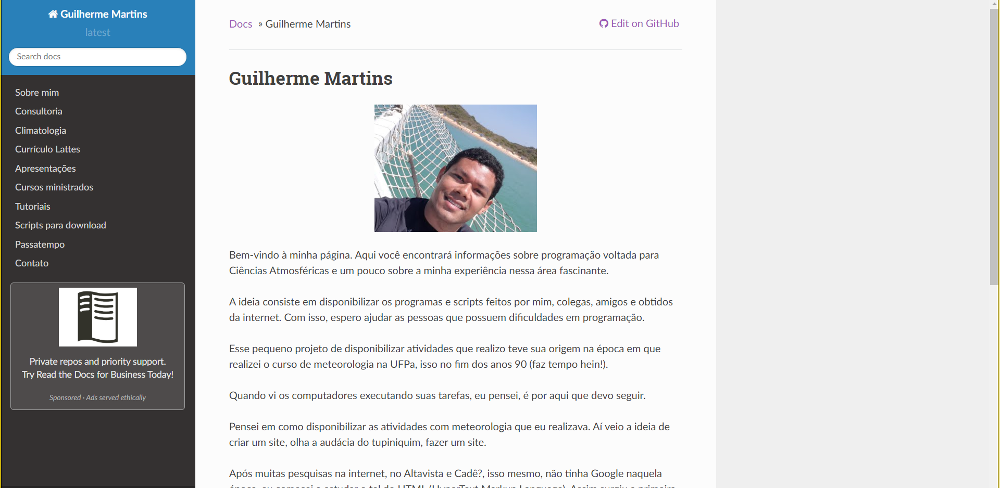

# homepage
Página pessoal do Guilherme Martins - jgmsantos@gmail.com.

O objetivo dessa página consiste em disponibilizar informações sobre progrmação voltada para Ciências Atmosféricas.

Serão disponibilizados programas feitos por mim, amigos e encontrados na internet para ajudar pessoas que possuem alguma dificuldade com programação.

Espero que essa página seja útil e que possa ajudar outras pessoas.

Disponível em: [https://guilherme.readthedocs.io/en/latest](https://guilherme.readthedocs.io/en/latest)
