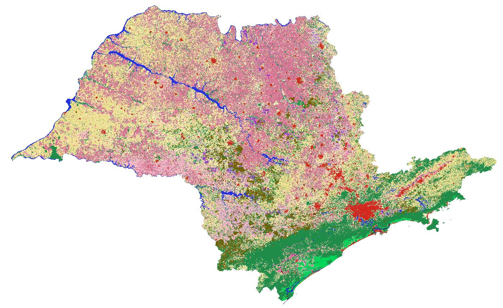
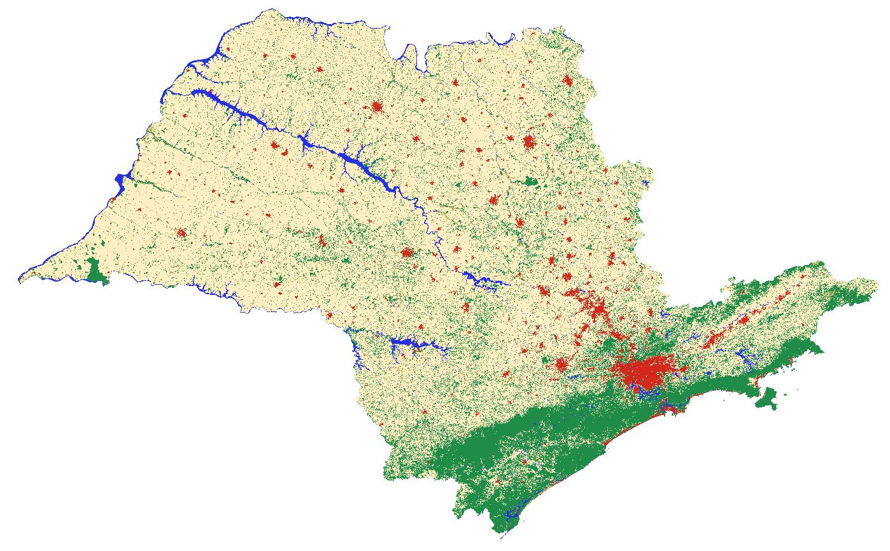
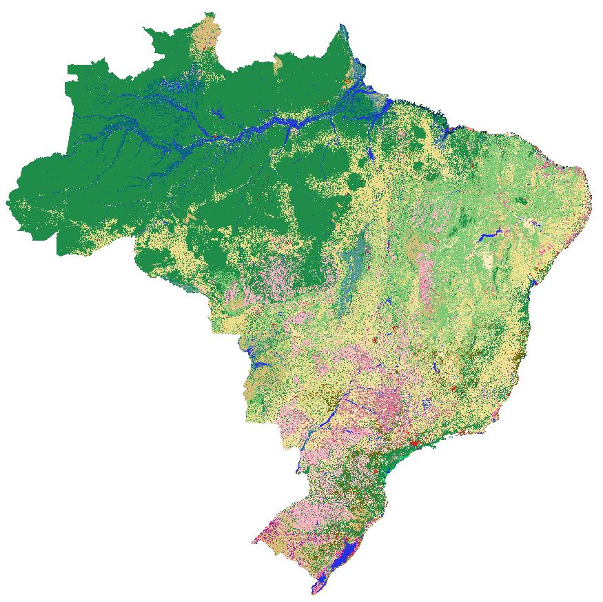
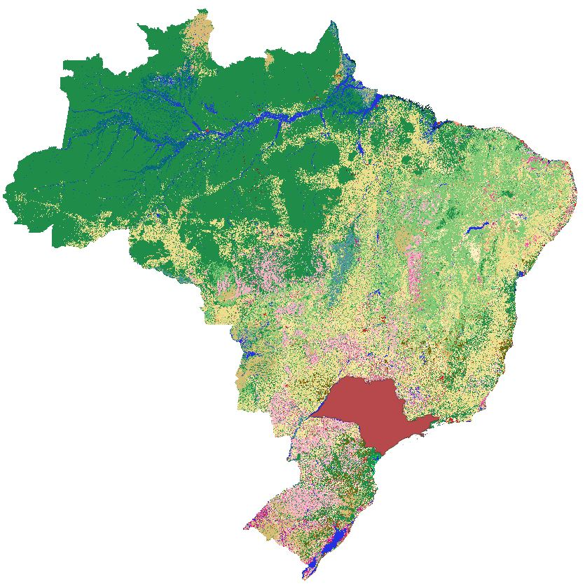
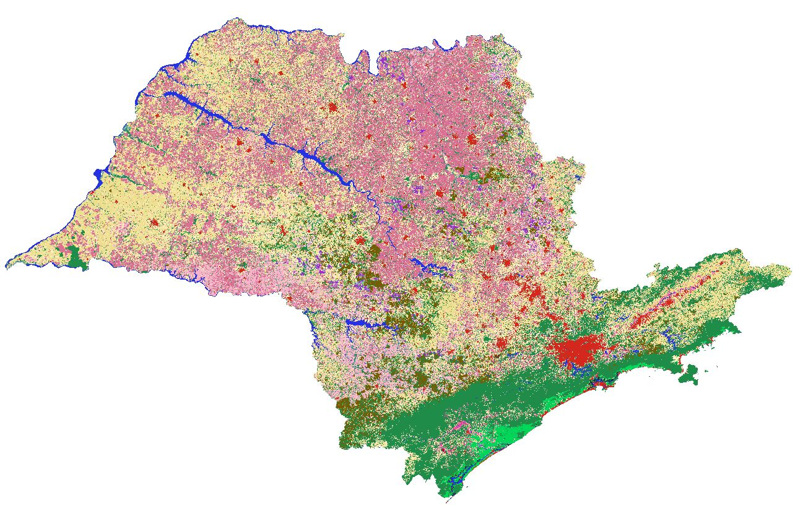
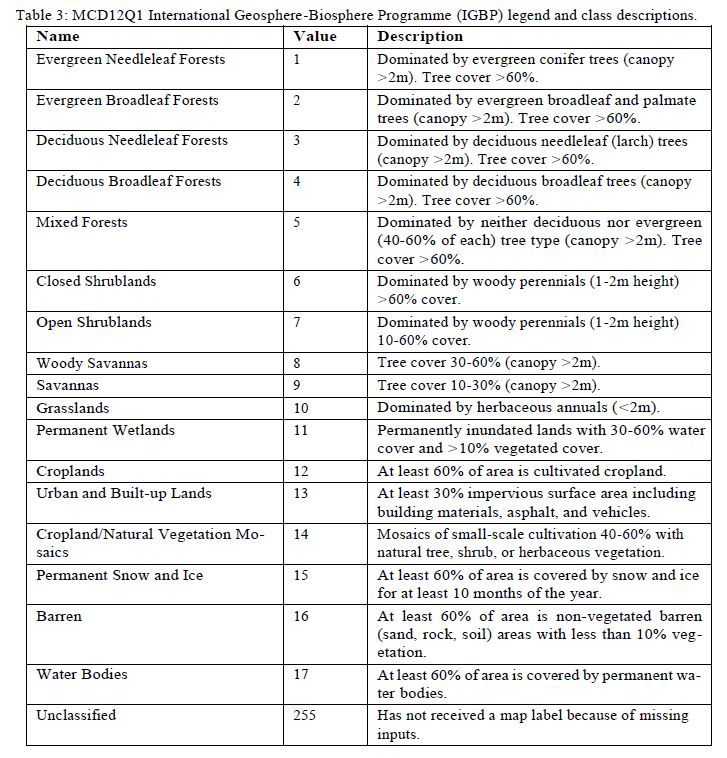

gdal
====

### Link para o site do gdal 

+ [http://www.gdal.org](http://www.gdal.org)
+ [http://www.gdal.org/gdal_translate.html](http://www.gdal.org/gdal_translate.html)
+ [http://www.gdal.org/formats_list.html](http://www.gdal.org/formats_list.html)


### Instalando o gdal no Linux

`sudo apt install gdal-bin`

### Exemplos de uso do gdal

#### Convertendo um arquivo NetCDF para o formato binário

+ Criar o arquivo descritor (ctl) com o cdo:

`cdo gradsdes input.nc`

Será criado o arquivo `input.ctl`. O `input.nc` é o seu arquivo NetCDF.

+ Gerando o binário a partir do NetCDF. Não esquecer de editar o `.ctl` para abrir corretamente o seu binário.

`gdal_translate -of ENVI input.nc output.bin`

#### Convertendo um arquivo NetCDF para o formato tif

`gdal_translate -of GTiff -a_srs EPSG:4326 input.nc output.tif`

#### Convertendo um arquivo no formato tif para NetCDF

`gdal_translate -of netcdf -co "FORMAT=NC" input.tif output.nc`

#### Convertendo um arquivo no formato NetCDF para o formato tif e compacta o arquivo (no sentido de reduzir o tamanho ocupado em disco pelo tif)

`gdal_translate -of GTiff -a_srs EPSG:4326 -co TILED=YES -co COPY_SRC_OVERVIEWS=YES -co COMPRESS=LZW input.nc output.tif`

#### Convertendo um arquivo shapefile para NetCDF

`gdal_rasterize -burn 1 -of netCDF -a_nodata -999 -a_srs epsg:4326 -tr 0.01 0.01 input.shp output.nc`

Onde: `-of` = formato de interesse, `-a_nodata` = valor UNDEF de interesse, `-a_srs epsg` = tipo de projeção e `-tr` = resolução de interesse, nesse caso, 1km.

#### Juntando arquivos tif

O objetivo consiste em unir (`gdal_merge.py`) dois arquivos, o `VENTO.U10M.GFS.ANL.2020070118.tif` e o `VENTO.V10M.GFS.ANL.2020070118.tif`. 

A ordem de disposição dos arquivos é importante. Ao gerar o `VENTO_UV.tif`, a variável `Band 1` corresponde a componente `u` e `Band 2` a componente `v`.

`gdal_merge.py -separate -o VENTO_UV.tif VENTO.U10M.GFS.ANL.2020070118.tif
VENTO.V10M.GFS.ANL.2020070118.tif`

Onde: `VENTO_UV.tif` é o arquivo com as duas variáveis. Esse nome é definido pelo usuário.

Basta digitar o comando abaixo para ver o conteúdo do arquivo `VENTO_UV.tif`.

`gdalinfo VENTO_UV.tif`

#### Reclassificar as classes do  MapBiomas

O objetivo consiste em reclassificar as 38 classes da coleção 8 do MapBiomas para 6 classes, isto é:

* Classe 1: Floresta
* Classe 2: Formação Natural não Florestal
* Classe 3: Agropecuária
* Classe 4: Área não Vegetada
* Classe 5: Corpo D'água
* Classe 6: Não observado

Os links abaixo mostram todas as classes da coleção 8 do MapBiomas:

* [Códigos de legenda](https://brasil.mapbiomas.org/codigos-de-legenda/)

* [As 38 classes](https://brasil.mapbiomas.org/wp-content/uploads/sites/4/2023/08/Legenda-Colecao-8-LEGEND-CODE.pdf)

* [Descrição detalhada das 38 classes](https://brasil.mapbiomas.org/wp-content/uploads/sites/4/2023/09/Legenda-Colecao-8-Descricao-Detalhada-PDF-PT-3-1.pdf)

Para recortar o mapa de uso e cobertura da terra do MapBiomas, basta seguir a dica do link abaixo. Lembrando que a resolução original é de 30 metros.

[Recortar um arquivo GeoTIFF utilizando shapefile](https://www.youtube.com/watch?v=tiCxRcr4q3Q&t=4s&ab_channel=CursosLibertatem)

Para fazer a reclassificação, utiliza-se o `gdal_calc.py`.

Script em Shell para realizar a reclassificação:

Para executar o script, basta abrir o seu terminal e digitar o comando abaixo:

```bash
bash classifica_mapbiomas_6classes.sh
```

```bash
#!/bin/bash

# Arquivo que está no seu computador.
Arquivo_Input=sao_paulo_2022.tif
# Arquivo a ser gerado no seu computador.
Arquivo_Output=sao_paulo_2022_6classes.tif

gdal_calc.py -A ${Arquivo_Input} --outfile ${Arquivo_Output} --NoDataValue=0 --calc="\
  1*(A==1)+1*(A==3)+1*(A==4)+1*(A==5)+1*(A==6)+1*(A==49)+\
  2*(A==10)+2*(A==11)+2*(A==12)+2*(A==32)+2*(A==29)+2*(A==50)+2*(A==13)+\
  3*(A==14)+3*(A==15)+3*(A==18)+3*(A==19)+3*(A==39)+3*(A==20)+3*(A==40)+\
  3*(A==62)+3*(A==41)+3*(A==36)+3*(A==46)+3*(A==47)+3*(A==35)+3*(A==48)+\
  3*(A==9)+3*(A==21)+\
  4*(A==22)+4*(A==23)+4*(A==24)+4*(A==30)+4*(A==25)+\
  5*(A==26)+5*(A==33)+5*(A==31)+\
  6*(A==27)"
```

Explicação do comando:

* -A: é o arquivo de entrada.
* --outfile: é o arquivo a ser gerado.
* --NoDataValue: define um valor para dado ausente (undef). Neste caso, o valor zero será undef.
* --calc: responsável pela reclassificação.
  * os números de `1*` a `6*` são as novas classes que serão geradas.
  * 1*(A==1)+1*(A==3)+1*(A==4)+1*(A==5)+1*(A==6)+1*(A==49) significa que do arquivo `A` (sao_paulo_2022.tif), os pixeis com as classes 1, 3, 4, 5, 6, e 49 serão substituídos pelo valor 1.
  * 2*(A==10)+2*(A==11)+2*(A==12)+2*(A==32)+2*(A==29)+2*(A==50)+2*(A==13). Neste caso, as classes 10, 11, 12, 32, 29, 50, 13 terão valor 2.
  * Para as demais classes o raciocínio é o mesmo.

As figuras abaixo mostram o antes e o depois da reclassificação.

* Antes com as 38 classes:


* Depois com as 6 classes:


#### Recortar um arquivo GeoTIFF utilizando shapefile

A figura abaixo representa o mapa de uso e cobertura da terra.



Será utilizado o shapefile do Estado de São Paulo, como mostrado abaixo para recortar o mapa acima exatamente no domínio deste estado..



O resultado será:



O trecho abaixo mostra como realizar este procedimento.

```bash
# Para instalar o gdal:
# conda install -c conda-forge gdal

from osgeo import gdal

# 'sao_paulo.tif': É o arquivo a ser gerado no computador. 
# 'GeoTIFF/brasil_coverage_2022.tif': É o arquivo a ser recortado. 
# 'SP_UF_2021/SP_UF_2021.shp': Máscara utilizada para recortar o dado.
# 'SP_UF_2021': Arquivo shapefile sem extensão.
# cropToCutline=True: Recorta exatamente no contorno do shapefile.

# Documentação do gdal (Warp):
# https://gdal.org/api/python/osgeo.gdal.html#osgeo.gdal.Warp

gdal.Warp(
    destNameOrDestDS='sao_paulo.tif', 
    srcDSOrSrcDSTab='GeoTIFF/brasil_coverage_2022.tif', 
    cutlineDSName='SP_UF_2021/SP_UF_2021.shp', 
    cutlineLayer='SP_UF_2021', 
    cropToCutline=True,
)
```


#### Download de dados do modelo GFS

O objetivo consiste em selecionar um horário de simulação do modelo americano Global Forecast System (GFS) sem realizar o download dele na máquina, selecionar algumas variáveis de interesse e salvar apenas as variáveis selecionadas localmente no formato NetCDF.

Selecionar variáveis de interesse:

Basta visualizar um dos arquivos com a extensão ```.idx```. Exemplo: ```gfs.t00z.pgrb2.0p50.f012.idx```.

Uma vez selecionada as variáveis, nota-se que tem um número para cada linha do arquivo ```.idx```, este é o número que será utilizado para selecionar as variáveis.

Exemplo: Serão selecionadas as variáveis abaixo: TMP, UGRD, VGRD e APCP que possuem a seguinte númeração: 581, 588, 589 e 596, respectivamente. Lembrando que essa informação veio do arquivo ```.idx```

```bash
581:127174079:d=2024032800:TMP:2 m above ground:12 hour fcst:
588:128579005:d=2024032800:UGRD:10 m above ground:12 hour fcst:
589:128863326:d=2024032800:VGRD:10 m above ground:12 hour fcst:
596:431949438:d=2024032800:APCP:surface:0-3 hour acc fcst:
```
A linha de comando abaixo selecionará essas variáveis de interesse e o resultado será armazenado no arquivo ```gfs.t00z.pgrb2.0p25.f002.nc```.

```bash
gdal_translate /vsicurl/https://www.ftp.ncep.noaa.gov/data/nccf/com/gfs/prod/gfs.20240328/00/atmos/gfs.t00z.pgrb2.0p50.f012 -b 581 -b 588 -b 589 -b 596 -projwin -58 2 -46 -9 -of netcdf -co "FORMAT=NC" gfs.t00z.pgrb2.0p25.f002.nc
```

Explicando o comando:
* Faz o download do horário de simulação (f012) de interesse:
  * /vsicurl/https://www.ftp.ncep.noaa.gov/data/nccf/com/gfs/prod/gfs.20240328/00/atmos/gfs.t00z.pgrb2.0p50.f012 
* Seleciona as bandas (variáveis) de interesse a partir do arquivo ```.idx```: 
  * -b 581 -b 588 -b 589 -b 596
* Recorta o dado na área de interesse. Convenção: longitude oeste (-58), latitude norte (2), longitude leste (-46) e latitude sul (-9):
  * -projwin -58 2 -46 -9
* Salva o arquivo no formato NetCDF:
  * -of netcdf -co "FORMAT=NC"
* Nome do arquivo a ser gerado no computador. É o nome definido pelo usuário:
  * gfs.t00z.pgrb2.0p25.f002.nc

Para salvar no formato GeoTIFF, basta remover o trecho ```-of netcdf -co "FORMAT=NC``` do comando acima:

```bash
gdal_translate /vsicurl/https://www.ftp.ncep.noaa.gov/data/nccf/com/gfs/prod/gfs.20240328/00/atmos/gfs.t00z.pgrb2.0p50.f012 -b 581 -b 588 -b 589 -b 596 -projwin -58 2 -46 -9 gfs.t00z.pgrb2.0p25.f002.tif
```

Para salvar todo o domínio espacial, sem recortar o dado, basta remover o parâmetro ```-projwin -58 2 -46 -9```.

```bash
gdal_translate /vsicurl/https://www.ftp.ncep.noaa.gov/data/nccf/com/gfs/prod/gfs.20240328/00/atmos/gfs.t00z.pgrb2.0p50.f012 -b 581 -b 588 -b 589 -b 596 -of netcdf -co "FORMAT=NC" gfs.t00z.pgrb2.0p25.f002.nc
```

Para visualizar o conteúdo do arquivo (ver o nome das bandas ou variáveis), basta fazer:

```bash
gdalinfo gfs.t00z.pgrb2.0p25.f002.nc
```

ou

```bash
gdalinfo gfs.t00z.pgrb2.0p25.f002.tif
```

Calcular a velocidade do vento.

Antes precisamos saber o nome das bandas ou componentes do vento (u [zonal] e v [meridional]). Para isso, será utilizado o comando ```gdalinfo```.

Exemplo:

```bash
gdalinfo gfs.t00z.pgrb2.0p25.f002.tif
```

Parte do resultado do comando acima é mostrado abaixo. O arquivo ```gfs.t00z.pgrb2.0p25.f002.tif``` possui 4 bandas ou variáveis (TMP, UGRD, VGRD e APCP).

```bash
Band 2 Block=720x1 Type=Float64, ColorInterp=Undefined
  Description = UGRD:10 m above ground:12 hour fcst
  Metadata:
    GRIB_COMMENT=u-component of wind [m/s]
    GRIB_DISCIPLINE=0(Meteorological)
    GRIB_ELEMENT=UGRD
    GRIB_FORECAST_SECONDS=43200

Band 3 Block=720x1 Type=Float64, ColorInterp=Undefined
  Description = VGRD:10 m above ground:12 hour fcst
  Metadata:
    GRIB_COMMENT=v-component of wind [m/s]
    GRIB_DISCIPLINE=0(Meteorological)
    GRIB_ELEMENT=VGRD
    GRIB_FORECAST_SECONDS=43200
```
A componente u representa a variável UGRD que é a banda 2 (```Band 2```). A componente v, é representada pela variável VGRD que é a banda 3 (```Band 3```). Esses valores 2 e 3 serão utilizados para calcular a velocidade do vento nos parâmetros ```--U_band=2``` e ```--V_band=3```.

O comando para calcular a velocidade é:

```bash
gdal_calc.py -U gfs.t00z.pgrb2.0p25.f002.tif --U_band=2 -V gfs.t00z.pgrb2.0p25.f002.tif --V_band=3 --calc="sqrt(U*U+V*V)" --NoDataValue=-999 --format=netcdf --overwrite --outfile velocidade.nc
```

Explicando o comando acima:
* -U gfs.t00z.pgrb2.0p25.f002.tif
  * -U é um nome qualquer que aponta para o arquivo ```gfs.t00z.pgrb2.0p25.f002.tif```, neste caso, a componente u do vento.
* --U_band=2
  * Correspondente a variável u do vento. O valor 2 quer dizer que a variável u é representada pelo nome ```Band 2``` que está no arquivo (verificado com o gdalinfo).
* -V gfs.t00z.pgrb2.0p25.f002.tif 
  * -V é um nome qualquer que aponta para o arquivo ```gfs.t00z.pgrb2.0p25.f002.tif```, neste caso, a componente v do vento.
* --V_band=3
  * Correspondente a variável v do vento. O valor 3 quer dizer que a variável v é representada pelo nome ```Band 3``` que está no arquivo (verificado com o gdalinfo).
* --calc=sqrt(U\*U+V\*V)"
  * É o calculo da velocidade do vento em m/s.
* --NoDataValue=-999
  * Define o valor ausente ou undef.
* --format=netcdf
  * Salva o arquivo no format NetCDF.
* --overwrite
  * No caso de executar o mesmo comando, sobreescreve o arquivo.
* --outfile velocidade.nc
  * É o nome do arquivo que contém a velocidade do vento (m/s).

#### Extrair uma variável de interesse do International Geosphere-Biosphere Programme (IGBP)

O objetivo consiste em converter do formato HDF4 para o formato NetCDF a variável de uso e cobertura da terra chamada de ```Majority_Land_Cover_Type_1``` que encontra-se no arquivo de interesse. Será utilizado o arquivo referente ao ano 2022.

Nome do arquivo do ano 2022: ```MCD12C1.A2022001.061.2023244164746.hdf```

##### Link para os dados

* Fonte de dados:
  * [https://lpdaac.usgs.gov/products/mcd12c1v061](https://lpdaac.usgs.gov/products/mcd12c1v061)

* Descrição do produto:
  * [https://lpdaac.usgs.gov/products/mcd12c1v061](https://e4ftl01.cr.usgs.gov/MOTA/MCD12C1.061/)

* Link para o download dos arquivos:
  * [https://e4ftl01.cr.usgs.gov/MOTA/MCD12C1.061](https://e4ftl01.cr.usgs.gov/MOTA/MCD12C1.061)

* Tabela com as classes de uso e cobertura da terra:
  * Link para a documentação: [Clique aqui](https://lpdaac.usgs.gov/documents/1409/MCD12_User_Guide_V61.pdf)
 


##### Informações da variável de interesse Majority_Land_Cover_Type_1

* Variável usada: ```Majority_Land_Cover_Type_1```

```
SDS Name: Majority_Land_Cover_Type_1
Description: Most likely IGBP class for each 0.05 degree pixel
Unbits: Class
Data Type: 8-bit unsigned intege
Fill Value: 255
No Data Value: N/A
Valida Range: 0 to 16
Scale Factor: N/A
```

##### Obter as informações do arquivo e conversão para o fomato NetCDF

Será usado o ```gdalinfo``` para ver o conteúdo do arquivo. Para ver o conteúdo, basta digitar o comando abaixo:

```
gdalinfo MCD12C1.A2022001.061.2023244164746.hdf
```

Parte da saída é mostrada abaixo:

```
Subdatasets:
  SUBDATASET_1_NAME=HDF4_EOS:EOS_GRID:"MCD12C1.A2022001.061.2023244164746.hdf":MOD12C1:Majority_Land_Cover_Type_1
  SUBDATASET_1_DESC=[3600x7200] Majority_Land_Cover_Type_1 MOD12C1 (8-bit unsigned integer)
  SUBDATASET_2_NAME=HDF4_EOS:EOS_GRID:"MCD12C1.A2022001.061.2023244164746.hdf":MOD12C1:Majority_Land_Cover_Type_1_Assessment
  SUBDATASET_2_DESC=[3600x7200] Majority_Land_Cover_Type_1_Assessment MOD12C1 (8-bit unsigned integer)
  SUBDATASET_3_NAME=HDF4_EOS:EOS_GRID:"MCD12C1.A2022001.061.2023244164746.hdf":MOD12C1:Land_Cover_Type_1_Percent
  SUBDATASET_3_DESC=[3600x7200x17] Land_Cover_Type_1_Percent MOD12C1 (8-bit unsigned integer)
  SUBDATASET_4_NAME=HDF4_EOS:EOS_GRID:"MCD12C1.A2022001.061.2023244164746.hdf":MOD12C1:Majority_Land_Cover_Type_2
  SUBDATASET_4_DESC=[3600x7200] Majority_Land_Cover_Type_2 MOD12C1 (8-bit unsigned integer)
  SUBDATASET_5_NAME=HDF4_EOS:EOS_GRID:"MCD12C1.A2022001.061.2023244164746.hdf":MOD12C1:Majority_Land_Cover_Type_2_Assessment
  SUBDATASET_5_DESC=[3600x7200] Majority_Land_Cover_Type_2_Assessment MOD12C1 (8-bit unsigned integer)
  SUBDATASET_6_NAME=HDF4_EOS:EOS_GRID:"MCD12C1.A2022001.061.2023244164746.hdf":MOD12C1:Land_Cover_Type_2_Percent
  SUBDATASET_6_DESC=[3600x7200x14] Land_Cover_Type_2_Percent MOD12C1 (8-bit unsigned integer)
  SUBDATASET_7_NAME=HDF4_EOS:EOS_GRID:"MCD12C1.A2022001.061.2023244164746.hdf":MOD12C1:Majority_Land_Cover_Type_3
  SUBDATASET_7_DESC=[3600x7200] Majority_Land_Cover_Type_3 MOD12C1 (8-bit unsigned integer)
  SUBDATASET_8_NAME=HDF4_EOS:EOS_GRID:"MCD12C1.A2022001.061.2023244164746.hdf":MOD12C1:Majority_Land_Cover_Type_3_Assessment
  SUBDATASET_8_DESC=[3600x7200] Majority_Land_Cover_Type_3_Assessment MOD12C1 (8-bit unsigned integer)
  SUBDATASET_9_NAME=HDF4_EOS:EOS_GRID:"MCD12C1.A2022001.061.2023244164746.hdf":MOD12C1:Land_Cover_Type_3_Percent
  SUBDATASET_9_DESC=[3600x7200x11] Land_Cover_Type_3_Percent MOD12C1 (8-bit unsigned integer)
Corner Coordinates:
Upper Left  (    0.0,    0.0)
Lower Left  (    0.0,  512.0)
Upper Right (  512.0,    0.0)
Lower Right (  512.0,  512.0)
Center      (  256.0,  256.0)
```

No nosso caso, estamos interessados no nome ```SUBDATASET_1_NAME```, ou seja, no valor que está a direita do sinal de igualdade e que contém o nome ```Majority_Land_Cover_Type_1``` que é a nossa variável de interesse.

```
HDF4_EOS:EOS_GRID:"MCD12C1.A2022001.061.2023244164746.hdf":MOD12C1:Majority_Land_Cover_Type_1
```

Este nome será usado para converter para o formato NetCDF com o comando abaixo:

```
gdal_translate -of netcdf -co "FORMAT=NC4" -projwin -90 15 -30 -60 HDF4_EOS:EOS_GRID:"MCD12C1.A2022001.061.2023244164746.hdf":MOD12C1:Majority_Land_Cover_Type_1 LUCC_2022.nc
```

Recorta o dado na área de interesse (```-projwin -90 15 -30 -60```). Convenção: longitude oeste (-90), latitude norte (15), longitude leste (-30) e latitude sul (-60).

O nome ```LUCC_2022.nc``` é definido pelo usuário e este arquivo será gerado no computador.

Ao executar o comando acima irá aparecer a seguinte mensagem:

```
0ERROR 1: netcdf error #-59 : NetCDF: Name contains illegal characters . 
at (netcdfdataset.cpp,NCDFPutAttr,10484)
```

**Tentei achar a solução para esta mensagem, mas não encontrei. Se alguém souber, compartilhe conosco.**

Eu comparei o arquivo ```LUCC_2022.nc``` com o arquivo ```MCD12C1.A2022001.061.2023244164746.hdf``` no QGIS e eles são extamente iguais.

#### Selecionar e recortar uma variável do SAMET/INPE

O arquivo (``SAMeT_CPTEC_TMAX_20250105.nc``) do link abaixo possui duas variáveis, ``tmax`` e ``nobs``. O objetivo consiste em salvar no formato NetCDF apenas a variável ``tmax``.

https://ftp.cptec.inpe.br/modelos/tempo/SAMeT/DAILY/TMAX/2025/01/SAMeT_CPTEC_TMAX_20250105.nc

Para sabe o nome das variáveis e as informações necessárias para fazer isso, basta digitar no seu terminal o comando abaixo:

```
gdalinfo /vsicurl/https://ftp.cptec.inpe.br/modelos/tempo/SAMeT/DAILY/TMAX/2025/01/SAMeT_CPTEC_TMAX_20250105.nc
```

E serão mostradas as seguintes informações:

```
Driver: netCDF/Network Common Data Format
Files: /vsicurl/https://ftp.cptec.inpe.br/modelos/tempo/SAMeT/DAILY/TMAX/2025/01/SAMeT_CPTEC_TMAX_20250105.nc
Size is 512, 512
Metadata:
  NC_GLOBAL#CDI=Climate Data Interface version 1.8.2 (http://mpimet.mpg.de/cdi)
  NC_GLOBAL#CDO=Climate Data Operators version 1.8.2 (http://mpimet.mpg.de/cdo)
  NC_GLOBAL#Conventions=CF-1.6
Subdatasets:
  SUBDATASET_1_NAME=NETCDF:"/vsicurl/https://ftp.cptec.inpe.br/modelos/tempo/SAMeT/DAILY/TMAX/2025/01/SAMeT_CPTEC_TMAX_20250105.nc":tmax
  SUBDATASET_1_DESC=[1x1381x1001] tmax (64-bit floating-point)
  SUBDATASET_2_NAME=NETCDF:"/vsicurl/https://ftp.cptec.inpe.br/modelos/tempo/SAMeT/DAILY/TMAX/2025/01/SAMeT_CPTEC_TMAX_20250105.nc":nobs
  SUBDATASET_2_DESC=[1x1381x1001] nobs (64-bit floating-point)
Corner Coordinates:
Upper Left  (    0.0,    0.0)
Lower Left  (    0.0,  512.0)
Upper Right (  512.0,    0.0)
Lower Right (  512.0,  512.0)
Center      (  256.0,  256.0)
```

Onde tem: ```Subdatasets:```, há duas informações:

```
SUBDATASET_1_NAME=NETCDF:"/vsicurl/https://ftp.cptec.inpe.br/modelos/tempo/SAMeT/DAILY/TMAX/2025/01/SAMeT_CPTEC_TMAX_20250105.nc":tmax
SUBDATASET_2_NAME=NETCDF:"/vsicurl/https://ftp.cptec.inpe.br/modelos/tempo/SAMeT/DAILY/TMAX/2025/01/SAMeT_CPTEC_TMAX_20250105.nc":nobs
```

No fim cada linha tem o nome ``tmax`` e ``nobs``. A informação que será utilizada será ``tmax``.

Basta copiar toda a linha à direita do sinal de igualdade, isto é:

```
NETCDF:"/vsicurl/https://ftp.cptec.inpe.br/modelos/tempo/SAMeT/DAILY/TMAX/2025/01/SAMeT_CPTEC_TMAX_20250105.nc":tmax
```

O comando final somente com a variável ``tmax`` ficará assim:

```
gdal_translate NETCDF:"/vsicurl/https://ftp.cptec.inpe.br/modelos/tempo/SAMeT/DAILY/TMAX/2025/01/SAMeT_CPTEC_TMAX_20250105.nc":tmax -of netCDF tmp01.nc
```

* ``tmp01.nc`` é o nome que será salvo no seu diretório. Altere o nome e o local (diretório) a ser armazenado de acordo com as suas necessidades.

Outra situação, seria realizar um recorte em uma área de interesse, uma vez que este arquivo engloba toda a América do Sul. Para isso, basta usar o parâmetro abaixo:

``-projwin -75 7 -34 -35``

* Convenção: longitude oeste, latitude norte, longitude leste e latitude sul.

```
gdal_translate NETCDF:"/vsicurl/https://ftp.cptec.inpe.br/modelos/tempo/SAMeT/DAILY/TMAX/2025/01/SAMeT_CPTEC_TMAX_20250105.nc":tmax -projwin -75 7 -34 -35 -of netCDF tmp01.nc
```