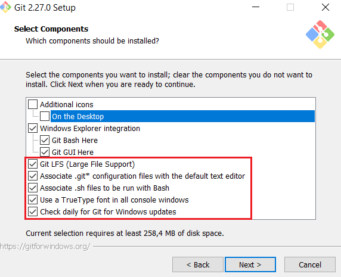
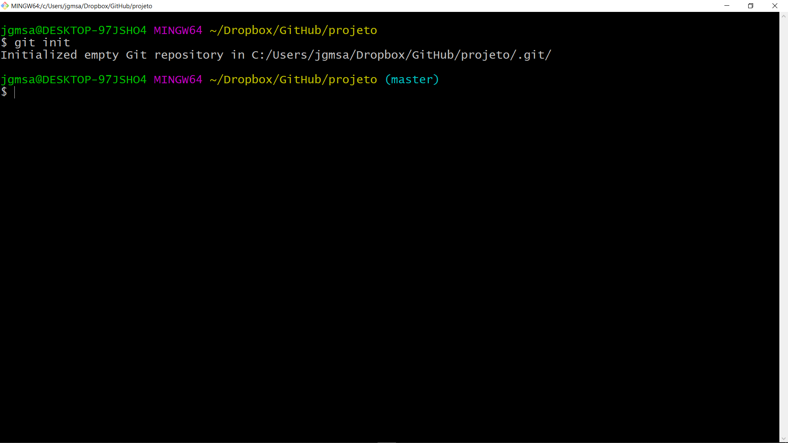
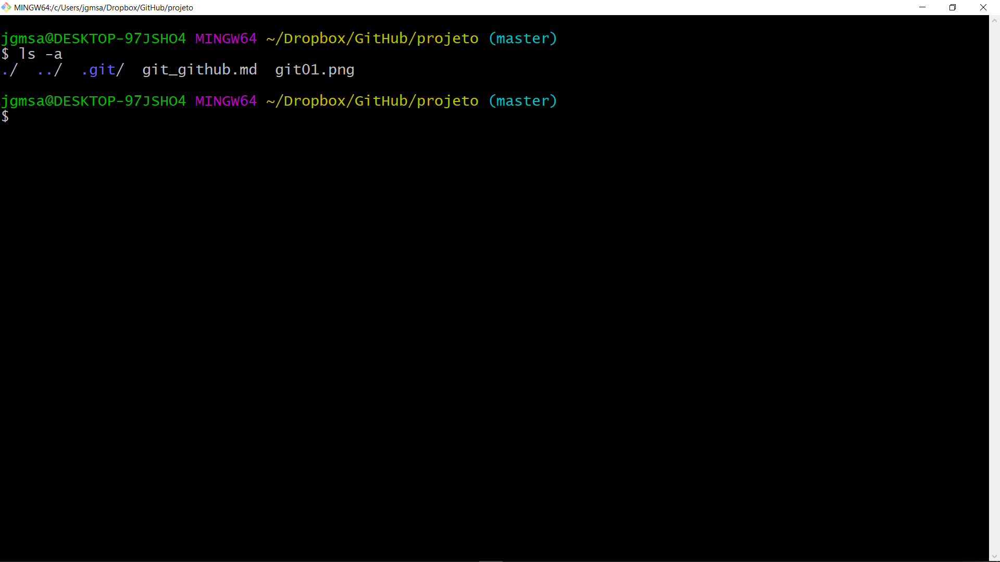
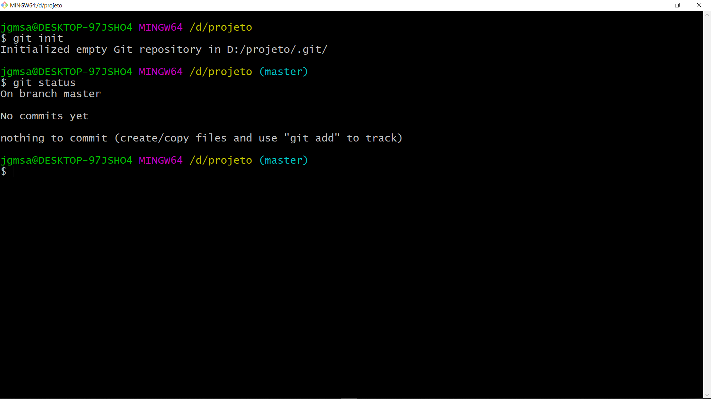
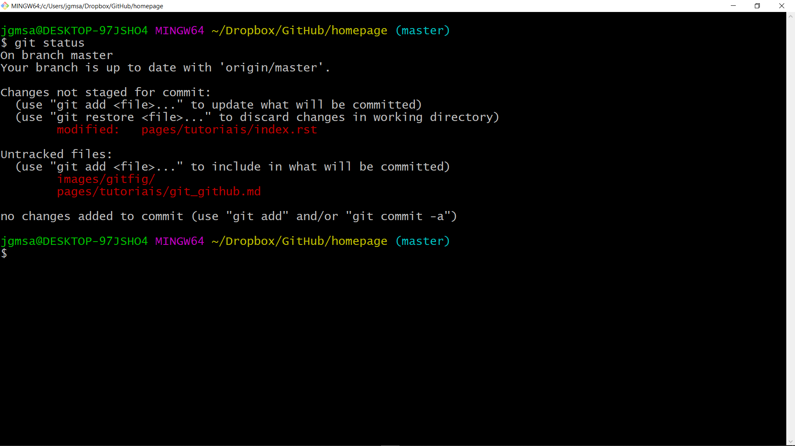
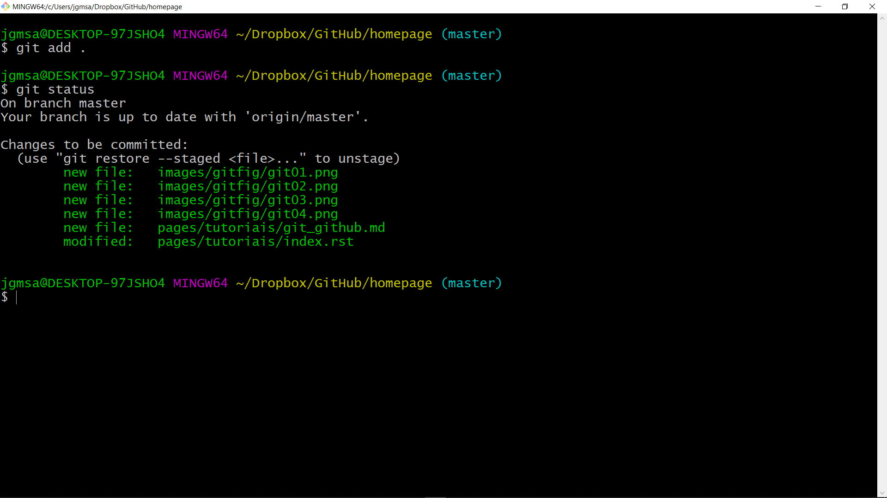
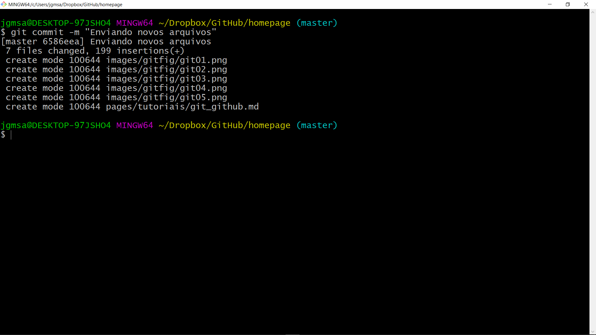
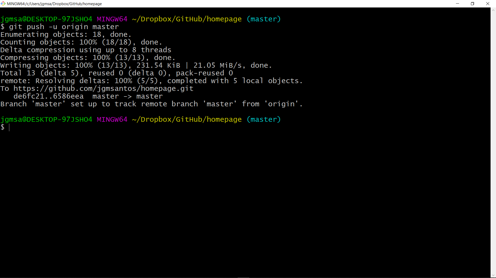
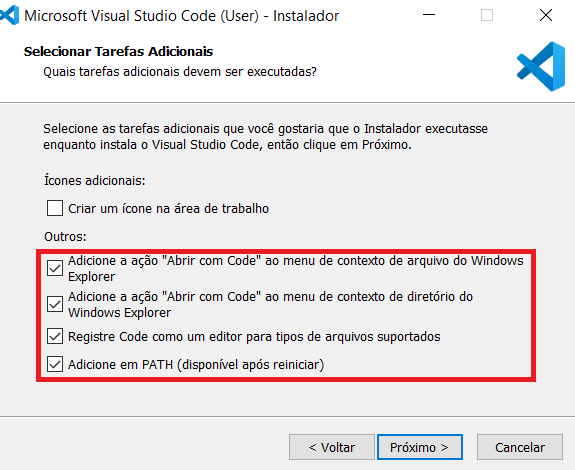

Git e Github
====================

### Uma breve história

O Git-SCM (Source Control Management ou Gerenciamento de controle de fonte) foi criado pelo [Linus Torvalds](https://github.com/torvalds) (conhecido como o criado do Linux) em 7 de abril de 2005 com o objetivo de auxiliar no desenvolvimento do Sistema Operacional Linux.

Durante o desenvolvimento de um software queremos saber:

1. O que mudou?
2. Quando mudou?
3. Por que mudou?
4. Quem fez a mudança?
5. Podemos reproduzir esta mudança?

E o Git tem essa funcionalidade de realizar todo este rastreamento.

### Diferença entre Git e Github

**Para ficar claro, Git não é Github.**

**O que é Git?**

+ É um sistema de controle de versão de código descentralizado. Cada repositório Git é um nó em uma rede descentralizada e diferentes nós podem se comunicar na rede.

**O que é Github?**

+ É uma plataforma Web que serve como um repositório de código que utiliza recursos do Git para que possamos centralizar nossos repositórios na internet, fazendo com que possamos ter um portfólio de códigos e projetos que podem ser públicos ou privados. O Github é um servidor de repositórios Git que surgiu em 2008.

+ **Quem usa Github?** Google, NASA, Facebook, LinkedIn, NetFlix, Spotify, são alguns exemplos de empresas que fazem uso desta plataforma.

### Instalando o Git no Windows

Para instalar, basta acessar o site abaixo:

+ [https://git-scm.com](https://git-scm.com)

E realizar o Download do arquivo.

Execute o arquivo salvo no seu computador e clique em `Next` e quando aparecer a janela abaixo:



Selecione as opções destacadas em vermelho e clique em `Next` até finalizar a instalação.

Para saber a versão do Git instalada, basta digitar o comando abaixo no console do Windows:

```
git --version
```

A versão utilizada nesta instalação é a:

```
git version 2.17.1
```

### Registrando um usuário e o seu e-mail

+ Uma boa prática a ser feita é registrar um nome de usuário e o seu e-mail. 

+ Estas informações são utilizadas para saber quem está trabalhando em um determinado projeto. 

+ Caso essas informações não sejam fornecidas, no momento de enviar as alterações para o Github, será retornado erro, por isso, a importância de realizar essa criação.

+ Há duas manerias de fazer esse registro, isto é, **local** (necessidade de autenticação) ou **global** (não há necessidade de autenticação).

+ E quando usar um ou outro? Caso seja utilizado um computador público, utiliza-se o `git config`. Por outro lado, caso o computador seja particular, utiliza-se o `git config --global`.

+ Vamos que ao interessa. Lembrando que foi criado um diretório chamado `projeto` e os comandos abaixo sáo digitados dentro dele.

**1. Para configurar localmente um repositório:**
```
git config user.name "Guilherme Martins"
```
```
git config user.email "jgmsantos@gmail.com"
```
**2. Para configurar globalmente um repositório:**

Toda vez que o usuário criar um repositório, o mesmo será reconhecido pelo Git não sendo necessário toda vez que criar um repositório inserir as informações de usuário e e-mail.

```
git config --global user.name "Curupira de Jesus"
```
```
git config --global user.email "Curupira de Jesus"
```

### O que é um repositório?

É onde os arquivos do Projeto ficam armazenados. Ao iniciar um projeto com o `git` cria-se um repositório para aquele projeto. Posteriormente, envia-se o repositório para alguns servidores específicos para o seu gerenciamento, como por exemplo, GitHub.

### Inicializando um repositório Git

+ O `git init` é utilizado para inicializar o Git em um determinado repositório. Por exemplo, crie um diretório onde será armazenado o repositório a ser trabalhado.

+ Ao criar o diretório, entre nele e digite o comando abaixo:

```
git init
```

Será mostrada a imagem abaixo:




Ao digitar o comando acima, digite no terminal o comando `ls -a` para ver arquivos e diretórios ocultos do sistema. Ao digitar este comando, será mostrado o diretório `.git`. Este diretório possui arquivos de configuração e outros diretórios que são utilizados para diferentes processos e para enviar o seu projeto para o Github. 

Dentro do diretório `.git` existe um arquivo chamado `config`. Como o nome diz, é um arquivo de configuração que será editado posteriormente.



E depois, digite o comando abaixo para obter informações sobre o repositório criado.

```
git status
```

Será mostrada a imagem abaixo:



Isso significa que que está tudo certo.

### Enviar um repositório local para o GitHub (remoto).

Antes de fazer este passo, no site do GitHub crie o reposítório para enviar do local para o remoto.

git remote add origin https://github.com/usuario/<NomeDoRepositorio>.git 
git branch -M main
git push -u origin master

### Criando o arquivo .gitignore

Como o próprio nome diz, o `.gitignore` é um arquivo no formato texto que será utilizado para ignorar arquivos ou diretórios. Deve-se criar este arquivo no mesmo local do repositório.

Ao criar esse arquivo, a primeita tarefa que deve ser feita é de verificar o seu status, digitando o comando:

```
git status
```

### Adicionando arquivos no repositório

+ Criuou-se o arquivo `git_github.md` que será editado dentro do diretório `pages/tutoriais` .

+ Criou-se um subdiretório (`gitfig`) no diretório `images` e foram adicionandas algumas imagens.

+ Agora, digita-se o comando abaixo para verificar o status das modificações:

```
git status
```

O resultado será:



Note que há 3 cores em vermelho, isso significa que esses arquivos precisam ser adicionados ao repositório.

Para atualizar os arquivos no repositório, utiliza o `git add <nome_arquivo>` ou quando se deseja atualizar vários arquivos de uma vez só, utiliza-se `git add .`.

O comando abaixo fará essa tarefa:

```
git add .
```

Sempre que uma alteração seja realiza, é sempre bom checar com o:

```
git status
```
Nota-se que a cor dos arquivos mudaram de vermelho para verde. Isso mostra que os arquivos já estão prontos para fazer o commit.




### Realizando um commit

+ O Commit (snapshot) representa o envio ou a submissão de arquivos que estão sendo trakeados para o status staged.

+ Cada commit gera um `hash ID` ou um código que é muito imporante para restaurar um projeto para um determinado ponto e para realizar uma tarefa específica.

+ Para se fazer um commit, basta digitar:
```
git commit -m "Enviando novos arquivos"
```

Serão mostras as informações abaixo:




E depois, usar o:

```
git status
```

Agora é o momento de submeter as alterações ao repositório externo. Isso é feito com o comando abaixo.

```
git push -u origin master
```

Se tudo ocorreu bem, será mostrada a imagem abaixo:




### Uso do Clone e do Pull

+ O clone simplemesmente cria uma cópia de um repositório do Github no seu computador.

+ Uma boa prática é criar na sua máquina local um diretório (`mkdir teste`) para clonar o repositório.

+ O resositório a ser clonado é:
   + https://github.com/jgmsantos/Scripts.git

+ É necessária a criação do diretório `teste` no `Download` para fazer o clone.

+ A imagem abaixo é referente ao repositório descrito acima. A ideia é baixar tudo que tem nele para a máquina local.

+ 


```
git init
git clone https://github.com/jgmsantos/Scripts.git
git status
git remote -v
```

### Visualizar as branchs

```
git branch
```

### Criar uma nova branch

```
git branch <NomeDaBranch>

git branch
```
### Mudar para uma nova branch

```
git checkout <NomeDaBranch>

git branch
```

>**Importante**: Cuidado ao criar uma nova branch! É aconselhável que a criação dela seja feita a partir do main.

### Remover uma branch

```
git checkout main

git branch

git branch -d <NomeDaBranch>

git branch
```
### Cria uma nova branch e entra nela diretamente

```
git chekout -b "<NomeDaBranch>"
```

### Merge de branch

```
git branch
```

A partir da branch main:

```
git merge <NomeDaBranch>
```

E depois de unir, enviar para o GitHub.

```
git push
```

### Comparação entre arquivos locais e remotos

Útil para comparar apenas um arquivo.

```
git diff HEAD: <NomeArquivo>
```

Caso fosse uma pasta:

```
git diff HEAD: /<Diretorio>/<NomeArquivo>
```
### Comando úteis

- Ver o histótico de commit:

`git log`

- Recuperar o arquivo do penúltimo commit.

`git checkout HEAD~1 -- roda_todos_script.sh`

Basta alterar `HEAD~1` para `HEAD~2` para pegar dois commit atrás.

- Desfazer os dois últimos commit

`git reset --hard HEAD~2`

- Exibe o nome da branch atual do seu repositório

`git branch --show-current`

### Passo a passo para enviar um repositório local para o GitHub

- Ver status.

``git status``

- Adicionar as mudanças. Os arquivos ainda não foram enviados.

``git add .``

- Fazer commit. Nesta etapa é criada uma imagem (snapshot) das mudanças no Git. Cria um registro com todas as alterações a partir do comando acima (git add .).

``git commit -m "sua mensagem de commit"``

- Enviar para o GitHub.

``git push origin main``

- Opcional para conferir o que foi enviado. Mostra apenas as últimas 5 linhas.

``git log --oneline -n 5``

### Alguns comandos úteis

- Ver o histótico de commit:

``git log``

- Recuperar o arquivo do penúltimo commit.

``git checkout HEAD~1 -- roda_todos_script.sh``

Basta alterar ``HEAD~1`` para ``HEAD~2`` para recuperar de dois commit atrás.

- Desfazer os dois últimos commit

``git reset --hard HEAD~2``

- Exibe o nome da branch atual do seu repositório

``git branch --show-current``

### Instalando o Visual Studio Code no Windows

O Visual Studio Code é excelente para trabalhar em conjunto com o Git e Github pois fornece uma interface gráfica amigável.

Os exemplos a seguir utilizarão esta ferramenta.

Acesse o link abaixo:

[https://code.visualstudio.com](https://code.visualstudio.com/)

E clique em `Download for Windows`.

Execute o arquivo salvo no seu computador e clique em `Next` e quando aparecer a janela abaixo:



Selecione as opções destacadas em vermelho e clique em `Próximo` até finalizar a instalação.