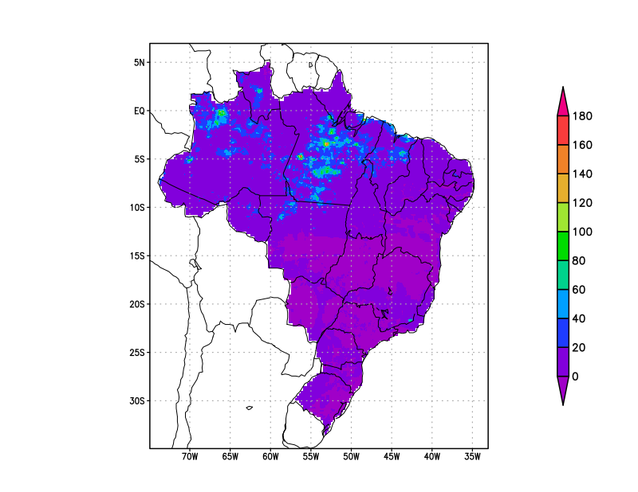
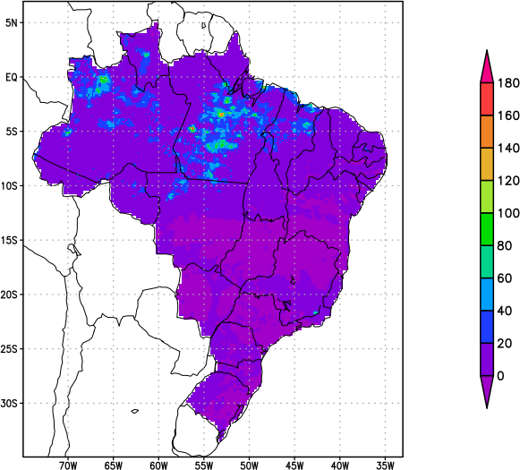
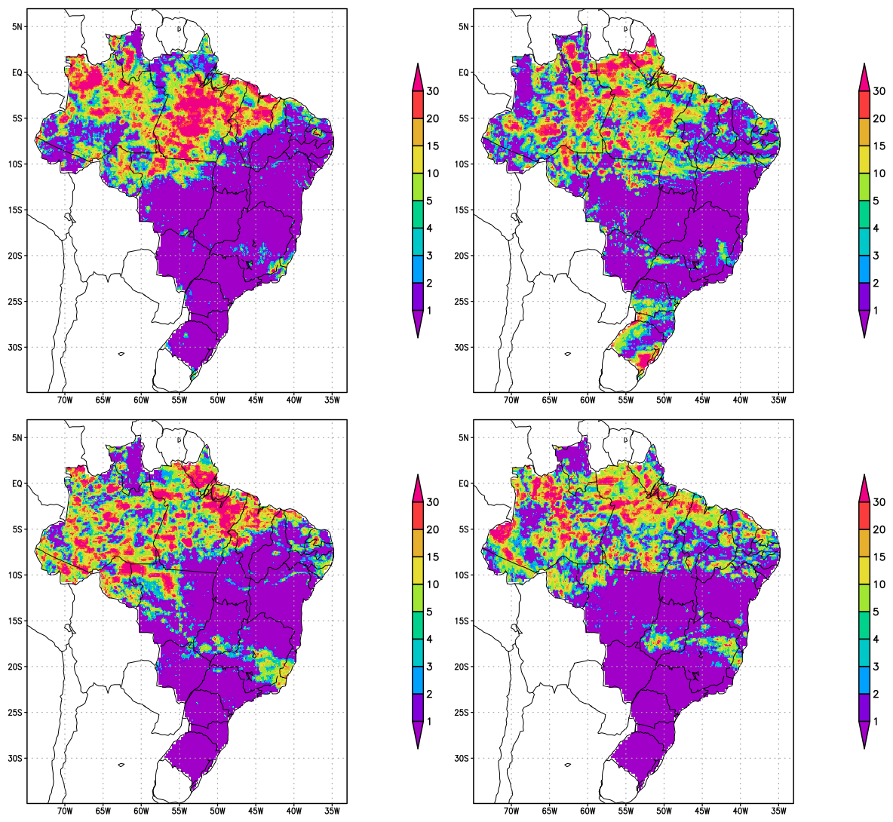

Imagemagick
=================================

O Imagemagick é muito bom para processar imagens.

Link oficial: [https://imagemagick.org/index.php](https://imagemagick.org/index.php)

### Remover espaços excedentes na figura

A figura01a.png possui espaços excedentes e o objetivo consiste em removê-los.



Comando a ser utilizado:

`convert -trim fig01a.png fig01b.png`

Resultado:


Os espaços excedentes foram removidos.

Aproveitando a figura01b.png (sem espaços excedentes), é possível deixar o fundo transparente, basta digitar o comando abaixo:
- Apenas o fundo branco ficará transparente (`-transparent white`).

Comando a ser utilizado:

`convert fig01b.png -transparent white fig01c.png`

Resultado:



### Criando painel de figuras

São utilizados 4 arquivos separados: `fig01.png`, `fig02.png`, `fig03.png` e `fig04.png`. Após remover os espaços excedentes com o  `trim`, cria-se o painel.
- O `-tile 2x2` diz para gerar 2 linhas por 2 colunas.
- O `-geometry +10+10` representa o espaçamento na direção x e y, respectivamente.

Comando a ser utilizado:

`montage -tile 2x2 -geometry +10+10 fig01.png fig02.png fig03.png fig04.png painel.png`

Outra forma:

`montage -tile 2x2 -geometry +10+10 fig??.png painel.png`

Resultado:



### Convertendo uma imagem para 300dpi

```
convert -units PixelsPerInch input -density 300 output.jpg
```

O "input" é o nome da sua imagem que está no seu computador.

Para visualizar a saída, basta digitar:

```
magick identify -verbose output.jpg
```

E verifique a linha 6 (Resolution:) do comando acima.