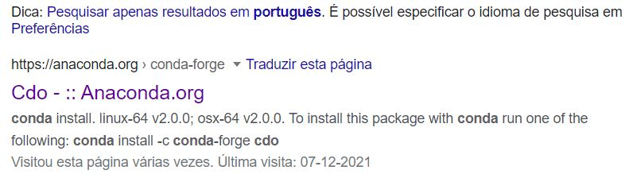
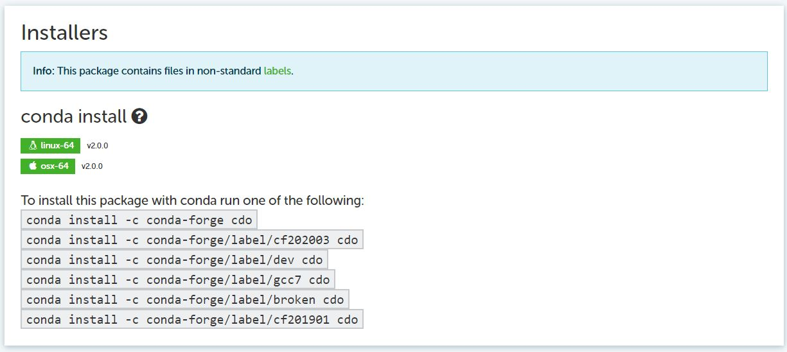

Miniconda
============

## 1. Introdução

O miniconda ajuda bastante na hora de instalar um programa porque ele resolve todas as dependências de forma que o usuário não precise ficar quebrando a cabeça na hora da instalação. 

A criação de um ambiente virtual facilita porque caso seja feita alguma instalação de programa e ele passe por alguma instabilidade, basta remover o ambiente virtual e criar um novo sem danificar o sistema operacional.

## 2. Instalação do miniconda no Linux por meio do site oficial

[https://docs.conda.io/en/latest/miniconda.html](https://docs.conda.io/en/latest/miniconda.html)

## 3. Baixar o instalador

+ Digitar no seu terminal Linux o comando:

```
wget https://repo.anaconda.com/miniconda/Miniconda3-latest-Linux-x86_64.sh
```

+ Executar o instalador

```
bash Miniconda3-latest-Linux-x86_64.sh
```

Basta aceitar todas as opções que vão aparecendo no processo de instalação.

Após a instalação é necessário reiniciar o terminal do Linux para que as mudanças sejam aplicadas.

Após reiniciar o terminal, ele ficará assim:

```
(base) guilherme@DESKTOP-LD7TCRV:~$ 
```

Note o nome `(base)` na frente do nome do usuário.

## 4. Para atualizar o conda

```
conda update -n base -c defaults conda
```

## 5. Criar um novo ambiente virtual

```
conda create --name <nome_ambiente>
```

Exemplo: Criação do ambiente virtual chamado `inpe`.

```
conda create --name inpe
```
## 6. Ver a lista de programas instalados

```
conda list
```

## 7. Desativar um ambiente virtual

```
conda deactivate
```

Ao fazer isso, o usuário sairá do ambiente virtual corrente e mudará para o ambiente virtual (base).

## 8. Ativar um ambiente

```
conda activate <nome_ambiente>
```

Exemplo: 

```
conda activate inpe
```
Antes o ambiente era o `(base)`.

```
(base) guilherme@DESKTOP-LD7TCRV:~$
```

Após o comando, ficará assim:

```
(inpe) guilherme@DESKTOP-LD7TCRV:~$
```

## 9. Remover um ambiente

```
conda env remove --name <nome_ambiente>
```

Exemplo: 

```
conda env remove --name inpe
```

## 10. Instalação de programas

A descrição abaixo é um exemplo de procura e instalação do programa CDO.

Caso seja necessário instalar um programa, mas não se sabe como fazê-lo, basta pesquisar no google, por exemplo, `cdo instalação conda`. Ao clicar na imagem abaixo:

OBS: A instalação é feita considerando sempre a versão mais recente do programa.



Aparecerá a imagem abaixo, basta copiar e colar a primeira linha da imagem no terminal do Linux,  ou seja:

```
conda install -c conda-forge cdo
```




### 10.1 Instalação do NCL

```
conda install -c conda-forge ncl
```

### 10.2 Instalação do gdal

```
conda install -c conda-forge gdal
```

### 10.3 Instalação do CDO

```
conda install -c conda-forge cdo
```

### 10.4 Instalação do imagemagick

```
conda install -c conda-forge imagemagick
```

### 10.5 Instalação do ncview

```
conda install -c conda-forge ncview
```
### 10.6 Instalação do htop

```
conda install -c conda-forge htop
```

### 10.7 Instalação do parallel

```
conda install -c conda-forge parallel
```

### 10.8 Instalação do nco

```
conda install -c conda-forge nco
```

### 10.9 Instalação do wgrib2

```
conda install -c conda-forge wgrib2
```

Ao executar o wgrib2 e aparecer o erro abaixo:

```
wgrib2: error while loading shared libraries: libjasper.so.1: cannot open shared object file: No such file or directory
```

Basta criar um link simbólico de acordo com o comando abaixo. Tudo isso é uma linha. Altere os caminhos de acordo com o seu usuário (`queimadas`) e ambiente virtual (`risco_fogo`):

```
ln -s /home/queimadas/miniconda3/envs/risco_fogo/lib/libjasper.so.4 /home/queimadas/miniconda3/envs/risco_fogo/lib/libjasper.so.1
```

Onde: `/home/queimadas/miniconda3/envs/risco_fogo/lib/libjasper.so.4` representa a biblioteca que está no computador.

E `/home/queimadas/miniconda3/envs/risco_fogo/lib/libjasper.so.1` representa o link simbólico que será a biblioteca a ser criada no seu computador, a que foi mostrada no erro.

Outro possível erro que pode aparecer:

```
wgrib2: error while loading shared libraries: libnetcdf.so.13: cannot open shared object file: No such file or directory
```

Basta criar um link simbólico de acordo com o comando abaixo. Tudo isso é uma linha. Altere os caminhos de acordo com o seu usuário (`queimadas`) e ambiente virtual (`risco_fogo`):

```
ln -s /home/queimadas/miniconda3/envs/risco_fogo/lib/libnetcdf.so.19 /home/queimadas/miniconda3/envs/risco_fogo/lib/libnetcdf.so.13
```

Onde: `/home/queimadas/miniconda3/envs/risco_fogo/lib/libnetcdf.so.19` representa a biblioteca que está no computador.

E `/home/queimadas/miniconda3/envs/risco_fogo/lib/libnetcdf.so.13` representa o link simbólico que será a biblioteca criada, a que foi mostrada no erro.

### 10.10 Instalação do netcdf4

```
conda install -c conda-forge netCDF4
```

### 10.11 Instalação de uma versão específica de um programa 

```
conda install <nome_programa>==<versão_programa>
```

Exemplo: Instalar a versão do `cdo 1.9.9`.

```
conda install cdo==1.9.9
```

## 11. Para atualizar um pacote

```
conda update <nome_pacote>
```
Exemplo:

```
conda update cdo
```
## 12. Desinstalar pacote

```
conda remove <nome_pacote>
````

Caso não funcione, pode-se usar o `--force` para forçar a desinstalação:

```
conda remove --force <nome_pacote>
```

Exemplo: Desinstalar o cdo.

```
conda remove cdo
```
E para forçar a desinstalação do CDO caso o comando acima não funcione:

```
conda remove --force cdo
```

## 13. Instalação de pacotes utilizando o environment.yml

O `environment.yml` é um arquivo que contém as dependências necessárias para criar um ambiente virtual. 

Supondo que o usuário queira instalar as mesmas bibliotecas de um colega, basta pedir para ele enviar o arquivo `environment.yml` gerado pelo comando abaixo.

Antes de executar o comando, ative o ambiente virtual que se deseja exportar as dependências por meio do comando `conda activate <nome_ambiente>`.

Eu fiz um teste, criei um ambiente virtual chamado `teste` com o comando `conda create --name teste`. Instalei algumas bibliotecas e depois exportei este ambiente virtual com o comando abaixo:

```bash
conda env export > environment.yml
```

Isso criará o arquivo chamado `environment.yml` no diretório atual. Ele contém as bibliotecas instaladas via conda. Além disso, também são disponibilizadas as bibliotecas instaladas com pip, tudo num só arquivo. No arquivo `environment.yml`, tem uma seção chamada pip (dentro de dependencies), que lista os pacotes instalados pelo pip.

Algo parecido com o trecho abaixo. O `name: teste` é o nome do ambiente virtual e `prefix: /home/gui/anaconda3/envs/teste` é onde está instalado o ambiente virtual `teste`.

```yaml	
name: teste
channels:
  - conda-forge
  - defaults
dependencies:
  - _libgcc_mutex=0.1=conda_forge
  - _openmp_mutex=4.5=2_kmp_llvm
  .
  .
  .
   - yaml=0.2.5=h7b6447c_0
  - zict=2.1.0=py39h06a4308_0
  - zipp=3.15.0=pyhd8ed1ab_0
  - zlib=1.2.13=h166bdaf_4
  - zstd=1.5.2=ha4553b6_0
  - pip:
      - affine==2.3.1
      - anyio==4.2.0
      - appdirs==1.4.4
      - asttokens==2.2.1
prefix: /home/gui/anaconda3/envs/teste
```

Como recriar o ambiente?

Quando você ou outra pessoa recriar o ambiente, o Conda instalará os pacotes instalados via Conda e o pip instalará as bibliotecas listadas na seção pip.

Antes de digitar o comando abaixo, note que no arquivo `environment.yml` é mostrado o nome do ambiente virtual que foi exportado, isto é, `name: teste`. 

Existe a possibilidade de criar o ambiente virtual com este nome (`name: teste`) ou com outro nome. Lembrando que foi o seu colega que enviou o arquivo `environment.yml`. 

Caso queira criar o ambiente virtual com outro nome, basta alterar o nome do ambiente no arquivo `environment.yml` para o nome desejado, por exemplo, alterar de `name: teste` para `name: clima`. Ou seja, será criado o ambiente virtual chamado `clima` (poderia ser qualquer nome). Além disso, é necessário alterar a última linha do arquivo `environment.yml`:

De:

`prefix: /home/gui/anaconda3/envs/teste`

Para:

`prefix: /home/gui/anaconda3/envs/clima`

Ou seja, onde tudo será instalado, como será criado o novo ambiente chamado clima, é importante alterar neste trecho o nome do ambiente virtual. Caso não altere o nome, o Conda dirá que já existe o ambiente virtual e não fará nada.

Agora, basta digitar o comando abaixo para criar o ambiente virtual chamado `clima`:

```bash
conda env create -f environment.yml
```

O comando acima pode ser feito dentro de qualquer ambiente virtual.

**Dica final:**

Sempre use `conda install` para pacotes disponíveis no Conda e reserve `pip install` para bibliotecas que não estão disponíveis no repositório do Conda. Isso minimiza problemas de compatibilidade.