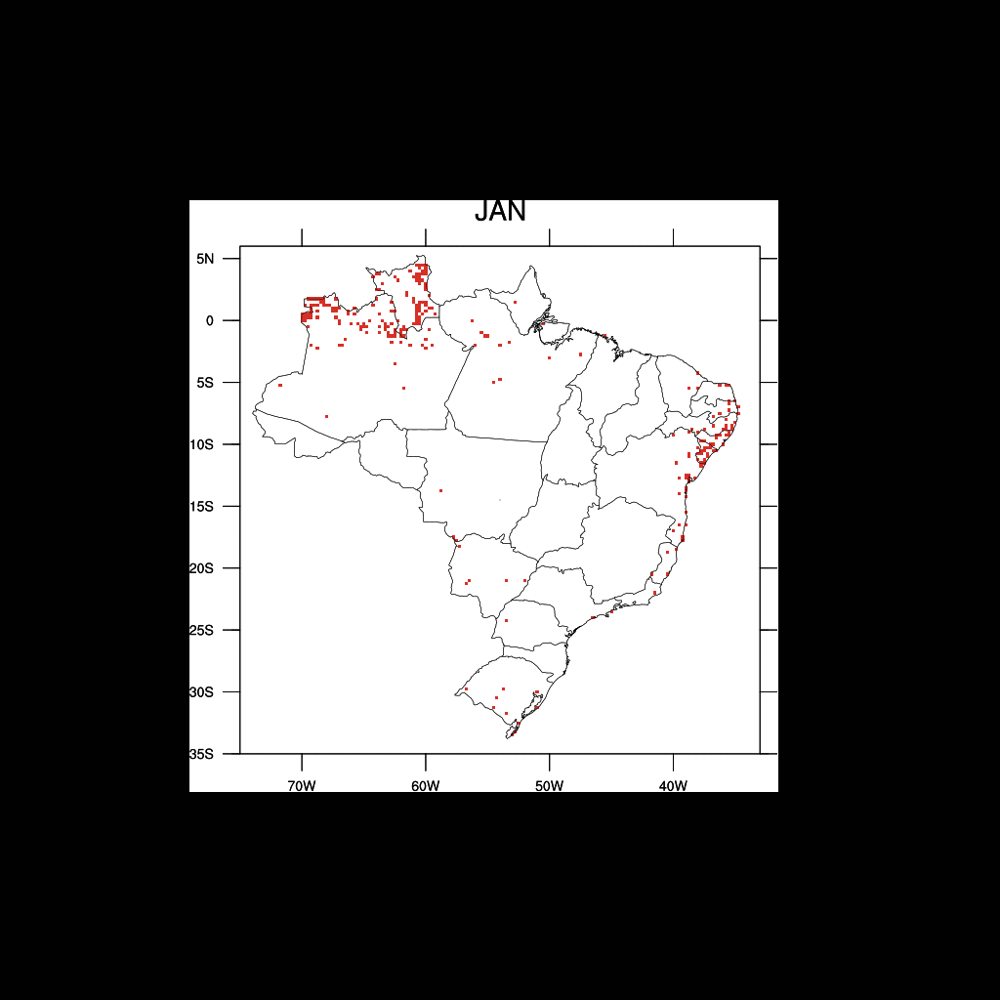

Climatologia
================

### Focos de queimadas

+ Algumas das figuras abaixo fazem parte do artigo disponível [aqui](https://periodicos.ufpe.br/revistas/rbgfe/article/view/243584).

#### Climatologia dos focos de queimadas

Os focos são do satélite AQUA e os mesmo foram reamostrados para uma grade regular de 25 km x 25 km. O  período utilizado foi de 2003 a 2018.

A porcentagem no canto inferior direito representa a contribuição de cada mês para a ocorrência dos focos.

Abaixo é mostrada a climatologia por cada estado brasileiro. No topo de cada barra são mostrados os valores médios para cada mês. Os dados foram normalizados entre 0 e 1.

#### Meses de ocorrência dos focos de queimadas

A imagem abaixo mostra apenas a localização média dos focos de queimadas do sensor do MODIS abordo do satélite AQUA. A figura foi gerada a partir da média mensal referente aos anos de 2003 a 2018. Os focos apresentam resolução espacial 25 km x 25 km.

#### Animação dos meses de ocorrência dos focos de queimadas

#### Painel dos meses de maior ocorrência dos focos de queimadas separados por meses

#### Número de dias com focos de queimadas

A partir dos dados diários de focos de queimadas no período de 2003 a 2018, o píxel com foco recebe o valor 1. Em seguida, realiza-se a contabilização dos dias com focos no mês, e posteriormente, calcula-se a sua média mensal. A partir disso, foi possível contabilizar o número médio de dias com focos de queimadas para cada mês. Os focos são do satélite AQUA e os mesmo foram reamostrados para uma grade regular de 25 km x 25 km.

Fonte dos dados de focos de queimadas: [INPE/Queimadas](http://queimadas.dgi.inpe.br/queimadas).

### Precipitação

A climatologia mensal de precipitação no período de 1981 a 2010 foi obtida do [CPC](https://psl.noaa.gov/data/gridded/data.cmap.html) Merged Analysis of Precipitation. O produto apresenta resolução horizontal de 2,5° latitude x 2,5° longitude.

