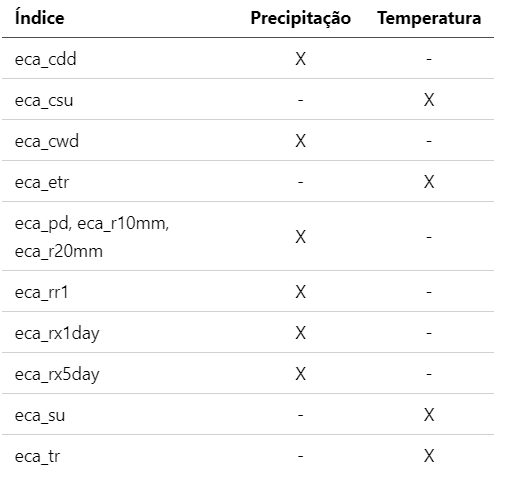

Climate Data Operators (CDO)
=================================

### Tutorias

+ [Introdução ao Climate Data Operators (CDO). Autor: Guilherme Martins. Versão oficial](http://mtc-m21b.sid.inpe.br/col/sid.inpe.br/mtc-m21b/2016/11.18.17.34/doc/publicacao.pdf)
  + [Download alternativo para o tutorial acima. **Versão sendo atualizada constantemente**](https://drive.google.com/open?id=15UT8bdlLlwxwazTvRk2IK28oys89Z4nl)

+ [CDO Reference Card](https://code.zmaw.de/projects/cdo/embedded/cdo_refcard.pdf)

+ [CDO User's Guide](https://code.mpimet.mpg.de/projects/cdo/embedded/cdo.pdf)

+ [Analyse and visualize](https://drive.google.com/file/d/1-CjKE9Akr5AZv3wClCSlRduRNgSiqUNV/view?usp=sharing)

+ [Climate Data Operators as a user-friendly tools for CMSAF'S satellite-derived climate monitoring products](https://drive.google.com/file/d/1upkxIQ9Is_66MGr_wfy_1yQIUeipM7U3/view?usp=sharing)

+ [Climate indices with CDO](https://drive.google.com/file/d/1VbCWik2sypCPCBD-kezXR4IsMeUx4m8b/view?usp=sharing)

+ [CDO_Seminar_20161206](https://drive.google.com/file/d/1TcJM0AEI1T0LYqk5341XCwevyg94f39Y/view?usp=sharing)

+ [Resolução de problemas](https://code.mpimet.mpg.de/projects/cdo/wiki/FAQ)

+ [CDO's python bindings](https://drive.google.com/file/d/1LJiBJ0MLVKzlnk4kmSx_6-pL8UnfI3jd/view?usp=sharing)

+ [Data Analysis and Visualizing using CDO and Ferret](https://drive.google.com/file/d/1yK4xGW5ywk04SlP6qeRJnroMKIoUW788/view?usp=sharing)

### Exemplos de uso com o CDO

1 O exemplo abaixo compara dois conjunto de dados espaciais (temperatura [ºC] e precipitação [mm/dia]) que possuem o mesmo domínio espacial, isto é, o mesmo número de pontos de latitude e longitude no intervalo de 28 dias. Lembrando que esse arquivo é apenas um exemplo, ele poderia ter qualquer comprimento temporal. Quando a precipitação for menor ou igual (`lec`) a 10 mm/dia, o conjunto de dados será convertido para valores 1 (condição verdadeira) e 0 (condição falsa). O mesmo ocorre com o operador `gec`, isto é, quando a temperatura for maior igual a 30C, o conjunto de dados receberá o valor 1, caso contrário, receberá o valor 0. Em outras palavras, serão criados dois conjuntos de dados com valores 0 e 1. O operador `mul` multiplicará os dois conjunto de dados, isto é, a matriz de dados de 0 e 1, e por fim, somará todos os 28 dias ou tempos gerando assim um arquivo com o total de dias quando a condição acima for satisfeita simultaneamente.

+ Os arquivos `temp.MT.nc` e `prec.MT.nc` possuem o mesmo domínio espacial e 28 dias (01 a 28 de maio de 2020).
+ Esse exemplo poderia ser aplicado para qualquer comprimento temporal.
+ Esse exemplo foi obtido em: [https://code.mpimet.mpg.de/boards/2/topics/9338](https://code.mpimet.mpg.de/boards/2/topics/9338).

`cdo -s -timsum -mul -gec,30 temp.MT.nc -lec,10 prec.MT.nc output.nc`

O resultado pode ser visualizado abaixo:


2 Alterar o nome da variável de vários arquivos em lote no formato NetCDF. É feito um loop utilizando o `for` em todos os arquivos NetCDF (`*.nc`), em seguida, com o uso do CDO por meio do operador `chname` altera-se o nome da variável do arquivo de `nome_antigo` para `nome_novo`. 

`for arquivo in $(ls -1 *.nc); do cdo -s chname,nome_antigo,nome_novo $arquivo $arquivo; done`

3 Verificar o nome da variável dos arquivos NetCDF utilizando o loop `for`.

`for arquivo in $(ls -1 *.nc); do cdo -s pardes $arquivo; done`

4 Substitui espaço por vírgula e substitui a primeira ocorrência de vírgula por “nada”.

+ O comando abaixo do CDO utilizando o operador `showlevel` do CDO mostrará a seguinte informação:

`cdo -s showlevel air.mon.mean.nc`

+ Resultado do comando acima:

`1000 925 850 700 600 500 400 300 250 200 150 100 70 50 30 20 10`

+ O objetivo consiste em substituir os `espaços em branco` por "`,`". Isso é feito com o comando abaixo utilizando o `tr` e o `sed`.

`cdo -s showlevel vwnd.nc | tr ' ' ',' | sed 's/,//'`

5 Utilizando a variável risco de fogo para obter o total de píxeis para cada categoria. O nome da variável do arquivo `tmp.nc` se chama `rbf` e a variável `x` pode ser qualquer nome.
```
cdo -s -output -fldsum -setmissval,0 -expr,'x=rbf<=0.15' tmp.nc
cdo -s -output -fldsum -setmissval,0 -expr,'x=rbf>0.15 && rbf<=0.40' tmp.nc
cdo -s -output -fldsum -setmissval,0 -expr,'x=rbf>0.40 && rbf<=0.70' tmp.nc
cdo -s -output -fldsum -setmissval,0 -expr,'x=rbf>0.70 && rbf<=0.95' tmp.nc
cdo -s -output -fldsum -setmissval,0 -expr,'x=rbf>0.95' tmp.nc
```

6 O objetivo do script abaixo consiste em converter vários  arquivos no formato texto com 6 colunas com resolução temporal a cada 3 hora, isto é, uma série temporal para o formato NetCDF. O arquivo não apresenta nível vertical.

+ O exemplo foi obtido do link abaixo e posteriormente adaptado:
  + [https://code.mpimet.mpg.de/boards/2/topics/8771](https://code.mpimet.mpg.de/boards/2/topics/8771)
  + Para o download dos arquivos [clique aqui](https://github.com/jgmsantos/Scripts/blob/master/CDO/01_nc2txt.zip)
  + O `01_nc2txt.zip` contém os seguintes arquivos: `data_-17.475_-69.475`, `data_-17.525_-69.475` e `nc2txt.sh`.

+ O script abaixo realizará essa tarefa e possui o nome de `txt2nc.sh`. O seu conteúdo é exibido logo a seguir.

+ Para torná-lo executável, basta digitar:

  `chmod +x txt2nc.sh`

+ Para executá-lo, basta digitar:

  `./txt2nc.sh`

+ Não se preocupe com as mensagens de Warning (Aviso) que vão aparecer.

```bash
#!/bin/bash

rm -f estacao_???.nc # Remove os arquivos para não gerar error.

ncols=6 # Número de variáveis.

# Cada coluna do arquivo texto é representada 
# pelo nome da variável/unidade na lista abaixo.
#               Col1  Col2  Col3   Col4 Col5  Col6
nome_variavel=("prec" "vel" "temp" "HR" "SWR" "LWR")
unidade_variavel=("mm" "m/s" "C" "HR" "W/m2" "W/m2")

# Altere a data conforme a resolução temporal do seu 
# arquivo. A unidade pode ser: hour, day, mon e year.
# O arquivo a ser gerado terá resolução temporal a cada
# 3 horas (3hour) começando em 01/01/1950.
time="1950-01-01,00:00:00,3hour"

k=1

for var in $(ls data_*) ; do 

   id=$(echo ${k} | awk '{printf("%.3d",$1)}')  # Nome do arquivo de saída.
   lat=$(echo ${var} | cut -d "_" -f 2)  # Latitude do local.
   lon=$(echo ${var} | cut -d "_" -f 3)  # Longitude do local.
   
   # Descrição do domínio a ser gerado.
   cat << EOF > grid.txt
   gridtype = lonlat
   xsize    = 1
   ysize    = 1
   xvals    = ${lon}
   yvals    = ${lat}
EOF

   j=0
   
   # Loop sobre todas as variáveis.
   for i in $(seq 1 ${ncols}) ; do
       echo "ID: ${id} -> variavel: ${nome_variavel[j]}"
	   
       $(cat  ${var} | cut -d " " -f ${i} > tmp.txt)
       cdo -s -f nc -setattribute,${nome_variavel[$j]}@units=${unidade_variavel[$j]} \ 
                    -settaxis,${time} -setname,${nome_variavel[$j]} \
                    -setmissval,-999 -input,grid.txt out_${i}.nc < tmp.txt
       j=$(expr $j + 1)
   done

   # Junta todos os arquivos em um NetCDF para cada localidade.
   cdo -s -O merge out_*.nc estacao_${id}.nc

   rm -f out_*.nc tmp.txt grid.txt  # Remove arquivos desnecessários.

   k=$(expr $k + 1)
done
```

Ao executar o script, serão mostradas as linhas abaixo:

```
ID: 001 -> variavel: prec
ID: 001 -> variavel: vel
ID: 001 -> variavel: temp
ID: 001 -> variavel: HR
ID: 001 -> variavel: SWR
ID: 001 -> variavel: LWR
Warning: Duplicate entry of parameter -1 in out_2.nc!
Warning: Duplicate entry of parameter -1 in out_3.nc!
Warning: Duplicate entry of parameter -1 in out_4.nc!
Warning: Duplicate entry of parameter -1 in out_6.nc!
ID: 002 -> variavel: prec
ID: 002 -> variavel: vel
ID: 002 -> variavel: temp
ID: 002 -> variavel: HR
ID: 002 -> variavel: SWR
ID: 002 -> variavel: LWR
Warning: Duplicate entry of parameter -1 in out_2.nc!
Warning: Duplicate entry of parameter -1 in out_3.nc!
Warning: Duplicate entry of parameter -1 in out_4.nc!
Warning: Duplicate entry of parameter -1 in out_6.nc! 
```

+ São gerados dois arquivos com os nomes de `estacao_001.nc` e `estacao_002.nc`.

+ Faça as devidas adaptações para os seus arquivos.

7 Exemplo de como substituir todos os valores da variável chuva em uma determinada latitude (`-9.75`) por um novo valor. Por exemplo, o arquivo `area.nc` representa as 
informações de chuva com o seguinte domínio: `lat = -9.75 a -8.25` e `lon = -55.75 a -54.25` para apenas um tempo, isto é,  esse arquivo é um dado é espacial. 

+ [Clique aqui](https://github.com/jgmsantos/Scripts/blob/master/NetCDF/area.nc) para realizar o download do arquivo `area.nc`

+ A sua forma tabular pode ser obtida com o comando abaixo:

`cdo -s outputtab,nohead,value,lat,lon area.nc`

+ O resultado é mostrado abaixo. Apenas lembrando que a primeira coluna é chuva, a segunda coluna é a latitude e a terceira coluna a longitude.

```
 11.3766  -9.75 -55.75   
 5.92187  -9.75 -55.25   
 2.93238  -9.75 -54.75   
 3.02412  -9.75 -54.25   
 7.97423  -9.25 -55.75   
 6.41053  -9.25 -55.25   
 4.56245  -9.25 -54.75   
 3.48293  -9.25 -54.25   
 9.39731  -8.75 -55.75   
 7.69693  -8.75 -55.25   
 5.17428  -8.75 -54.75   
 3.52867  -8.75 -54.25  
 71.4464  -8.25 -55.75   
 60.8246  -8.25 -55.25   
 38.8118  -8.25 -54.75   
 16.1115  -8.25 -54.25   
```
Realizando a substituição dos valors de chuva no arquivo `area.nc` na latitiude `-9.75` pelo valor `100`. Para isso, será utilizado o operador ternário `"?:"` que funciona 
como uma estrutura condicional `if-then-else`. O valor da latitude tem que existir no seu arquivo.

O comando abaixo realiza essa tarefa. Como interpretar o comando? Será verificada a latitude `-9.75` da variável do seu arquivo `area.nc` que se chama `rain` (`cdo -s pardes area.nc` para ver o nome da variável). Quando a latitude for encontrada, o seu valor de chuva será substituído pelo novo valor 100, e no caso contrário, pelo valor da variável `rain`. O resultado será armazenado em `output.nc`. 

+ **Observação:** Apenas lembrando que somente o valor da precipitação na latitude escolhida será alterada.

Comando do CDO para realizar essa tarefa:

+ **var:** é um nome qualquer para o arquivo que srá armazenado em `output.nc`. Pode-se utilizar qualquer nome.
+ **rain:** é o nome da variável do arquivo `area.nc`.

`cdo -s -expr,'var=((clat(rain)==-9.75) ? 100 : rain)' area.nc output.nc`

+ Para ver o resultado, basta digitar: 

`cdo -s outputtab,nohead,value,lat,lon output.nc`

+ Compare o resultado com o arquivo original `area.nc`. Nota-se que apenas os valores de chuva na latitude `-9.75` foram modificados para o valor `100`. 

+ Altere a latitude de acordo com a sua necessidade.

```
     100  -9.75 -55.75  
     100  -9.75 -55.25  
     100  -9.75 -54.75  
     100  -9.75 -54.25  
 7.97423  -9.25 -55.75  
 6.41053  -9.25 -55.25  
 4.56245  -9.25 -54.75  
 3.48293  -9.25 -54.25  
 9.39731  -8.75 -55.75  
 7.69693  -8.75 -55.25  
 5.17428  -8.75 -54.75  
 3.52867  -8.75 -54.25  
 71.4464  -8.25 -55.75  
 60.8246  -8.25 -55.25  
 38.8118  -8.25 -54.75  
 16.1115  -8.25 -54.25  
```
8 Alterando apenas um ponto de latitude e de longitude. Nesse exemplo, será alterado o valor da `longitude = -55.25` e `latitude = -9.75`. Lembrando que o dado é espacial.

+ **var:** é um nome qualquer para o arquivo que srá armazenado em `output.nc`. Pode-se utilizar qualquer nome.
+ **rain:** é o nome da variável do arquivo `area.nc`. 

+ O comando a ser utilizado é:

`cdo -s -expr,'var=((clon(rain)==-55.25 && clat(rain)==-9.75) ? 100 : rain)' area.nc output.nc`

Para ver o resultado:

`cdo -s outputtab,value,lat,lon output.nc`

```
 11.3766  -9.75 -55.75 
     100  -9.75 -55.25 
 2.93238  -9.75 -54.75 
 3.02412  -9.75 -54.25 
 7.97423  -9.25 -55.75 
 6.41053  -9.25 -55.25 
 4.56245  -9.25 -54.75 
 3.48293  -9.25 -54.25 
 9.39731  -8.75 -55.75 
 7.69693  -8.75 -55.25 
 5.17428  -8.75 -54.75 
 3.52867  -8.75 -54.25 
 71.4464  -8.25 -55.75 
 60.8246  -8.25 -55.25 
 38.8118  -8.25 -54.75 
 16.1115  -8.25 -54.25 
```
+ Compare o resultado com o arquivo original `area.nc`.

### Índices Climáticos utilizando o CDO

Antes de tudo, escolha adequadamente consultando a tabela abaixo o melhor índice a ser utilizado de acordo com o seu dado:

**Importante1:** Os dados utilizados nos índices são diários.

**Importante2:** Os exemplos abaixo foram aplicados em uma série temporal. Os índices podem ser utilizados em um arquivo espacial.



+ [Clique aqui](https://code.mpimet.mpg.de/projects/cdo/embedded/cdo_eca.pdf) para realizar o download da documentação sobre os índices climáticos.

+ [Clique aqui](https://github.com/jgmsantos/Scripts/tree/master/NetCDF) para realizar o download do arquivo de precipitação `prec.med.espacial.nc`.

+ [Clique aqui](https://github.com/jgmsantos/Scripts/tree/master/NetCDF) para realizar o download do arquivo de temperatura `temp.med.espacial.nc`.

**1 ECACDD (Consecutive dry days index per time period ou índice de dias secos consecutivos por período)**

Retorna a quantidade de dias secos consecutivos quando a precipitação (mm/dia) for menor que um determinado limiar (R), o padrão é R= 1 mm/dia. Uma variável adicional é fornecida, trata-se do quantidade ou número de períodos secos maior que N dias.

+ O arquivo de saída terá sempre a última data do arquivo.
+ Duas variáveis são retornadas:
  + `consecutive_dry_days_index_per_time_period`
  + `number_of_cdd_periods_with_more_than_5days_per_time_period`

+ Sintaxe: `cdo eca_cdd,R,N input.nc output.nc`

Onde:

+ `R`: Valor real. Representa o limiar de precipitação em mm/dia. Todo o valor de precipitação menor que esse limiar será considerado. O valor padrão de uso é R = 1 mm/dia.
+ `N`: Valor inteiro. Representa quantas vezes o limiar de precipitação foi excedido. O valor padrão de uso é N = 5.

A série abaixo representa 31 valores (dias 01 a 31) de precipitação para um determinado mês que será utilizada para facilitar o entendimento.

```
dia01 3.04614
dia02 2.98772
dia03 3.11760
dia04 3.36420
dia05 3.08065
dia06 2.74675
dia07 2.55087
dia08 1.82483
dia09 1.96171
dia10 2.09543
dia11 1.86413
dia12 2.17233
dia13 1.77234
dia14 1.58769
dia15 3.34800
dia16 3.12167
dia17 2.08523
dia18 1.99947
dia19 2.10749
dia20 2.41033
dia21 2.80767
dia22 2.95542
dia23 4.15026
dia24 4.49258
dia25 3.33465
dia26 3.24766
dia27 2.78279
dia28 2.59603
dia29 3.24640
dia30 2.59884
dia31 3.36611
```

+ Exemplo1: Deseja-se quantificar o número de dias consecutivos secos em que a precipitação foi menor que 3 mm/dia. Além disso, quantos períodos de até 4 dias foram contabilizados? Não esqueça de realizar o download do arquivo `prec.med.espacial.nc` para testar diferentes configurações de valores.

`cdo -s eca_cdd,3,4 prec.med.espacial.nc output.nc`

+ Resultado:

  + `consecutive_dry_days_index_per_time_period` = 9
  + `number_of_cdd_periods_with_more_than_4days_per_time_period` = 2

+ Explicação: 
  + A contagem de acordo com o limiar de precipitação, isto é, menor que 3 mm/dia começou a partir do dia 06 e foi até o dia 14, totalizando assim, 9 dias.
  + O valor 2 representa a quantidade de períodos em que esse limiar de 3 mm/dia foi excedido. A contagem considera para o primeiro período do dia 06 a 14, e o segundo, do dia 17 a 22, totalizando assim, dois períodos.

**2 ECACSU (Consecutive summer days index per time period ou índice consecutivo de dias de verão por período)**

Retorna a quantidade de dias consecutivos quando a temperatura (Kelvin) for maior que um determinado limiar (T), o padrão é T= 25ºC. Uma variável adicional é fornecida, trata-se da quantidade ou número de períodos de verão maior que N dias.

+ **Importante: O arquivo a ser utilizado deve estar em Kelvin.**

+ O arquivo de saída terá sempre a última data do arquivo.
+ Duas variáveis são retornadas:
  + `consecutive_summer_days_index_per_time_period`
  + `number_of_csu_periods_with_more_than_5days_per_time_period`

+ Sintaxe: `cdo eca_csu,T,N input.nc output.nc`

Onde:

+ `T`: Valor real. Representa o limiar de temperatura (ºC). Todo o valor de temperatura maior que esse limiar será considerado. O valor padrão de uso é T = 25ºC.
  + **Importante: Esse valor é dado em graus Celsius.**
+ `N`: Representa quantas vezes o limiar de temperatura foi excedido. O valor padrão de uso é N = 5.

**Série de temperatua em Kelvin. Essa série será utilizada para calcular o índice.**

```
dia01 295.116
dia02 295.153
dia03 295.248
dia04 295.177
dia05 295.234
dia06 295.27
dia07 295.322
dia08 295.413
dia09 295.574
dia10 295.67
dia11 295.625
dia12 295.623
dia13 295.507
dia14 295.658
dia15 295.718
dia16 295.571
dia17 295.54
dia18 295.695
dia19 295.725
dia20 295.643
dia21 295.357
dia22 295.213
dia23 295.416
dia24 295.645
dia25 295.799
dia26 295.945
dia27 295.832
dia28 295.751
dia29 295.624
dia30 295.645
dia31 295.765
```

A série acima foi convertida para graus Celsius para melhor entendimento do cálculo, somente isso! Lembrando que esse índice utiliza a temperatura em Kelvin, e não em Celsius.

```
dia01 21.966
dia02 22.0031
dia03 22.0978
dia04 22.0268
dia05 22.0836
dia06 22.1197
dia07 22.1722
dia08 22.2628
dia09 22.4235
dia10 22.5202
dia11 22.4749
dia12 22.4726
dia13 22.3574
dia14 22.5084
dia15 22.5678
dia16 22.4205
dia17 22.3902
dia18 22.5454
dia19 22.5746
dia20 22.4934
dia21 22.2071
dia22 22.0632
dia23 22.2659
dia24 22.4952
dia25 22.6491
dia26 22.795
dia27 22.6822
dia28 22.6014
dia29 22.4739
dia30 22.4953
dia31 22.6148
```
+ Exemplo1: Deseja-se quantificar o número de dias consecutivos em que o limiar de temperatura foi maior que 22.6ºC. Além disso, quantos períodos de mais de 3 dias foram contabilizados? Não esqueça de realizar o download do arquivo `temp.med.espacial.nc` para testar diferentes configurações de valores.

`cdo -s eca_csu,22.6,3 temp.med.espacial.nc output.nc`

+ Resultado:

  + `consecutive_summer_days_index_per_time_period` = 4
  + `number_of_csu_periods_with_more_than_3days_per_time_period` = 1

+ Explicação: 
  + A contagem de acordo com o limiar de temperatura, isto é, maior que 22.6ºC começou a partir do dia 25 e foi até o dia 28, totalizando assim, 4 dias.
  + O valor 1 representa a quantidade de períodos em que esse limiar de 22.6ºC foi excedido. A contagem considera apenas um período, isto é, do dia 25 a 28, por isso, o valor 1.

**3 ECACWD (Consecutive wet days index per time period ou índice consecutivo de dias úmidos por período)**

Retorna a quantidade de dias consecutivos úmidos quando a precipitação (mm/dia) for maior que um determinado limiar (R), o padrão é R = 1 mm/dia. Uma variável adicional é fornecida, trata-se da quantidade ou o número de períodos úmidos maior que N dias.

+ O arquivo de saída terá sempre a última data do arquivo.
+ Duas variáveis são retornadas:
  + `consecutive_wet_days_index_per_time_period`
  + `number_of_cwd_periods_with_more_than_5days_per_time_period`

+ Sintaxe: `cdo eca_cwd,R,N input.nc output.nc`

Onde:

+ `R`: Valor real. Representa o limiar de precipitação em mm/dia. Todo o valor de precipitação maior que esse limiar será considerado. O valor padrão de uso é R = 1 mm/dia.
+ `N`: Valor inteiro. Representa quantas vezes o limiar de precipitação foi excedido. O valor padrão de uso é N = 5.

A série abaixo representa 31 valores (dias 01 a 31) de precipitação para um determinado mês que será utilizada para facilitar o entendimento.

```
dia01 3.04614
dia02 2.98772
dia03 3.11760
dia04 3.36420
dia05 3.08065
dia06 2.74675
dia07 2.55087
dia08 1.82483
dia09 1.96171
dia10 2.09543
dia11 1.86413
dia12 2.17233
dia13 1.77234
dia14 1.58769
dia15 3.34800
dia16 3.12167
dia17 2.08523
dia18 1.99947
dia19 2.10749
dia20 2.41033
dia21 2.80767
dia22 2.95542
dia23 4.15026
dia24 4.49258
dia25 3.33465
dia26 3.24766
dia27 2.78279
dia28 2.59603
dia29 3.24640
dia30 2.59884
dia31 3.36611
```

+ Exemplo1: Deseja-se quantificar o número de dias consecutivos úmidos em que a precitação foi maior que 3.5 mm/dia. Além disso, quantos períodos maior que 5 dias foram contabilizados? Não esqueça de realizar o download do arquivo `prec.med.espacial.nc` para testar diferentes configurações de valores.

`cdo -s eca_cwd,3.5,5 prec.med.espacial.nc output.nc`

+ Resultado:

  + `consecutive_wet_days_index_per_time_period` = 2
  + `number_of_cwd_periods_with_more_than_5days_per_time_period` = 0

+ Explicação: 
  + A contagem de acordo com o limiar de precipitação, isto é, maior que 3.5 mm/dia começou a partir do dia 23 e foi até o dia 24, totalizando assim, 2 dias.
  + O valor 0 representa a quantidade de períodos em que esse limiar de 3.5 mm/dia foi excedido. A contagem considerou que não houve período em que esse limiar fosse ultrapassado, por isso, o valor 0.

**4 ECAETR (Intra-period extreme temperature range ou faixa de temperatura extrema)**

Dada duas séries de temperaturas máxima e mínima, a faixa de temperatura extrema representa a diferença entre o valor máximo e mínimo de temperatura, em outras palavras, R = Max(T)-Min(T). A unidade é a mesma do arquivo utilizado.

+ [Clique aqui](https://github.com/jgmsantos/Scripts/tree/master/NetCDF) para realizar o download dos arquivos `tmax.nc` e `tmin.nc`.
+ O arquivo de saída terá sempre a última data do arquivo.
+ Apenas uma variável é retornada:
  + `intra_period_extreme_temperature_range`

+ Sintaxe: `cdo eca_etr tmax.nc tmin.nc`

Onde:

+ `tmax` e `tmin` devem ter a mesma unidade.

A série abaixo representa 31 valores (dias 01 a 31) de temperatura máxima (2 coluna) e mínima (3 coluna) para um determinado mês que será utilizada para facilitar o entendimento. A unidade utilizada é graus Celsius.

```
dia01	20.1	19.5
dia02	20.2	19.4
dia03	19.4	18.7
dia04	18.7	18.2
dia05	18.3	17.5
dia06	17.6	16.8
dia07	16.8	16.1
dia08	16.1	15.3
dia09	16.1	15.2
dia10	16.1	15.4
dia11	16.0	15.6
dia12	16.1	15.4
dia13	16.8	15.5
dia14	19.5	16.8
dia15	21.9	19.4
dia16	22.4	21.6
dia17	24.4	21.7
dia18	25.3	23.8
dia19	26.0	24.2
dia20	25.4	23.7
dia21	24.3	23.2
dia22	23.2	21.7
dia23	21.8	20.4
dia24	20.5	19.7
dia25	20.4	19.7
dia26	20.0	18.8
dia27	19.1	18.3
dia28	18.3	17.6
dia29	17.6	16.9
dia30	16.9	15.9
dia31	16.0	15.3
```
+ Exemplo1: Deseja-se saber a variação de temperatura a partir da temperatura máxima e mínima. Foram utilizados dois arquivos, `tmax.nc` e o `tmin.nc`.

`cdo -s eca_etr tmax.nc tmin.nc output.nc`

+ Resultado:

  + `intra_period_extreme_temperature_range` = 10.800

+ Explicação: 
  + A partir da série temporal de temperatura máxima, obtém-se o seu maior valor, que é 26ºC. Por outro lado, o valor mínimo da temperatura mínima é de 15.2ºC. Basta calcular a diferença entre (Tmax - Tmin) que será obtido o valor 10.800ºC.


**5 ECAPD (Precipitation days index per time period ou índice de dias de precipitação por período)**

Retorna a quantidade de dias com chuva quando o valor de precipitação (mm/dia) for maior que um determinado limiar (x).

+ [Clique aqui](https://github.com/jgmsantos/Scripts/tree/master/NetCDF) para realizar o download do arquivo `ppt.nc`.
+ O arquivo de saída terá sempre a última data do arquivo.
+ Apenas uma variável é retornada:
  + `precipitation_days_index_per_time_period`

+ Sintaxe1: O usuário pode definir um limiar de precipitação.
  + `cdo eca_pd,x input.nc output.nc`
+ Sintaxe2: Considera o limiar maior que 10 mm.
  + `cdo eca_r10mm input.nc output.nc`
+ Sintaxe3: Considera o limiar maior que 20 mm.
  + `cdo eca_r20mm input.nc output.nc`

Onde:

+ `x` é um valor real. Representa o miliar de chuva a ser considerado (mm/dia).

A série abaixo representa 31 valores (dias 01 a 31) de precipitação para um determinado mês que será utilizada para facilitar o entendimento. A unidade utilizada é mm/dia.

```
dia01	30.5
dia02	29.9
dia03	31.2
dia04	33.6
dia05	30.8
dia06	27.5
dia07	25.5
dia08	18.2
dia09	19.6
dia10	21.0
dia11	18.6
dia12	21.7
dia13	17.7
dia14	15.9
dia15	33.5
dia16	31.2
dia17	20.9
dia18	20.0
dia19	21.1
dia20	24.1
dia21	28.1
dia22	29.6
dia23	41.5
dia24	44.9
dia25	33.3
dia26	32.5
dia27	27.8
dia28	26.0
dia29	32.5
dia30	26.0
dia31	33.7
```

+ Exemplo1: Deseja-se saber a quantidade de dias em que a chuva ultrapassou um determinado limiar. Foi utilizado o arquivo `ppt.nc`.

+ Forma 1:
`cdo -s eca_pd,42 ppt.nc output.nc`
  + Resultado: `precipitation_days_index_per_time_period` = 1

+ Forma 2:
`cdo -s eca_r10mm ppt.nc output.nc`
  + Resultado: `heavy_precipitation_days_index_per_time_period` = 31

+ Forma 3:
`cdo -s eca_r20mm ppt.nc output.nc`
  + Resultado: `very_heavy_precipitation_days_index_per_time_period` = 25

+ Explicação: 
  + Para a Forma 1, houve apenas um dia (dia24) com chuva maior que 42 mm/dia. Para a Forma 2 que considera 10 mm/dia, foi retornado um total de 31 dias, ou seja todo o mês, a chuva ultrassou esse limiar. E por fim, a Forma 3 que considera o limiar de 20 mm/dia, foram detectados 25 dias com chuva acima desse limiar.

**6 ECARR1 (Wet days index per time period ou índice de dias úmidos por período)**

Retorna a quantidade de dias com chuva quando o valor de precipitação (mm/dia) for maior que um determinado limiar (R). O R é opcional, e possui valor padrão R = 1 mm/dia.

+ [Clique aqui](https://github.com/jgmsantos/Scripts/tree/master/NetCDF) para realizar o download do arquivo `ppt.nc`.
+ O arquivo de saída terá sempre a última data do arquivo.
+ Apenas uma variável é retornada:
  + `wet_days_index_per_time_period`

+ Sintaxe:
  + `cdo eca_rr1,R input.nc output.nc`

Onde:

+ `R` é um valor real. Representa o limiar de chuva a ser considerado (mm/dia).

A série abaixo representa 31 valores (dias 01 a 31) de precipitação para um determinado mês que será utilizada para facilitar o entendimento. A unidade utilizada é mm/dia.

```
dia01	30.5
dia02	29.9
dia03	31.2
dia04	33.6
dia05	30.8
dia06	27.5
dia07	25.5
dia08	18.2
dia09	19.6
dia10	21.0
dia11	18.6
dia12	21.7
dia13	17.7
dia14	15.9
dia15	33.5
dia16	31.2
dia17	20.9
dia18	20.0
dia19	21.1
dia20	24.1
dia21	28.1
dia22	29.6
dia23	41.5
dia24	44.9
dia25	33.3
dia26	32.5
dia27	27.8
dia28	26.0
dia29	32.5
dia30	26.0
dia31	33.7
```

+ Exemplo1: Deseja-se saber a quantidade de dias em que a chuva ultrapassou um determinado limiar. Foi utilizado o arquivo `ppt.nc`.

`cdo -s eca_rr1,40 ppt.nc output.nc`
  + Resultado: `wet_days_index_per_time_period` = 2

+ Explicação: 
  + Apenas os dias 23 e 24 foram maiores que o limiar selecionado (40 mm/dia), totalizando assim, dois dias.

**7 ECARX1DAY (Highest one day precipitation amount per time period ou quantidade máxima de precipitação de um dia por período de tempo)**

Retorna o maior valor de precipitação (mm/dia) da série.

+ [Clique aqui](https://github.com/jgmsantos/Scripts/tree/master/NetCDF) para realizar o download do arquivo `ppt.nc`.
+ O arquivo de saída terá sempre a última data do arquivo.
+ Apenas uma variável é retornada:
  + `highest_one_day_precipitation_amount_per_time_period`

+ Sintaxe:
  + Forma 1: Realiza o cálculo para toda a série.
  + `cdo eca_rx1day input.nc output.nc`
  + Forma 2: Realiza o cálculo para todos os meses, por meio do parâmetro `m`.
  + `cdo eca_rx1day,m input.nc output.nc`

A série abaixo representa 31 valores (dias 01 a 31) de precipitação para um determinado mês que será utilizada para facilitar o entendimento. A unidade utilizada é mm/dia.

```
dia01	30.5
dia02	29.9
dia03	31.2
dia04	33.6
dia05	30.8
dia06	27.5
dia07	25.5
dia08	18.2
dia09	19.6
dia10	21.0
dia11	18.6
dia12	21.7
dia13	17.7
dia14	15.9
dia15	33.5
dia16	31.2
dia17	20.9
dia18	20.0
dia19	21.1
dia20	24.1
dia21	28.1
dia22	29.6
dia23	41.5
dia24	44.9
dia25	33.3
dia26	32.5
dia27	27.8
dia28	26.0
dia29	32.5
dia30	26.0
dia31	33.7
```

+ Exemplo1: Qual é a maior quantidade precipitação da série analisada? Foi utilizado o arquivo `ppt.nc`.

`cdo -s eca_rx1day ppt.nc output.nc`
  + Resultado: `highest_one_day_precipitation_amount_per_time_period` = 44.9

+ Explicação: 
  + O maior valor de precipitação da série ocorre no dia 24, isto é, 44.9.

**8 ECARX5DAY (Highest five-day precipitation amount per time period ou quantidade mais alta de precipitação em cinco dias por período)**

Retorna a maior quantidade de precipitação (mm/dia) da série e a quantidade de 5 períodos com precipitação total maior que `x` mm. O valor padrão de `x = 50 mm/dia`. Esse parâmetro é opcional.

+ O arquivo de saída terá sempre a última data do arquivo.
+ Duas variáveis são retornadas:
  + `highest_five_day_precipitation_amount_per_time_period`
  + `number_of_5day_heavy_precipitation_periods_per_time_period`

+ Sintaxe:
  + Forma1 : `cdo eca_rx5day input.nc output.nc`
  + Forma2 : `cdo eca_rx5day,x input.nc output.nc`
  
Onde:

+ `x` é um valor real. Representa o limiar de chuva a ser considerado (mm/dia).

A série abaixo representa 31 valores (dias 01 a 31) de precipitação para um determinado mês que será utilizada para facilitar o entendimento. A unidade utilizada é mm/dia.

```
dia01	30.5
dia02	29.9
dia03	31.2
dia04	33.6
dia05	30.8
dia06	27.5
dia07	25.5
dia08	18.2
dia09	19.6
dia10	21.0
dia11	18.6
dia12	21.7
dia13	17.7
dia14	15.9
dia15	33.5
dia16	31.2
dia17	20.9
dia18	20.0
dia19	21.1
dia20	24.1
dia21	28.1
dia22	29.6
dia23	41.5
dia24	44.9
dia25	33.3
dia26	32.5
dia27	27.8
dia28	26.0
dia29	32.5
dia30	26.0
dia31	33.7
```

+ Exemplo 1: Qual é a maior quantidade precipitação da série analisada? Foi utilizado o arquivo `ppt.nc`.

`cdo -s eca_rx5day,35 ppt.nc output.nc`

  + Resultado: `highest_five_day_precipitation_amount_per_time_period` = 44.9 mm/dia no dia 24
  + Resultado: `number_of_5day_heavy_precipitation_periods_per_time_period` = 2

+ Explicação: 
  + O maior valor de precipitação da série ocorre no dia 24, isto é, 44.9 mm/dia. Outra ponto é, quantos dias com chuva estiveram acima deste limiar? Apenas 2 dias, isto é, os dias 23 e 24.

**9 ECASU (Summer days index per time period ou índice de dias de verão por período)**

Retorna a quantidade de dias quando a temperatura (Kelvin) for maior que um determinado limiar (T), o padrão é T= 25ºC.

+ **Importante: O arquivo a ser utilizado deve estar em Kelvin.**

+ O arquivo de saída terá sempre a última data do arquivo.
+ Duas variáveis são retornadas:
  + `summer_days_index_per_time_period`

+ Sintaxe: `cdo eca_su,T input.nc output.nc`

Onde:

+ `T`: Valor real. Representa o limiar de temperatura (ºC). Todo o valor de temperatura maior que esse limiar será considerado. O valor padrão de uso é T = 25ºC.
  + **Importante: Esse valor é dado em graus Celsius.**

**Série de temperatua em Kelvin. Essa série será utilizada para calcular o índice.**

```
dia01 295.116
dia02 295.153
dia03 295.248
dia04 295.177
dia05 295.234
dia06 295.27
dia07 295.322
dia08 295.413
dia09 295.574
dia10 295.67
dia11 295.625
dia12 295.623
dia13 295.507
dia14 295.658
dia15 295.718
dia16 295.571
dia17 295.54
dia18 295.695
dia19 295.725
dia20 295.643
dia21 295.357
dia22 295.213
dia23 295.416
dia24 295.645
dia25 295.799
dia26 295.945
dia27 295.832
dia28 295.751
dia29 295.624
dia30 295.645
dia31 295.765
```

A série acima foi convertida para graus Celsius para melhor entendimento do cálculo, somente isso! Lembrando que esse índice utiliza a temperatura em Kelvin, e não em Celsius.

```
dia01 21.966
dia02 22.0031
dia03 22.0978
dia04 22.0268
dia05 22.0836
dia06 22.1197
dia07 22.1722
dia08 22.2628
dia09 22.4235
dia10 22.5202
dia11 22.4749
dia12 22.4726
dia13 22.3574
dia14 22.5084
dia15 22.5678
dia16 22.4205
dia17 22.3902
dia18 22.5454
dia19 22.5746
dia20 22.4934
dia21 22.2071
dia22 22.0632
dia23 22.2659
dia24 22.4952
dia25 22.6491
dia26 22.795
dia27 22.6822
dia28 22.6014
dia29 22.4739
dia30 22.4953
dia31 22.6148
```
+ Exemplo1: Deseja-se quantificar o número de dias em que o limiar de temperatura foi maior que 22.6ºC. Não se esqueça de realizar o download do arquivo `temp.med.espacial.nc` para testar diferentes configurações de valores.

`cdo -s eca_su,22.6 temp.med.espacial.nc output.nc`

+ Resultado:

  + `summer_days_index_per_time_period` = 5

+ Explicação: 
  + A contagem de acordo com o limiar de temperatura, isto é, maior que 22.6ºC foi identificado nos dias 25, 26, 27, 28 e 31, totalizando assim, 5 dias.

**10 ECATR (Tropical nights index per time period ou índice de noites tropicais por período)**

Retorna a quantidade de dias quando a temperatura mínima (Kelvin) for maior que um determinado limiar (T), o padrão é T= 20ºC.

+ **Importante: O arquivo a ser utilizado deve estar em Kelvin.**

+ O arquivo de saída terá sempre a última data do arquivo.
+ Apenas uma variável é retornada:
  + `tropical_nights_index_per_time_period`

+ Sintaxe: `cdo eca_tr,T input.nc output.nc`

Onde:

+ `T`: Valor real. Representa o limiar de temperatura mínima (ºC). Todo o valor de temperatura mínima maior que esse limiar será considerado. O valor padrão de uso é T = 20ºC.
  + **Importante: Esse valor é dado em graus Celsius.**

**Série de temperatua em Kelvin. Essa série será utilizada para calcular o índice.**

```
dia01 295.116
dia02 295.153
dia03 295.248
dia04 295.177
dia05 295.234
dia06 295.27
dia07 295.322
dia08 295.413
dia09 295.574
dia10 295.67
dia11 295.625
dia12 295.623
dia13 295.507
dia14 295.658
dia15 295.718
dia16 295.571
dia17 295.54
dia18 295.695
dia19 295.725
dia20 295.643
dia21 295.357
dia22 295.213
dia23 295.416
dia24 295.645
dia25 295.799
dia26 295.945
dia27 295.832
dia28 295.751
dia29 295.624
dia30 295.645
dia31 295.765
```

A série acima foi convertida para graus Celsius para melhor entendimento do cálculo, somente isso! Lembrando que esse índice utiliza a temperatura em Kelvin, e não em Celsius.

```
dia01 21.966
dia02 22.0031
dia03 22.0978
dia04 22.0268
dia05 22.0836
dia06 22.1197
dia07 22.1722
dia08 22.2628
dia09 22.4235
dia10 22.5202
dia11 22.4749
dia12 22.4726
dia13 22.3574
dia14 22.5084
dia15 22.5678
dia16 22.4205
dia17 22.3902
dia18 22.5454
dia19 22.5746
dia20 22.4934
dia21 22.2071
dia22 22.0632
dia23 22.2659
dia24 22.4952
dia25 22.6491
dia26 22.795
dia27 22.6822
dia28 22.6014
dia29 22.4739
dia30 22.4953
dia31 22.6148
```
+ Exemplo1: Deseja-se quantificar o número de dias em que o limiar de temperatura foi maior que 22.6ºC. Não esqueça de realizar o download do arquivo `temp.med.espacial.nc` para testar diferentes configurações de valores.

`cdo -s eca_tr,22.6 temp.med.espacial.nc output.nc`

+ Resultado:

  + `tropical_nights_index_per_time_period` = 5

+ Explicação: 
  + A contagem de acordo com o limiar de temperatura, isto é, maior que 22.6ºC foi identificado nos dias 25, 26, 27, 28 e 31, totalizando assim, 5 dias.

### Preencher uma série temporal com dados ausentes

O arquivo (`RF.serie.2019.2020.nc`) abaixo possui a seguinte descrição:

```
    -1 :       Date     Time   Level Gridsize    Miss :     Minimum        Mean     Maximum : Parameter name
     1 : 2019-01-01 00:00:00       0        1       0 :                 0.32735             : rbf
     2 : 2019-02-01 00:00:00       0        1       0 :                 0.32749             : rbf
     3 : 2019-03-01 00:00:00       0        1       0 :                 0.37153             : rbf
     4 : 2019-04-01 00:00:00       0        1       0 :                 0.31629             : rbf
     5 : 2019-05-01 00:00:00       0        1       0 :                 0.42684             : rbf
     6 : 2019-06-01 00:00:00       0        1       0 :                 0.78590             : rbf
     7 : 2019-07-01 00:00:00       0        1       0 :                 0.63605             : rbf
     8 : 2019-08-01 00:00:00       0        1       0 :                 0.76745             : rbf
     9 : 2019-09-01 00:00:00       0        1       0 :                 0.77284             : rbf
    10 : 2019-10-01 00:00:00       0        1       0 :                 0.53810             : rbf
    11 : 2019-11-01 00:00:00       0        1       0 :                 0.25542             : rbf
    12 : 2019-12-01 00:00:00       0        1       0 :                 0.10599             : rbf
    13 : 2020-01-01 00:00:00       0        1       0 :                 0.24178             : rbf
    14 : 2020-02-01 00:00:00       0        1       0 :                 0.14035             : rbf
    15 : 2020-03-01 00:00:00       0        1       0 :                 0.47496             : rbf
    16 : 2020-04-01 00:00:00       0        1       0 :                 0.67511             : rbf
    17 : 2020-05-01 00:00:00       0        1       0 :                 0.42278             : rbf
    18 : 2020-06-01 00:00:00       0        1       0 :                 0.75047             : rbf
    19 : 2020-07-01 00:00:00       0        1       0 :                 0.86487             : rbf
```
Essse arquivo vai até julho de 2020. A ideia é complementar com os demais meses faltantes, isto é, agosto, setembro, outubro, novembro e dezembro. E para fazermos isso, utilizamos o comando abaixo:

`cdo -s -f nc -settaxis,2020-08-01,00:00:00,1mon -setmissval,-999 -duplicate,5 -const,-999,RF.serie.2019.2020.nc out.nc`

+ Explicação:
  + O operador `const` cria um campo com valores constante, neste caso, o valor será de -999. O arquivo será utilizado como base para criar a grade de interesse.
  + O operador `duplicate` duplica 5 vezes ou tempos (agosto, setembro, outubro, novembro e dezembro = 5 meses) o campo que será criado.
  + O `setmissval` converte o valor `-999` para valor ausente.
  + O `settaxis` define uma data, neste caso, a data será a continuação dos meses faltantes, isto é, agosto, setembro, outubro, novembro e dezembro.
  + O `out.nc` será o arquivo com as novas modificações.

Agora, basta juntar os arquivos (`RF.serie.2019.2020.nc` e `out.nc`) para termos os meses completos com o comando abaixo:

`cdo -s -O mergetime RF.serie.2019.2020.nc out.nc saida.nc`

Agora, basta digitar:

`cdo -s infon saida.nc`

Os meses de agosto até dezembro estão com valores ausentes (nan).

E o resultado será:

```
    -1 :       Date     Time   Level Gridsize    Miss :     Minimum        Mean     Maximum : Parameter name
     1 : 2019-01-01 00:00:00       0        1       0 :                 0.32735             : rbf
     2 : 2019-02-01 00:00:00       0        1       0 :                 0.32749             : rbf
     3 : 2019-03-01 00:00:00       0        1       0 :                 0.37153             : rbf
     4 : 2019-04-01 00:00:00       0        1       0 :                 0.31629             : rbf
     5 : 2019-05-01 00:00:00       0        1       0 :                 0.42684             : rbf
     6 : 2019-06-01 00:00:00       0        1       0 :                 0.78590             : rbf
     7 : 2019-07-01 00:00:00       0        1       0 :                 0.63605             : rbf
     8 : 2019-08-01 00:00:00       0        1       0 :                 0.76745             : rbf
     9 : 2019-09-01 00:00:00       0        1       0 :                 0.77284             : rbf
    10 : 2019-10-01 00:00:00       0        1       0 :                 0.53810             : rbf
    11 : 2019-11-01 00:00:00       0        1       0 :                 0.25542             : rbf
    12 : 2019-12-01 00:00:00       0        1       0 :                 0.10599             : rbf
    13 : 2020-01-01 00:00:00       0        1       0 :                 0.24178             : rbf
    14 : 2020-02-01 00:00:00       0        1       0 :                 0.14035             : rbf
    15 : 2020-03-01 00:00:00       0        1       0 :                 0.47496             : rbf
    16 : 2020-04-01 00:00:00       0        1       0 :                 0.67511             : rbf
    17 : 2020-05-01 00:00:00       0        1       0 :                 0.42278             : rbf
    18 : 2020-06-01 00:00:00       0        1       0 :                 0.75047             : rbf
    19 : 2020-07-01 00:00:00       0        1       0 :                 0.86487             : rbf
    20 : 2020-08-01 00:00:00       0        1       1 :                     nan             : rbf
    21 : 2020-09-01 00:00:00       0        1       1 :                     nan             : rbf
    22 : 2020-10-01 00:00:00       0        1       1 :                     nan             : rbf
    23 : 2020-11-01 00:00:00       0        1       1 :                     nan             : rbf
    24 : 2020-12-01 00:00:00       0        1       1 :                     nan             : rbf
```
### Vídeo aula de CDO

+ 2020

  + [Playlists de CDO](https://www.youtube.com/playlist?list=PLGveZDDSWu_7G2ZrM_u8AQD8KNzd1vSwT). Julho de 2020.

+ 2018
  + [Dia 1 - 25 Outubro de 2018](https://www.youtube.com/watch?v=9IQ9fNlnkUo&t=1232s)

   + [Dia 2 - 26 Outubro de 2018](https://www.youtube.com/watch?v=VSPjY2GaX1M&t=27s)

### Podcast

+ [EPISÓDIO 22 - CDO (CLIMATE DATA OPERATORS - Novembro de 2018)](https://soundcloud.com/cptecinpe/episodio-22)