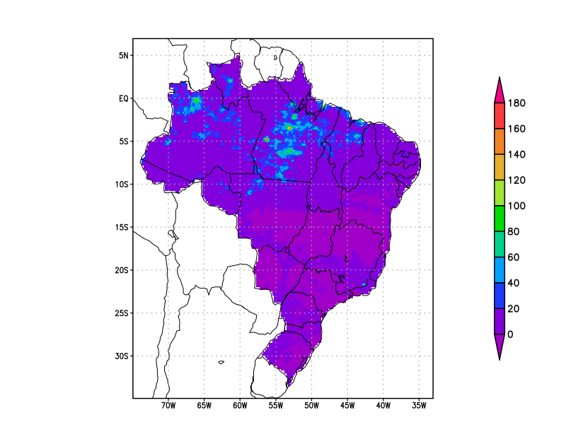
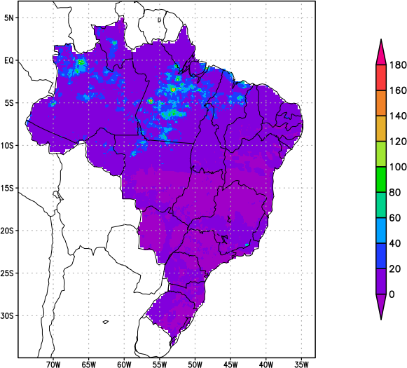
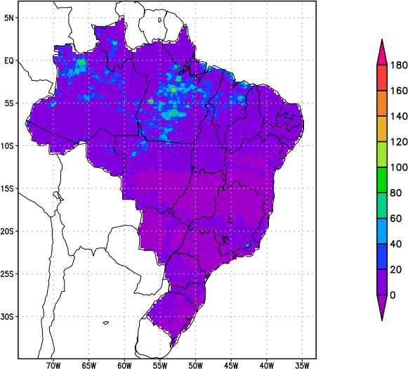
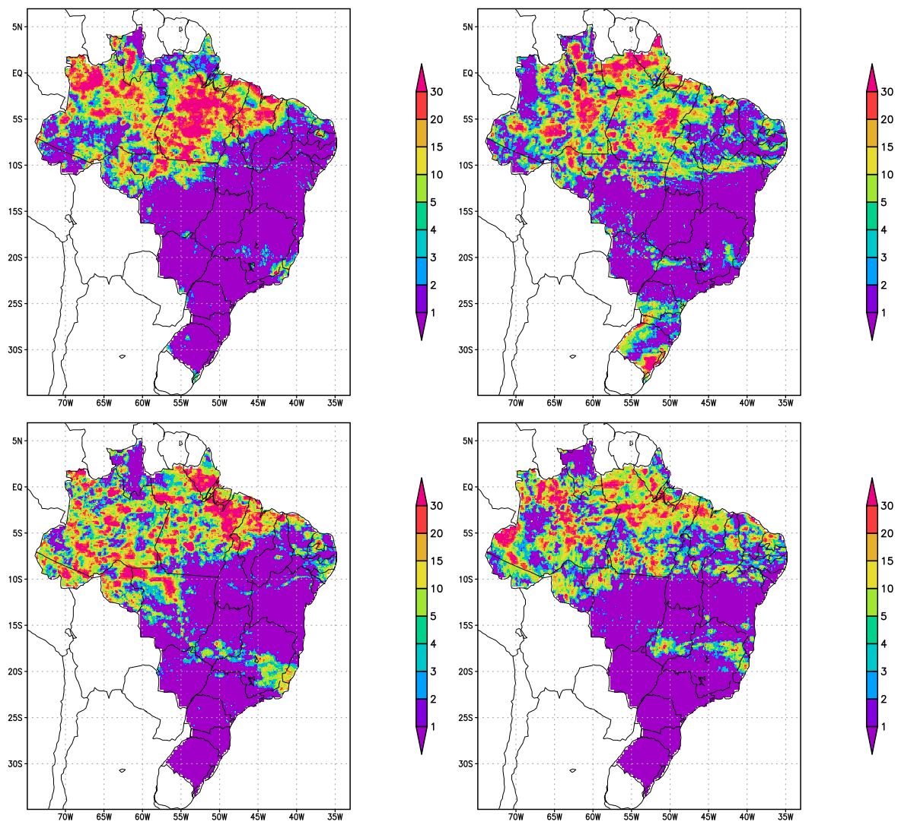

### Imagemagick

O Imagemagick é muito bom para processar imagens.

Link oficial: [https://imagemagick.org/index.php](https://imagemagick.org/index.php)

1 Remover espaços excedentes na figura.

A figura01a.png possui espaços excedentes e o objetivo consiste em removê-los.

Comando a ser utilizado:

`convert -trim fig01a.png fig01b.png`

Resultado:

Os espaços excedentes foram removidos.

Aproveitando a figura01b.png (sem espaços excedentes), é possível deixar o fundo transparente, basta digitar o comando abaixo:
- Apenas o fundo branco ficará transparente (`-transparent white`).

Comando a ser utilizado:

`convert fig01b.png -transparent white fig01c.png`

Resultado:

2 Criando painel de figuras.

São utilizados 4 arquivos separados: `fig01.png`, `fig02.png`, `fig03.png` e `fig04.png`. Após remover os espaços excedentes com o  `trim`, cria-se o painel.
- O `-tile 2x2` diz para gerar 2 linhas por 2 colunas.
- O `-geometry +10+10` representa o espaçamento na direção x e y, respectivamente.

Comando a ser utilizado:

`montage -tile 2x2 -geometry +10+10 fig01.png fig02.png fig03.png fig04.png painel.png`

Outra forma:

`montage -tile 2x2 -geometry +10+10 fig??.png painel.png`

Resultado:

