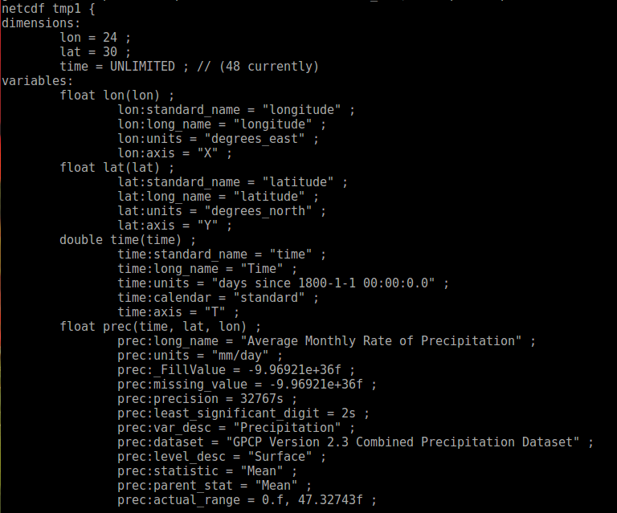
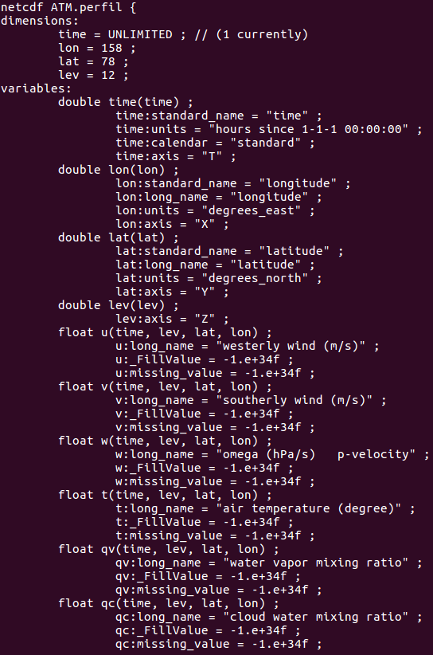
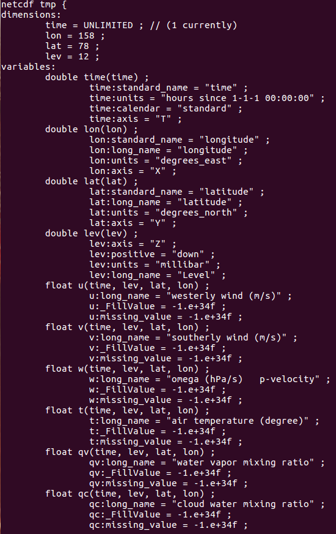
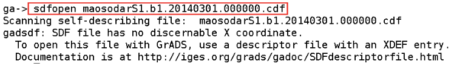
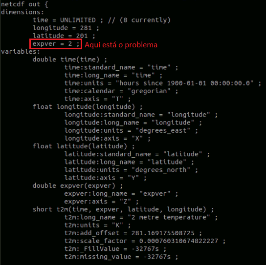
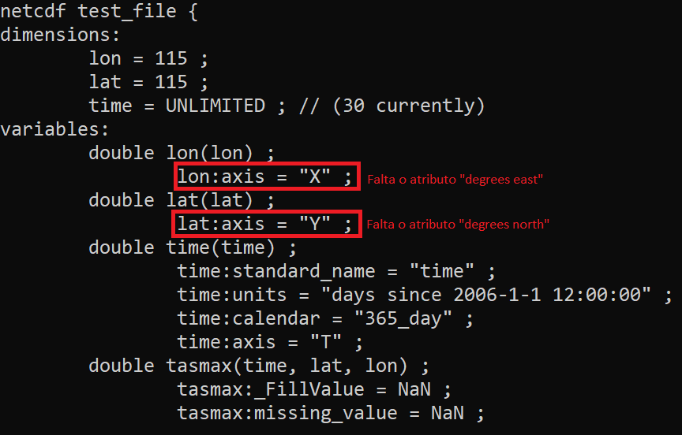
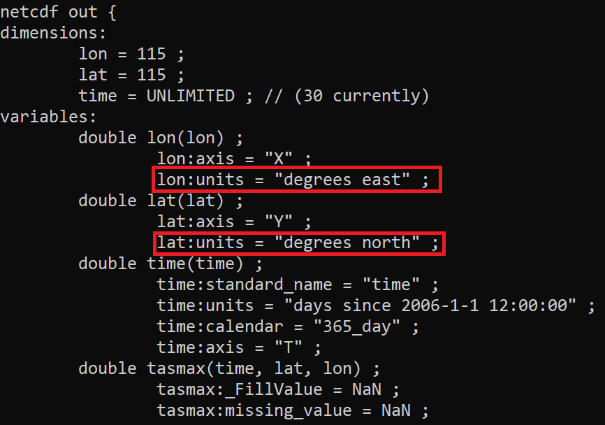

netCDF Operators (NCO)
======================

### Link para o site do NCO

+ [http://nco.sourceforge.net](http://nco.sourceforge.net)


### Instalando o nco

`sudo apt-get install nco`

+ As informações abaixo ou atributos foram obtidas com o comando `ncdump -h arquivo.nc`. O arquivo `arquivo.nc` é um nome fictício. É mostrado abaixo apenas um pequeno trecho da saída desse comando.



### Exemplos de uso com o nco

1 Apagar o atributo `long_name` da variável `precip`. São utilizadas aspas duplas duas vezes.

`ncatted -a long_name,precip,d,c,"" input.nc output.nc`

2 Alterar o nome da variável `precip` para `prec`.

`ncrename -v precip,prec input.nc output.nc`

3 Alterar o nome de uma dimensão (nome que está entre os parênteses na figura acima). Exemplo: alterar o nome da dimensão `lat` para `latitude`.

`ncrename -d lat,latitude input.nc output.nc`

4 Alterar o nome da variável `[-v]` (`latitude` para `lat` e `longitude para `lon`) e sua dimensão `[-d]` (`latitude` para `lat` e `longitude` para `lon`).

`ncrename -v latitude,lat -v longitude,lon -d latitude,lat -d longitude,lon input.nc output.nc`

5 Alterar o nome do atributo `units` da variável `precip` de `mm/day` para `mm dia-1`.

`ncatted -a units,precip,o,c,"mm dia-1" input.nc output.nc`

6 Alterar o calendário da variável `time` para `standard`.

`ncatted -a calendar,time,m,c,"standard" input.nc output.nc`

7 Criar o atributo `missing_value` ou `_FillValue` para a variável `precip`. Caso não adicione a váriável `precip` no comando abaixo, serão criados os valores `missing_value` e `_FillValue` para todas as variáveis do arquivo. O valor `-999` fica a critério de cada um.

`ncatted -O -a _FillValue,precip,o,f,-999 -a missing_value,precip,o,f,-999 input.nc output.nc`
 
8 Reordenar as dimensões da variável `precip` que se encotram na seguinte ordem `precip(time,lat,lon)` para `precip(lat,lon,time)`.

`ncpdq -a lat,lon,time input.nc output.n`

9 Criar vários atributos (`standard_name`, `missing_value`, `_FillValue`,`precip` e `units`) de uma só vez para a variável `precip`.

`ncatted -O -a standard_name,precip,c,c,"Precipitacao" -O -a missing_value,precip,c,f,-999 -O -a _FillValue,precip,c,f,-999 -O -a units,precip,c,c,"mm/day" input.nc output.nc`

10 Apagar a variável e a dimensão `time` do arquivo.

`ncks -C -O -x -v time input.nc output1.nc`

`ncwa -a time output1.nc output2.nc`

11 Criar atributos para a dimensão nível vertical. 

  + Ao tentar visualizar o arquivo ATM.perfil.nc, a distribuição vertical dos níveis é: 100 200 300 400 500 600 700 800 850 900 950 1000. Porém, deseja-se que o primeiro nível vertical seja 1000 hPa e não 100 hPa. Isso ocorre porque está faltando um atributo na variável `lev` que define qual o sentido que o nível vertical deve aumentar ou diminuir. Sabe-se que o nível vertical aumenta em direção a superfície terrestre, portanto, deve-se criar o atributo `positve` com o valor `down` para visualizar de forma correta os níveis verticais.
  
  + A imagem abaixo é o resultado do comando ncdump -h ATM.perfil.nc que é o arquivo original
  
  + Nota-se que a variável `lev` tem apenas o atributo `axis = "Z"`. 


   
  + Serão criados os atributos `positive`, `units` e `long_name` na variável `lev` que terão valores `down`,`millibar` e `Level`, respectivamente. Tudo isso é feito no arquivo `ATM.perfil.nc`, ele não será apagado. O novo arquivo (tmp.nc) terá todas as novas modificações desejadas.

  + Para consertar o arquivo, basta fazer:

`ncatted -O -a positive,lev,c,c,"down" -a units,lev,c,c,"millibar" -a long_name,lev,c,c,"Level"  ATM.perfil.nc tmp.nc`

  + O resultado é mostrado na figura abaixo:

  + A variável `lev` que antes só tinha o atributo `axis = "Z"`, agora possui 3 novos atributos (`positive`, `units` e `long_name`), e o responsável pela correta visualização dos níveis verticais é o atributo `positive = "down"`. Os demais atributos servem para fornecer informações adicionais sobre a variável `lev`.


   
12 Criar a dimensão lat e lon no arquivo para plotar no GrADS.

  + Ao tentar abrir o arquivo maosodarS1.b1.20140301.000000.cdf no GrADS, a mensagem abaixo aparecerá. Esse arquivo é uma série temporal, logo possui apenas um ponto de latitude e um ponto de longitude.
  
  + Esse arquivo está disponível [clicando aqui](https://drive.google.com/open?id=1bNrCZRfvM5C1eALTUI7VsAzkuFd29jJr)


   
  + Para resolver isso, basta usar o comando abaixo. O `ncap2` faz parte do [nco](http://nco.sourceforge.net).

`ncap2 -s 'defdim("lon",1);lon[lon]=-60;lon@units="degrees_east";lon@axis="X";lon@long_name="longitude";defdim("lat",1);lat[lat]=-10;lat@units="degrees_north";lat@axis="Y";lat@long_name="latitude"' maosodarS1.b1.20140301.000000.cdf output.nc`

  + `maosodarS1.b1.20140301.000000.cdf` é o arquivo de entrada e `output.`nc é o arquivo de saída. O `output.nc` é um nome qualquer definido pelo usuário.
  
  + O nome `lon` em `defdim("lon",1)`, define o nome da dimensão a ser criada e o mesmo se aplica em `defdim("lat",1)`. Com isso foram criados os nomes das dimensões `lon` e `lat` no arquivo output.nc.
  
  + Os nomes que têm `"@"` são os atributos criados para essas dimensões.
  
  + O valor 1 em `defdim("lon",1)` representa um ponto de longitude, e o mesmo se aplica em `defdim("lat",1)`, isto é, um ponto de latitude uma vez que esse arquivo é uma série temporal, logo `lon = 1` e `lat = 1`.
  
  + O valor `-60` em `lon[lon]=-60` e `-10` em `lat[lat]=-10` representam um valor qualquer de `lon` e `lat`, respectivamente. Escolha um valor de sua preferência.

  13 Remover os atributos globais.

  `ncatted -h -a history,global,d,, input.nc output.nc`

14 Remover dimensões indesejadas

Ao tentar manipular dados do ERA5 com o CDO em alguns casos surgirão alguns erros. Isso ocorre porque no NetCDF tem uma dimensão chamada `expver` que precisa ser removida. Isso é feito utilizando o nco conforme demonstrado na figura abaixo:



Para remover esta dimensão basta utilizar o comando abaixo:

`ncwa -O -a expver input.nc output.nc`

15 Adicionando atributos as coordenadas latitude e longitude de um arquivo

Quando os atributos `degrees north` e `degrees east` não estão no arquivo e ao tentar realizar alguma manipulação no mesmo, será retornado erro. Um exemplo pode ser visto na figura abaixo. 

As informações do conteúdo do arquivo foram visualizadas com o comando `ncdump -h teste_file.nc`. Nota-se que não há esses atributos, e para resolver isso, basta utilizar o comando abaixo.




Comando para resolver esse problema:

```bash
ncatted -O -a units,lat,o,c,"degrees north" -a units,lon,o,c,"degrees east" test_file.nc output.nc
```

Nota-se que o `output.nc` possui os atributos mencionados anteriormente conforme a figura abaixo. Com isso, é possível manipular adequadamente o seu arquivo.



**Importante:** O nome das coordenadas são `lat` e `lon` por isso foi utilizado esse nome no comando acima. Caso no seu arquivo o nome seja `latitude` e `longitude`, altere para o nome correto. O comando ficaria da seguinte forma:

```bash
ncatted -O -a units,latitude,o,c,"degrees north" -a units,longitude,o,c,"degrees east" test_file.nc output.nc
```

16 Apagar a dimensão time_bnds

```bash
ncks -C -x -v time_bnds input.nc output.nc
```