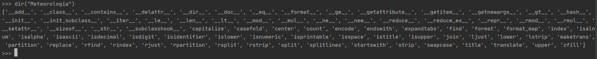
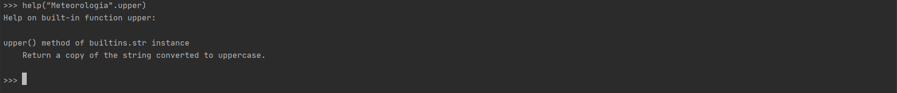

Python
=================================

### Instalando o Python no Windows

[https://www.python.org/downloads/](https://www.python.org/downloads/)

Ao executar o instalador, selecione a opção **Add Python to PATH**.

### Instalando o PyCharm no Windows

o PyCharm é uma IDE (*Integrated Development Environment* ou Ambiente de Desenvolvimento Integrado) que será utilizada para criar os programas em Python.

[https://www.jetbrains.com/pt-br/pycharm/download/#section=windows](https://www.jetbrains.com/pt-br/pycharm/download/#section=windows)

Basta clicar em **Baixar** na sessão **Community**.

Ao instalar o PyCharm, marque em **Create Associations** a opção `.py`.

### Definindo variáveis de ambiente no Windows

Vá para o seu usuário no Windows e digite na barra de endereço:

`C:\Users\jgmsa`

`jmsan` é o nome do meu usuário no Windows.

E digite: `AppData`

`C:\Users\jgmsa\AppData` 

Acesse o diretório:

`C:\Users\jgmsa\AppData\Local\Programs\Python\Python38-32\Scripts`

O `Python38-32 é a versão Python instalada no meu computador.

Apenas copie este caminho, pois ele será utilizado a seguir.

Vá para o painel de controle do Windows:

`Painel de Controle->Sistema e Segurança->Sistema->Configurações Avançadas do Sistema->Variáveis de Ambiente`

Há uma opção chamada `Variáveis do Sistema`, encontre a variável `Path`, clique em `Editar`, depois em `Novo` e cole a linha copiada acima.

Isso foi feito para adicionar os binários do Python a variável `Path`. 

Após fazer isso, clique em `OK` e depois clique em `Novo` para criar uma nova variável de ambiente e digite o nome abaixo:

Nome da variável `WORKON_HOME`
Valor da variável `%USERPROFILE%\Envs`

Basta clicar em `OK` e depois fechar tudo.

### Criando ambientes virtuais

Isto foi feito para criar ambientes virtuais no Python para deixar a instalação padrão do Python intocável, pois é uma prática muito boa em programação trabalhar com ambientais virtuais.

Em seguida, digite no seu terminal:

`pip --version`

Para saber se o pip está sendo reconhecido. Deve aparecer algo assim:

`pip 19.3.1 from /home/martins/.miniconda3/lib/python3.7/site-packages/pip (python 3.7)`

Depois digite os comandos no seu terminal do Windows:

`pip install virtualenv`
`pip install virtualenvwrapper-win`
`mkvirtualenv python`

O nome escolhido foi `python`, mas fica a sua escolha. Todo este processo foi feito para trabalhar com um ambiente virtual utilizando separado da instalação do Python que a forma correta de se trabalhar.

Note que o nome da sua linha de comando passa a se chamar `python` que foi o nome dado ao ambiente virtual.

Para remover um ambiente virtual, basta digitar:

`rmvirtualenv python`

Para sair de um ambiente virtual, basta digitar:

`deactivate`

Para entrar em um ambiente virtual, basta digitar:

`workon python`

A vantagem de fazer tudo isso, consiste em evitar conflitos nos programas Python utilizando versões diferentes, pois este procedimento mantém a mesma versão do Python mesmo que o seu sistema seja atualizado.

Feito todos os passos, agora começa a brincadeira com o PyCharm.

### Iniciando em Python - Um pouco sobre PEP (Python Enhancement Proposals)

Uma boa prática é ler sobre as PEP 8:

[https://www.python.org/dev/peps](https://www.python.org/dev/peps)

A PEP 8 (link abaixo) é um guia de estilo de codificação em Python, ou seja, como escrever um programa de forma adequada:

[https://www.python.org/dev/peps/pep-0008](https://www.python.org/dev/peps/pep-0008)

Exemplos de PEP 8:

- Utilize sempre 4 espaços para identação em vez de TAB. O TAB pode ter configurações diferentes em computadores distintos.
- Utilize sempre letras minúsculas separadas por `_` para funções ou variáveis.
- Utilize sempre duas linhas em branco para separar funções e definições de classe com duas linhas em branco.
- Métodos dentro de uma classe devem separados por uma única linha em branco.
- Imports devem ser feitos em linhas separadas.
  - `import sys`
  - `import os`
- Os imports são sempre declarados no topo do script.

### Iniciando em Python

Utilitários Python (`dir` e `help`) para auxiliar na programação.

`dir`: Apresenta todos os atributos/propriedades e funções/métodos disponíveis
para determinado tipo de dado ou variável.

dir(tipo de dado ou variável)

- Exemplo: Com o Python ativo, digitar no terminal o comando abaixo:

`>>> dir("Meteorologia")`



Ao digitar este comando serão mostradas todas as opções que podem ser utilizadas com o tipo `"Meteorologia"`.

Por exemplo, deseja-se saber o que um determinado comando faz, como no exemplo, para isso, utiliza-se o help.

`>>> "Meteorologia".upper`

`help`: Apresenta a documentação/como utilizar os atributos/propriedades e funções/métodos disponíveis para determinado tipo de dado ou variável.

`>>> help("Meteorologia".upper)`



Será mostrado o que o comando faz.

Ao digitar o comando abaixo:

`>>> "Meteorologia".upper()`


Toda a string foi convertida para o formato maiúsculo.

### Sobre variáveis em Python

Existem dois tipos:

- Váriáveis globais:
    - Variáveis globais são reconhecidas, ou seja, seu escopo compreende todo o programa.
    - Exemplo:
    ```python
    num = 2

    print(num)
    print(type(num))
    ````
- Variáveis locais:
    - Variáveis locais são reconhecidas apenas no bloco onde foram declaradas, ou seja, seu escopo está limitado ao bloco onde foi declarada.
    - Exemplo:
    ```python
    numero = 2

    if numero > 10:
        novo = numero + 10

    print(novo)
    ```
    - Será gerado erro porque a variável `novo` faz parte do contexto da estrutura condicional `if`.

- Para declarar variáveis em Python, utiliza-se:
    - `nome_da_variavel = valor_da_variavel`

O `Python` é uma liguagem de `tipagem dinâmica`. Isso siginifica que ao declarar uma variável, não há necessidade de informar o tipo da variável.

### Estrutura condicional

- Estrutura if:

```python
temperatura = 30

if temperatura < 40:
    print("Temperatura menor que 40 graus Celsius")
```

- Estrutura if-else:

```python
temperatura = 45

if temperatura < 40:
    print("Temperatura menor que 40 graus Celsius") # Sempre utilizar quatro espaços. Caso contrários será retornado erro.
else:
    print("Temperatura maior que 40 graus Celsius") # Sempre utilizar quatro espaços. Caso contrários será retornado erro.
```

- Estrutura if-elif-else:

```python
temperatura = 50

if temperatura < 30:
    print("Temperatura menor que 30 graus Celsius")
elif temperatura == 50:
    print("Temperatura igual a 50 graus Celsius")
else:
    print("Temperatura maior que 30 graus Celsius")
```

É possível utilizar vários `elif` que dependerá da condição.

### Estrutura lógica

- Estruturas lógicas: `and` (e), `or` (ou), `not` (não) e `is` (é).
- Operadores unários, isto é, dependem apenas de um valor:
    - `not`
- Operadores binários:
    - `and`, `or` e `is`
- Regras de funcionamento:
  - Para o `and`, ambos os valores devem ser `True`.
  - Para o `or`, um ou outro valor precisa ser `True`.
  - Para o `not`, o valor do booleano (`True` ou `False`) é invertido, ou seja, se for `True`, vira `False`, e vice-versa.
  - Para o `is`, o valor é comparado com outro valor.

- Exemplo de uso do `and`:

```python
umidade_relativa = 80
temperatura = 20

if umidade_relativa <= 30 and temperatura >= 40:
    print("Condição perigosa")
else:
    print("Condição favorável")
```

- Exemplo de uso do `or`:
```python
umidade_relativa = 80
temperatura = 45

if umidade_relativa <= 30 or temperatura >= 40:
    print("Condição perigosa")
else:
    print("Condição favorável")
```

- Exemplo de uso do `not`:
```python
umidade_relativa = 80

if not umidade_relativa <= 30:
    print("Umidade relativa alta")
else:
    print("Umidade relativa baixa")
```

- Exemplo de uso do `is`:
```python
umidade_relativa = 80

if (umidade_relativa <= 30) is False:
    print("Umidade relativa alta")
else:
    print("Umidade relativa baixa")
```

O trecho `(umidade_relativa <= 30)` é `False`, logo `False is False`? Verdade, por isso, `print("Umidade relativa alta")`

### Estrutura de repetição

#### Loop for

- Loop: É uma estrutura de repetição.
- Utilizamos loops para iterar sobre sequências ou sobre valores iteráveis.
- Loop `for` (para).
- `for`: É uma dessas estruturas.
- Exemplo1:
```python
nome = "Meteorologia"

for letra in nome:
    print(letra)
```

- Exemplo2:
```python
for numero in range(1, 10): # O último número é exclusivo.
    print(numero)
```

#### Loop while

- O bloco do `while` será repetido enquando a `expressão_booleana` for verdadeira. Expressão booleana é toda expressão onde o resultado é `True` (verdadeiro) ou `False` (falso).
- Em um loop while é importante que cuidemos do critério de parada para não causar um loop infinito.

```python
Exemplo1: Compara o valor 10 com o 5.

num = 10
print(num < 5) # False
```

```python
Exemplo2: Imprime os valores de 1 a 9, lembrando que o último valor é exclusivo.

numero = 1

while numero < 10:
    print(numero)
    numero = numero + 1
```

```python
Exemplo3: Enquanto o usuário não digitar sim, o loop será executado.

resposta = ''

while resposta != 'sim':
    resposta = input("Já acabou Jéssica?")
```

#### break

- Utilização do `break` para sair de loops de maneira projetada.
- Exemplo1:
```python
for numero in range(1, 11):
    if numero == 6:
        break
    else:
        print(numero)
print('Sai do loop') # print está fora do bloco for.
```

- Exemplo2:
```python
while True:
    comando = input("Digite 'sair' para sair")
    if comando == 'sair':
        break
```

### Coleções em Python

#### Listas

Listas em Python funcionam como vetores/matrizes (arrays) em outras linguagens, com a diferença de serem dinâmico e também de poder colocar qualquer tipo de dado.

Em Python:
- As listas em Python são representadas por `[]`.
- **Dinâmico**: Não possui tamanho fixo, ou seja, pode-se criar a lista e adicionar elementos a ela;
- **Qualquer tipo de dado**: Não possuem tipo de dado fixo, ou seja, pode-se colocar qualquer tipo de dado.
- **Listas são mutaveis:** elas podem mudar constantemente

Exemplos de listas:

```python
lista1 = [1, 99, 4, 27, 15] # Lista de inteiros.
lista2 = ['M', 'e', 't', 'e', 'o', 'r', 'o', 'l', 'o', 'g', 'i', 'a'] # Lista de strings.
lista3 = [] # Lista vazia.
lista4 = list(range(11)) # Cria uma lista com 10 elementos (0 a 10) do tipo inteiro.
lista5 = list('Meteorologia') # Lista de strings.
```
Aplicações utilizando lista:

- Localizar um número dentro da lista:

```python
Podemos facilmente checar se determinado valor estã contido na lista
lista = list(range(11))
num = 7

if num in lista:
    print(f'Encontrei o numero {num}')
else:
    print(f'Nao encontrei o numero {num}')
```

- Ordenar uma lista:

```python
lista = [1, 99, 4, 27, 15]
lista.sort() # Ordena primeiro.
print(lista)
```

- Contar o número de ocorrências de um valor em uma lista: 

```python
lista = [1, 99, 4, 27, 15]
print(lista.count(1)) # 2 ocorrências para o valor 1.
```

```python
lista = [1, 99, 4, 1, 15]
print(lista.count(1)) # 2 ocorrências para o valor 1.
```

- Adicionar elementos em listas
  - Para adicionar valores em listas, utilizamos a função `append`.

```python
lista = [1, 99, 4, 27, 15]
print(lista)
lista.append(42)
print(lista)
```

- Com append, somente é possível adicionar 1 elemento por vez;

```python
lista = [1, 99, 4, 27, 15]
print(lista)
lista.append([8, 3, 11]) # Coloca a lista dentro de uma lista.
print(lista)
```

- Para verificar se uma lista está dentro de uma lista:

```python
lista = [1, 99, 4, 27, 15, [2, 7, 8]]
if [2, 7, 8] in lista:
    print("Encontrei a lista")
else:
    print("Não encontrei a lista")
```

- Adicionar elementos em uma lista utilizando o `extent`:
  - O valor inserido ficará sempre no fim da lista. 

```python
lista = [1, 99, 4, 27, 15]
lista.extend([123, 44, 67])
print(lista)
```
- Inserir elementos em uma lista informando a posição com o uso do `insert`:
  - Pode-se inserir um novo elemento na lista informando a posição do índice.
  - Insere na posição 2 o valor -999.
  - Isso não substitui o valor inicial. O mesmo será deslocado para a direita da lista.
  - É possível misturar diferentes tipos, isto é, números e strings, por exemplo.

```python
lista = [1, 99, 4, 27, 15] # Índice 0 1 2 3 4
lista.insert(2, -999) # No índice 2, insere o valor -999.
print(lista)
```

```python
lista = [1, 99, 4, 27, 15] # Índice 0 1 2 3 4
lista.insert(3, 'Temperatura') # No índice 3, insere o valor 'Temperatura'.
print(lista)
```

- Juntar duas listas utilizando o `extend`:

```python
lista1 = [1, 99, 4, 27, 15]
lista2 = [2, 6, 7]
lista1.extend(lista2)
print(lista1)
```

- Inverter os valores de uma lista utilizando o `reverse`:
- Forma 1:

```python
lista = [1, 99, 4, 27, 15]
lista.reverse()
print(lista)
```
- Forma 2:
```python
lista = [1, 99, 4, 27, 15]
print(lista[::-1])
```

- Copiar uma lista utilizando o `copy`:

```python
lista = [1, 99, 4, 27, 15]
lista1 = lista.copy()
print(lista1)
```

- Contar o número de elementos de uma lista utilizando o `len`:

```python
lista = [1, 99, 4, 27, 15]
print(len(lista))
```

- Remover e retornar o último elemento de uma lista com a função `pop`:

```python
lista = [1, 99, 4, 27, 15]
print(lista)
lista.pop()
print(lista)
```

- Remover o elemento da lista pelo seu índice:
  - **Observação1**: Os elementos a direita deste índice serão deslocados para esquerda.
  - **Observação2**: Se não houver elemento no índice informado será retornado o erro `IndexError`.

```python
lista = [1, 99, 4, 27, 15] # Índice 0 1 2 3 4
print(lista)
lista.pop(2) # Remove o valor 4 da lista que encontra-se no índice 2.
print(lista)
```

- Remover (limpar) todos os elementos de uma lista utilizando o `clear`:

```python
lista = [1, 99, 4, 27, 15]
print(lista)
lista.clear()
print(lista)
```

- Repetir elementos em uma lista:

```python
lista = [1, 2, 3]
print(lista)
lista = lista * 3 # Repete a lista 3 vezes.
print(lista)
```

- Converter uma string para uma lista utilizando o `split`:
  - **Observação**: Por padrão, o `split` separa os elementos da lista pelo espaço entre elas.

```python
nome = 'Egua moleque'
print(nome)
nome = nome.split()
print(nome) # ['Egua', 'moleque']
```

Outro exemplo utilizando um separador, neste caso, a `,`:

```python
nome = 'Egua, moleque'
print(nome)
nome = nome.split(',') # O separador entre as palavras é a vírgula.
print(nome) # ['Egua', 'moleque']
```

- A partir da lista `nome`, coloca espaço entre cada elemento dela e depois tranforma em uma string utilizando o `join`:

```python
nome = ['Egua', 'moleque']
nome = ' '.join(nome)
print(nome) # Egua, moleque
```

- Adiciona `$` entre cada elemento da lista e tranforma em uma string:

```python
nome = ['Egua', 'moleque']
nome = '$'.join(nome) # Separa os elementos da lista por $.
print(nome) # Egua$moleque
```

- Pode-se colocar qualquer tipo de dado em uma lista, inclusive misturando estes dados:

```python
lista = [1, 2.34, True, 'Tempo', 'd', [1, 2, 3], 4534567]
print(lista)
print(type(lista))
```

- Iterando sobre lista:
- Utilizando o `for`.

```python
# Exemplo: Imprimindo os valores de uma lista.
lista = [1, 2, 3, 4]
for elemento in lista:
    print(elemento)
```

```python
# Exemplo2: Somando elementos de uma lista.
lista = [1, 2, 3, 4]
soma = 0

for elemento in lista:
    print(elemento)
    soma = soma + elemento
print(soma) # 10
```

```python
# Exemplo3: Somando strings.
lista = ['e', 'g', 'u', 'a']
soma = ''
for elemento in lista:
    print(elemento)
    soma = soma + elemento
print(soma)
```

- Utilizando o `while`.

```python
carrinho = []  # Lista vazia que receberá os valores.
produto = ''  # Uma variável do tipo string para armazenar os produtos.

while produto != 'sair':
    print("Adicione um produto na lista ou digite 'sair' para sair: ")
    produto = input()
    if produto != 'sair':
        carrinho.append(produto)

for produto in carrinho:
    print(produto)
```

- Acessar os valores de uma lista de forma indexada:

```python
#           0         1         2        3
cores = ['verde', 'amarelo', 'azul', 'branco']

print(cores[0])   # verde
print(cores[1])   # amarelo
print(cores[2])   # azul
print(cores[3])   # branco
```

- Fazer acesso aos elementos de uma lista de forma indexada inversa:

```python
print(cores[-1])   # branco
print(cores[-2])   # azul
print(cores[-3])   # amarelo
print(cores[-4])   # verde
print(cores[-5])   # IndexError: List index out of range
```

- Gerar índice em um `for` com o `enumerate`:
  - O `enumerate` gera pares chave/valor. Coloca chave no índice e o valor na variavel cor.
 - O resultado do `enumerate` será `[(0, 'verde'), (1, 'amarelo'), (2, 'azul'), (3, 'branco')]`.

```python
# Exemplo de uso.
cores = ['verde', 'amarelo', 'azul', 'branco']

for indice, cor in enumerate(cores):
    print(indice, cor)
```

- Listar aceitam valores repetidos:
  - Algumas coleções não aceitam repetição.

```python
lista = []  # Cria uma lista vazia.
lista.append(42)
lista.append(42)
lista.append(33)
lista.append(33)
lista.append(42)

print(lista)
```

- Encontrar o índice de um elemento na lista utilizando o `ìndex`:

```python
# Caso o valor não esteja na lista será retornado erro (ValueError).
lista = [5, 6, 7, 8, 10]
print(lista.index(6)) # Em qual índice está o valor 6? 1
```

- Retornar o índice do primeiro elemento encontrado:
```python
#  O valor 5 tem duas repetições.
numeros = [5, 6, 7, 5, 8]
print(numeros.index(5)) # 0
```

- Fazer busca dentro de um range, ou seja, qual índice começar a busca:

```python
#          0  1  2  3  4  5
numeros = [5, 6, 7, 5, 8, 9]
print(numeros.index(5, 1))  # Busca o valor 5 na lista a partir do índice 1. Resultado: 3.
print(numeros.index(5, 2))  # Busca o valor 5 na lista a partir do índice 2. Resultado: 3.
print(numeros.index(5, 3))  # Busca o valor 5 na lista a partir do índice 3. Resultado: 3.
print(numeros.index(5, 4))  # Busca o valor 5 na lista a partir do índice 4. Gera erro porque não está na lista => ValueError: 5 is not in list

```

- Pode-se fazer busca dentro de um range (início/fim):

```python
#          0  1  2  3  4  5  6
numeros = [5, 6, 7, 5, 8, 9, 10]
print(numeros.index(8, 3, 6)) # Busca o indice do valor 8 entre os indices 3 e 6. Resultado: 4.
```

- Algumas operações matemáticas:
```python
# Soma*, valor máximo*, valor mínimo*, tamanho
# *Somente se os valores forem inteiros ou reais

lista = [1, 2, 3, 4, 5, 6]

print(sum(lista))
print(max(lista))
print(min(lista))
print(len(lista))  # Qualquer tipo de dado
```

- Transformar lista em tupla:

```python
lista = [1, 2, 3, 4, 5, 6]
print(lista)
print(type(lista))

# Os parênteses caracterizam a tupla.
tupla = tuple(lista)
print(tupla)
print(type(tupla))
```

- Copiando uma lista para outra (Shallow copy e Deep Copy)

   - Forma 1: Deep Copy

```python
lista = [1, 2, 3]
print(lista)  # [1, 2, 3]

nova = lista.copy() # Criando uma nova lista.
print(nova)  # [1, 2, 3]

nova.append(4) # Adiciona o valor 4 a lista nova.

print(lista)  # [1, 2, 3]
print(nova)  # [1, 2, 3, 4]
```
- Ao utilizar `lista.copy()` copia-se os dados da lista para uma nova lista, mas elas ficaram totalmente independentes, ou seja, modificando uma lista, não afeta a outra. Isso em Python é chamado de `Deep Copy` (cópia profunda).

- Forma 2: Shallow Copy

```python
lista = [1, 2, 3]
print(lista)  # [1, 2, 3]

nova = lista  # Cópia de lista para nova.
print(nova)  # [1, 2, 3]

nova.append(4)

print(lista)  # [1, 2, 3, 4]
print(nova)  # [1, 2, 3, 4]
```
- Ao utilizar a cópia via atribuição, copia-se os dados da lista para a nova a lista, mas após realizar a modificação em uma das listas, essa modificação se reflete em ambas as listas. Isso em Python é chamado de `Shallow Copy`.

#### Tuplas

- Tuplas são bastante parecidas com listas.
- Utiliza-se tuplas sempre que não há necessidade de modificar os dados contidos em uma coleção.
- Qual a razão de utilizar tuplas?
  - Tuplas são mais rápidas do que listas.
  - Tuplas deixam o seu código mais seguro, isso porque trabalhar com elementos imutáveis deixa o seu cõdigo mais seguro.
- Existem basicamente duas diferenças básicas:
  - As tuplas são representadas por parênteses ().
  - `As tuplas são imutáveis`. Isso significa que ao se criar uma tupla ela não muda. Toda operação em uma tupla gera uma nova tupla.
  - A indexação em tuplas é a mesma feita em listas.
- Exemplos de tuplas:

```python
tupla1 = (1, 2, 3)
print(type(tupla1))

# É o mesmo que:
tupla1 = 1, 2, 3
```

**Observação**: Tuplas com 1 elemento

```python
tupla1 = (4)  # Isso não é uma tupla.
print(tupla1)
print(type(tupla1))

tupla2 = (4,)  # Isso é uma tupla
print(tupla2)
print(type(tupla2))

tupla3 = 4,  # Isso é uma tupla
print(tupla3)
print(type(tupla3))
```

**Conclusão**: Conclui-se que  tuplas são definidas pela vírgula e não pelo uso do parênteses.

- Podemos gerar uma tupla dinamicamente com `range(início,fim,passo)`:

```python
tupla = tuple(range(4))
print(tupla)  # (0, 1, 2, 3)
print(type(tupla))
```

- Desempacotamento de tupla:

```python
# Gera erro (ValueError) se colocar um número diferente de elementos para desempacotar.
tupla = ('Meteorologia', 'Previsão de tempo')
curso, funcao = tupla
print(curso)
print(funcao)
```

```python
# Concatenação (juntar) de tuplas
tupla1 = (1, 2, 3)
print(tupla1)  # (1, 2, 3)

tupla2 = (4, 5, 6)
print(tupla2)  # (4, 5, 6)

print(tupla1 + tupla2)  # Tuplas são imutáveis.

print(tupla1)
print(tupla2)

tupla3 = tupla1 + tupla2  # Pode-se criar uma nova tupla.

print(tupla3)  # (1, 2, 3, 4, 5, 6)
print(tupla2)
print(tupla1)

# Tuplas são imutáveis, mas pode-se sobrescrever seus valores.
tupla1 = tupla1 + tupla2  # (1, 2, 3, 4, 5, 6)
print(tupla1)
```

- Verificar se determinado elementos estã contido na tupla:
```python 
tupla = (1, 2, 3)
print(3 in tupla)  # True
```

- Iterando sobre uma tupla:

```python
tupla = (1, 2, 3)

for n in tupla:
    print(n)

# Obtendo o índice e valor da tupla.

for indice, valor in enumerate(tupla):
    print(indice, valor)
```

- Contando elementos dentro de uma tupla:
```python
tupla = ('a', 'b', 'c', 'd', 'e', 'a', 'b')
print(tupla.count('a'))  # 2
```

- Converte string para tupla:
```python
curso = tuple('Meteorologia')
print(curso)  # ('M', 'e', 't', 'e', 'o', 'r', 'o', 'l', 'o', 'g', 'i', 'a')
```

### Dicionários

- Em algumas linguagens de progrmação, os dicionários Python são conhecidos por mapas.
- Dicionários são coleções do tipo chave/valor.
- Dicionários são representados por `chaves {}`.
- Sobre dicionários:
    - Chaves e valor são separados por `'chave:valor'`;
    - Tanto chave quanto valor podem ser de qualquer tipo de dado;
    - Pode-se misturar tipos de dados.

- Exemplos:
```python
# Exemplo:
variaveis = {'Temp': '30', 'UR': '80', 'Prec': '10'}
print(variaveis)
print(type(variaveis))  # <class 'dict'>

```

- Acessando as informações utilizando a chave:

```python
# Exemplo: Acessando as informações utilizando a chave.
# Forma 1:
variaveis = {'Temp': '30', 'UR': '80', 'Prec': '10'}
print(variaveis)
print(variaveis['Temp'])
print(variaveis['VV'])  # KeyError: 'VV'

# Acesso via get:
# Forma 2: Acessando via get (Forma Remocomendada).
# Caso o get não encontre o objeto com a chave informada será retornado o valor None e será gerado erro KeyError.
print(variaveis.get('UR'))
print(variaveis.get('VV'))  # None
```

- Pode-se definir um valor padrão para o caso de não encontrar o objeto com a chave informada:

```python
# Exemplo: Pode-se definir um valor padrão para o caso de não encontrar o objeto com a chave informada.
variaveis = {'Temp': '30', 'UR': '80', 'Prec': '10'}
nome = variaveis.get('VV', 'Não encontrado')  # Procurar pelo 'Prec', e caso não ache, retorna 'Não encontrado'
print(f'Valor da variável {nome}')
```

- Pode-se utilizar qualquer tipo de dado (int, float, boolean), inclusive lista, tupla, dicionário com chaves de dicionários.

- Tuplas são bastante interessante de serem utilizadas como chave de dicionários, pois as mesmas são imutáveis.
```python
localidades = {
    (35.6895, 39.6917): 'Escritorio em Tókio',
    (40.7128, 74.0060): 'Escritorio em Nova York',
    (37.7749, 122.4195): 'Escritorio em São Paulo',
}

print(localidades)
print(type(localidades))
```

- Adicionar elementos em um dicionário:

```python
# Exemplo: Adicionar elementos em um dicionário.
receita = {'jan': 100, 'fev': 120, 'mar': 300}
print(receita)
print(type(receita))

# Forma 1: Forma mais comum
receita['abr'] = 350
print(receita)

# Forma 2:
novo_dado = {'maio': 500}
receita.update(novo_dado)
print(receita)
```
- Atualizando dados em um dicionário:

```python
# Atualizando dados em um dicionário
# Forma 1:
receita = {'jan': 100, 'fev': 120, 'mar': 300}
receita['maio'] = 550
print(receita)

# Forma 2
receita.update({'maio': 600})
print(receita)
```

- **Conclusão1:** A forma de adicionar novos elementos ou atualizar dados em um dicionário é a mesma.
- **Conclusão2:** Em dicionário não pode ter chaves repetidas.
- Remover dados de um dicionário:

```python
# Exemplo: Remover dados de um dicionário.
receita = {'jan': 100, 'fev': 120, 'mar': 300}
print(receita)

# Forma 1: Forma mais comum.
ret = receita.pop('mar')
print(ret)
print(receita)
```
- **Observação 1:** É preciso informar sempre a chave, e caso não se encontre o elemento, um KeyError é informado.
- **Observação 2:** Ao remover um objeto, o valor desse objeto é sempre retornado.
- **Observação 3:** O valor removido é retornado.

```python
# Forma 2:
del receita['fev']
print(receita)
del receita['fev']  # Erro => KeyError: 'fev' porque não existe mais na chave
print(receita)
```
- Neste caso o valor removido não é retornado.
- Imagine que você tem comércio eletrônico, onde temos um carrinho de compra onde adicionamos produtos.
- Copiando um dicionário para outro:

```python
# Exemplo: Copiando um dicionário para outro.
# Forma 1: Deep Copy.
d = dict(a=1, b=2, c=3)  # Não usual
novo = d.copy()
print(novo)

novo['d'] = 4
print(d)
print(novo)

# Forma 2 - Shallow Copy
d = dict(a=1, b=2, c=3)  # Não usual
novo = d
print(novo)
novo['d'] = 4
print(d)
print(novo)
```
### Tipo None

- O tipo de dado `None` em Python representa o tipo sem tipo, ou poderia ser conhecido também como tipo vazio, porém falar  que é um tipo sem tipo é mais apropriado.
- O tipo `None` é sempre especificado com a primeira letra maiúscula.
- Quando utilizar `None`?
  - Utiliza-se `None` quando deseja-se criar uma variável e inicializá-la com um tipo sem tipo, antes de receber um valor final.
- O tipo `None` em Python é sempre considerado `False`.

```python
# Exemplo:
numeros = None

print(numeros)
print(type(numeros))

numeros = (1.44, 1.34, 5.67)
print(numeros)
print(type(numeros))
```

### Conjuntos

- Conjuntos em qualquer linguagem de programação, faz referência à Teoria dos Conjuntos da Matemática.
- No Python, os conjuntos são chamados de `Sets`.
- `Sets` (Conjuntos) não possuem valores duplicados.
- `Sets` (Conjuntos) não possuem valores ordenados.
- Os elementos não são acessados via índice, ou seja, conjuntos não são indexados.

Conjuntos são bons para se utilizar quando há necessidade armazenar elementos, porém a sua ordenação não é importante.

Os conjuntos são referenciados em Python com chaves ` {}`.

- Diferença entre Conjuntos (Sets) e Mapas (Dicionários) em Python:
  - Um dicionário tem chave/valor.
  - Um mapa tem apenas valor.

Definindo um conjunto:

```python
# Forma 1:
s = set({1, 2, 3, 2, 2})  # Repare nos valores repetidos.
print(s)  # {1, 2, 3}
print(type(s))  # <class 'set'>
```

Ao criar um conjunto, caso seja adicionado um valor já existente, o mesmo será ignorado sem gerar erro e não fará parte  do conjunto.

```python
# Forma 2: Mais comum.
s = {1, 2, 3, 2, 2}  # Repare nos valores repetidos.
print(s)  # {1, 2, 3}
print(type(s))  # <class 'set'>
```

- Usos interessantes com Sets:
-  Adicionando elementos em um conjunto:

```python
s = {1, 2, 3}
print(s)
s.add(4)
s.add(4)  # Duplicidade não gera erro. Simplesmente, é ignorado e não é adicionado no conjunto.
print(s)
```

- Remover elementos de um conjunto:

```python

s = {1, 2, 3}
print(s)
# Forma 1:
s.remove(3)  # Não é indice (conjuntos não são indexados). Informa-se o valor a ser removido. Nenhum valor é retornado.
print(s)

# Remover um elemento que não está no set.
s.remove(33)  # KeyError: 33

# Caso o valor não seja encontrado será gerado KeyError: 33.

# Forma 2:
s = {1, 2, 3}
print(s)
s.discard(2)
print(s)
s.discard(22)

# Se o valor não for encontrado nenhum erro é gerado.
```

- Métodos matemáticos de Conjuntos:

Imagine que há dois conjuntos: Um contendo estudantes de Python e um outro contendo estudantes do curso de Java.

- Precisa-se gerar um conjunto com nomes de estudantes únicos.

```python
estudantes_python = {'Marcos', 'Patricia', 'Ellen', 'Pedro', 'Julia', 'Guilherme'}
estudantes_java = {'Fernando', 'Gustavo', 'Julia', 'Ana', 'Patricia'}

# Veja que alguns alunos que estudam Python também estudam Java.

# Forma 1: Utilizando union - Mais recomendado.
unicos = estudantes_python.union(estudantes_java)
print(unicos)
```

- Gerar um conjunto de estudantes que estão em ambos os cursos:

```python
estudantes_python = {'Marcos', 'Patricia', 'Ellen', 'Pedro', 'Julia', 'Guilherme'}
estudantes_java = {'Fernando', 'Gustavo', 'Julia', 'Ana', 'Patricia'}

ambos = estudantes_python.intersection(estudantes_java)
print(ambos)
```

- Gerar um conjunto de estudantes que não estão no outro curso:

```python
estudantes_python = {'Marcos', 'Patricia', 'Ellen', 'Pedro', 'Julia', 'Guilherme'}
estudantes_java = {'Fernando', 'Gustavo', 'Julia', 'Ana', 'Patricia'}

so_python = estudantes_python.difference(estudantes_java)
print(so_python)

so_java = estudantes_java.difference(estudantes_python)
print(so_java)
```

### Collections Counter

Recebe um iterável como parâmetro e cria um objeto do tipo `Collections Counter` que é parecido com um dicionário, contendo como chave o elemento da lista  passada como parâmetro e como valor a quantidade de ocorrência desse elemento.

Mais informações sobre `Collections` podem ser obtidas em: [https://docs.python.org/3.8/library/collections.html](https://docs.python.org/3.8/library/collections.html)

- Exemplos de uso de `Counter`:
```python
# Exemplo 1: Utilizando uma lista.
from collections import Counter
lista = [1, 1, 1, 2, 2, 3, 3, 10, 10, 11]
print(lista)
res = Counter(lista)  # <class 'collections.Counter'>
print(type(res))
print(res)  # Counter({1: 3, 2: 2, 3: 2, 10: 2, 11: 1})
```

Para cada elemento da lista, o `Counter` criou uma chave e colocou como valor a quantidade de ocorrências.

```python
# Exemplo 2: Utilizando uma string.
from collections import Counter
print(Counter('Meteorologia'))  # Counter({'o': 3, 'e': 2, 'M': 1, 't': 1, 'r': 1, 'l': 1, 'g': 1, 'i': 1, 'a': 1})
```

Tratando um texto com o `Counter`:

```python
# Exemplo 3: Tratanto um texto.
from collections import Counter
texto = """A Meteorologia é fascinante fascinante demais"""
palavras = texto.split()
print(palavras)
res = Counter(palavras)
print(res)

# Econtrando as duas palavras com mais ocorrência.
print(res.most_common(2))  # [('fascinante', 2), ('A', 1)]
```

### Funções em Python

#### Definindo funções

- Funções são pequenos trechos de código que realizam tarefas específicas.
- Pode ou não receber entrada de dados e retornar uma saída de dados.
- Muito úteis para executar procedimentos similares por repetidas vezes.
- Ao se escrever uma função que realiza várias tarefas dentro dela, e bom fazer uma verificação para que a função seja simplificada.

Em Python, a forma geral de definir uma função é:

```Python
def nome_da_função(parametros_de_entrada):
    bloco_da_função
```

Onde:
`nome_da_função`: Sempre com letras maiúsculas, e se for nome composto, separar por underline (Snake Case).
`parametro_de_entrada`: Opcionais, onde tendo mais de um, deve-se separar por virgula, podendo ser opcionais ou não. 
`bloco_da_função`: Chamado de corpo da função ou implementação, é onde o processamento da função acontece. Neste bloco, pode ter ou não retorno da função.

Para definir uma função, utiliza-se a palavra reservada `def` informando ao Python que está sendo definida uma função. Utiliza-se o dois pontos `:` que é utilizado em Python para definir blocos.

Algumas observações sobre função:

- Dentro da função pode-se utilizar outras funções.
- A função abaixo executa apenas uma tarefa, ou seja, ela imprime `oi`.
- Esta função não recebe nenhum parâmetro de entrada.
- Esta função não retorna nada.

```python
def hello():  # Não tem nenhum parâmetro de entrada.
    print("Égua mano, té doido!")  # Bloco da função.

# Chamada de execução.
hello()  # Égua mano, té doido!
```

Nunca esqueca de utilizar o `()` ao executar uma função.
- Exemplo: 

```python
# Forma errado.
hello
```

```python
# Forma correta.
hello()  # () e junto ao nome da função.
```

#### Funções com retorno

```python
numeros = [1, 2, 3]
ret_pop = numeros.pop()  # O pop remove o último número da lista.
print(f'Retorno de pop: {ret_pop}')  # Retorno de pop: 3
ret_pr = print(numeros)  # [1, 2]
print(f'Retorno de print: {ret_pr}')  # Retorno de print: None
```

- Quando uma função não retorna nenhum valor, o resultado será `None`.
- Funções Python que retornam valores, devem retorná-los com a palavra reservada `return`.
- Não necessariamente cria-se uma variavel para receber o retorno de uma função. Pode-se passar a execução da função para outras funções.

Exemplo:

```python
def quadrado_7():
    return 7*7

# Cria-se uma variável para receber o retorno da função.
ret = quadrado_7()
print(f'Retorno de {ret}')
print(f'Retorno de {quadrado_7()}')  # É o mesmo que a linha de cima.
```

Algumas considerações sobre o `return`.

- O `return` finaliza a função, ou seja, ela sai da execução da função.
- Pode-se em uma função, diferentes `returns`.
- Pode-se em uma função retornanr qualquer tipo de dado, e até mesmo múltiplos valores.

```python
# Exemplo 1: O `return` finaliza a função, ou seja, ela sai da execução da função.
def diz_oi():
    return 'oi!'
    print('Estou sendo executado após o retorno')  # Esta linha nunca será executada.

print(diz_oi())
```

```python
# Exemplo 2: Pode-se em uma função, diferentes `returns`.
def nova_funcao():
    variavel = None
    if variavel:
        return 4
    elif variavel is None:
        return 3.2
    return 'b'

print(nova_funcao())  # 3.2
```

```python
# Exemplo 3: Pode-se em uma função retornanr qualquer tipo de dado, e até mesmo múltiplos valores.
def outra_funcao():
    return 2, 3, 4, 5

print(outra_funcao())  # (2, 3, 4, 5)
print(type(outra_funcao()))  # <class 'tuple'>
```

#### Funções com parâmetro

Funções com parâmetros (de entrada).

- Funções que recebem dados para serem processados dentro da mesma.
- Pensar em um programa qualquer, geralmente tem-se: entrada -> processamdo -> saída.
- Sobre fuções, sabe-se que:
  - Não possuem entrada.
  - Não possuem saída.
  - Possuem entrada, mas não possuem saída.
  - Não possuem entrada, mas possuem saída.
  - Possuem entrada e saída.
- Qual a diferença entre parâmetros e argumentos?
  - `Parametros` são variaveis declaradas na definição de uma função.
  - `Argumentos` são dados passados durante a execução de uma função.

Exemplos:

```python
# Caso o parâmetro (numero) não seja informado, será retornado erro (TypeError), ou seja, ele é obrigatório.
def quadrado(numero):
    return return numero ** 2  # numero elevado ao quadrado.

print(quadrado(5))  # 25
print(quadrado(10))  # 100

# Outra forma de imprimir o valor da função:
ret = quadrado(2)  # Armazena a função em uma variável.
print(ret)
```

Funções podem ter `n` parâmetros de entrada, ou seja, pode-se receber como entrada em uma função quantos parâmetros forem necessários. Eles são separados por vírgula.

```python
def soma(a, b):
    return a + b

print(soma(2, 5))  # 7

# Outro exemplo:

def outra(num1, b, msg):
    return (num1 + b) * msg

print(outra(3, 2, 'Meteorologia '))  # 3 + 2 = 5, e com isso, a palavra (Meteorologia) será repetida 5 vezes.
```
- A ordem dos parâmetros é importante.

```python
def nome_completo(nome, sobrenome):  # Evitar nomes do tipo string1, string2.
    return f'Seu nome completo é {nome} {sobrenome}'

nome = 'Andirobaldo'
sobrenome = 'Curio'

print(nome_completo(nome, sobrenome))  # Seu nome completo é Andirobaldo Curio
```

### Funções com Docstrings

São úteis quando se deseja fornecer informações detalhadas sobre a função e seus parâmetros.
```python
def tk2tc(tk):
    """
    Função que ao fornecer a temperatura em Kelvin, retorna o valor em graus Celsius.
    :param tk: Temperatura em Kelvin.
    :return: Retorna o valor da temperatura em graus Celsius.
    """
    return tk - 273.15

print(tk2tc(300))
help(tk2tc)  # Mostra como a função deve ser utilizada. É o help da função criada.
```

### Como entender o *args?

- O `*args` é um parâmetro como outro qualquer (parâmetro de entrada de uma função). Isso significa que pode ser chamada de qualquer coisa, desde que começe com asterisco.
- Por convenção, a comunidade Python decidiu adotar dessa forma, portando utiliza-se `*args` para definí-lo.
- Mas o que é o `*args`?
  - O parâmetro `*args` é utilizado em uma função, coloca os valores extras informados como entrada em uma tupla. Lembrando que tuplas são imutáveis.

Exemplo:

```python
def soma_numeros(*args):  # Para declarar, utiliza-se *.
    return sum(args)  # Soma todos os elementos.

print(soma_numeros())  # 0
print(soma_numeros(1, 2, 3))  # 6
print(soma_numeros(1, 2, 3, 4))  # 10
```

Outro exemplo, desta vez utiliza-se uma lista:

```python
def soma_numeros(*args):
    return sum(args)

numeros = [1, 2, 3, 4, 5, 6, 7]  # Lista com os valores.

# Gera erro:
print(soma_numeros(numeros))  # TypeError: unsupported operand type(s) for +: 'int' and 'list'

# Para corrigir este erro, utiliza-se o *:
print(soma_numeros(*numeros))  # 28
```

```python
# Pode-se utilizar com tupla:
numeros = (1, 2, 3, 4, 5, 6, 7)  # Tupla com os valores.
print(soma_numeros(*numeros))  # 28

# Pode-se utilizar com Set (cojunto):
numeros = {1, 2, 3, 4, 5, 6, 7}  # Set (conjunto) de valores.
print(soma_numeros(*numeros))  # 28
```

**Importante:** Só não funciona com dicionário porque o mesmo utiliza `chave:valor`.

O asterisco serve para que informe ao Python que está sendo passado como argumento uma coleção de dados (lista, tupla e set). Dessa forma, o Python saberá que precisa desempacotar estes dados.

### Como entender o **kwargs?

Este é só mais um parâmetro, mas diferente do `args` que coloca os valores extras em uma tupla, o `**kwargs` exige que sejam utilizados parâmetros nomeados, e transforma esses parâmetros extras em um dicionario.

Ao utilizar funções nas funções pode-se ter nesta ordem:
- Parâmetros obrigatórios.
- `*args`.
- Parâmetros default (parâmetros não obrigatórios).
- `**kwargs`.

```python
def minha_funcao(idade, nome, *args, solteiro=False, **kwargs):
    print(f'{nome} tem {idade} anos')
    print(args)
    if solteiro:
        print('Solteiro')
    else:
        print('Casado')
    print(kwargs)

minha_funcao(8, 'Julia')  # Apenas parâmetros obrigatórios = 8, 'Julia'.
minha_funcao(18, 'Felicity', 4, 5, 3, solteiro=True)  # Parâmetros obrigatórios = 18, 'Felicity'; *args = 4, 5, 3; alterando o valor de solteiro.
minha_funcao(34, 'Felipe', eu='Nao', voce='Vai')  # Parâmetros obrigatórios = 34, 'Felipe'; **kwargs = eu='Nao', voce='Vai'.
minha_funcao(19, 'Carla', 9, 4, 3, java=False, python=True)  # Parâmetros obrigatórios = 19, 'Carla'; *args = 9, 4, 3; **kwargs = java=False, python=True.
```
Entendendo porque é interessante manter a ordem dos parâmetros na declaração.

Função com a ordem correta dos parâmetros:

```python
def mostra_info(a, b, *args, instrutor='Geek', **kwargs):
    return [a, b, args, instrutos, kwargs]

print(mostra_info(1, 2, 3, sobrenome='University', cargo='Instrutor'))
```
O que está sendo feito?

```python
a = 1
b = 3
args = (3,)
instrutor = 'Geek'
kwargs = {'sobrenome': 'University', 'cargo', 'Instrutor'}
```

Descompactando com `**kwargs`:

```python
def mostra_nome(**kwargs):
    return f"{kwargs['nome']} {kwargs['sobrenome']}"

nomes = {'nome': 'Felicity', 'sobrenome': 'Jones'}

# Forma errada:
print(mostra_nome(nomes))  # TypeError: mostra_nome() takes 0 positional arguments but 1 was given

# Forma correta: Utiliza-se o **.
print(mostra_nome(**nomes))
```

Uma observação sobre dicionários:

```python
def soma_multiplos_numeros(a, b, c):
    print(a + b + c)

dicionario = dict(a=1, b=2, c=3)
soma_multiplos_numeros(**dicionario)  # 6
```

O nome das chaves em um dicionário deve ser os mesmos dos parâmetros da função, se for diferente, será retornado erro.

```python
def soma_multiplos_numeros(a, b, c):
    print(a + b + c)

dicionario = dict(d=1, e=2, f=3)  
soma_multiplos_numeros(**dicionario)  # TypeError: soma_multiplos_numeros() got an unexpected keyword argument 'd'
```

O erro ocorreu porque houve mudança no nome dos parâmetros na variável `dicionario`, o correto é `a, b, c` e não `d, e, f`.

### List Comprehensions

Utilizando `List Comprehension` pode-se gerar novas listas com dados processados a partir de outro iterável.

- Sintaxe da List Comprehension
```python
[dado for dado in iteravel ]
```

Exemplos:

```python
# Exemplo de uso do List Comprehensions:
numeros = [1, 2, 3, 4, 5]
res = [numero * 10 for numero in numeros]
print(res)  # [10, 20, 30, 40, 50]
```

Para enter melhor o que está acontecendo divide-se a a expressão em duas partes:
- A primeira parte: `for numero in numeros`.
- A segunda parte: `numero * 10`.

```python
# Exemplo usando função:
numeros = [1, 2, 3, 4, 5]

def funcao(valor):
    return valor * valor

res = [funcao(numero) for numero in numeros]
print(res)  # [1, 4, 9, 16, 25]
```

```python
# Exemplo utilizando loop:
numeros_dobrados = []  # Lista vazia para armazenar os valores.

for numero in [1, 2, 3, 4, 5]:
    numeros_dobrados.append(numero * 2)  # Armazena o resultado na lista que antes era vazia.

print(numeros_dobrados)  # [2, 4, 6, 8, 10]
```

```python
# Utilizando List Comprehension - Muito melhor que usar loop:
print([numero * 2 for numero in [1, 2, 3, 4, 5]])  # [2, 4, 6, 8, 10]
```

É possível adicionar estruturas condicionais lógicas as `List Comprehensions`.

```python
numeros = [1, 2, 3, 4, 5, 6]

# Qualquer número par, o módulo de 2 é zero, e o zero em Python é False. E o not False é igual a True.
pares = [numero for numero in numeros if not numero % 2]

# Qualquer número ímpar, o módulo de 2 é 1, e 1 em Python é True.
impares = [numero for numero in numeros if numero % 2]

print(pares)  # [2, 4, 6]
print(impares)  # [1, 3, 5]
```

Outro exemplo:

```python
numeros = [1, 2, 3, 4, 5, 6]

res = [numero * 2 if numero % 2 == 0 else numero /2 for numero in numeros]
print(res)  # [0.5, 4, 1.5, 8, 2.5, 12]
```

### Funções lambdas

Conhecidas por expressões Lambdas, ou simplesmente Lambdas, são funções sem nome, ou seja, funções anônimas.

Em funções Python pode-se ter nenhuma ou várias entradas. Em Lambdas ocorre o mesmo.

- Representação genérica da função lambda:
  - `n = lambda: x1, x2, ..., xn: <expressao>`

Exemplos:

```python
amar = lambda: 'Como não amar Python?'

uma = lambda x: 3 * x + 1

duas = lambda x, y: (x * y) ** 0.5

tres = lambda x, y, z: 3 / (1 / x + 1 / y + 1 / z)
```

```python
print(amar())  # Como não amar Python?
print(uma(6))  # 19
print(duas(5, 7))  # 5.916079783099616
print(tres(3, 6, 9))  # 4.909090909090908
```

Outro exemplo:

```python
# Função quadrática
# f(x) = a * x ** 2 + b * x + c

# Definindo uma função
def geradora_funcao_quadratica(a, b, c):
    """Retorna a função quadratica f(x) = a * x ** 2 + b * x + c"""
    return lambda x: a * x ** 2 + b * x + c

# a = 3, b = 1, c = 1 e x = 2.
print(geradora_funcao_quadratica(3, 1, 1)(2))
```

### Fuções integradas 

#### Map

Com o `map` é possível realizar o mapeamento de valores para função.

`Map` (mapeia uma função para um iterável) é uma função que recebe dois parâmetros: o primeiro é a função, o segundo, um iterável, o resultado do map é do tipo `map object`.

Os resultados do `map` são colocados em um `map object` que pode ser convertido para uma lista, tupla, dicionário, depende do interesse do usuário.

Exemplo:

```python
# Forma 1: Usando map.
import math

def area(r):
    return math.pi * (r ** 2)  # Calcula o raio.

raios = [2, 5, 7.1, 0.3, 10, 44]

areas = map(area, raios)  # Pega os valores de cada raio, exemplo, raio = 2 e aplica na função area e retorna o resultado.

print(areas)  # map object
print(type(areas))  # class 'map'
print(list(areas))  # [12.566370614359172, 78.53981633974483, 158.36768566746147, 0.2827433388230814, 314.1592653589793, 6082.12337734984]
```

Outro exemplo:

```python
# Forma 2: Usando map com lambda.
import math

raios = [2, 5, 7.1, 0.3, 10, 44]

print(list(map(lambda r: math.pi * (r ** 2), raios)))  # [12.566370614359172, 78.53981633974483, 158.36768566746147, 0.2827433388230814, 314.1592653589793, 6082.12337734984]
```

**Observação:** Após o uso da função `map()`, depois da primeira utilização do resultado ele zera. Isso é interessante porque limpa a memória da máquina.

Outro exemplo:

```python
# Uma lista contendo tuplas.
cidades = [('Berlim', 29), ('Cairo', 36), ('Buenos Aires', 19), ('Los Angeles', 26), ('Tokio', 27), ('Nova York', 28), ('Londres', 22)]

print(cidades)

# Converter de Celsius para Farenheit:
# f = 9/5 * c + 32

# Usando a função Lambda:

c_para_f = lambda dado: (dado[0], (9/5) * dado[1] + 32)

print(list(map(c_para_f,cidades)))  # A função map (c_para_f) recebe apena um parâmetro, por outro lado, o lambda recebe varios.
```

#### Filter

Serve para filtrar dados de uma determinada coleção.

Assim como a função `map()`, a `filter()` recebe dois parâmetros, sendo uma função e um iterável.

Qual a diferença entre `map()` e `filter()`?

- `map()`: Recebe dois parâmetros, uma função e um iterável e retorna um objeto mapeando a função para cada elemento do iterável.
  - O `map()` retorna outros valores que não sejam booleano. A função será aplicada nos dados e retorna um valor.
- O `filter()` recebe dois parâmetros, uma função e um iterável e retorna um objeto filtrando apenas os elementos de acordo com a função.
  - O `filter()` retorna valore booleanos (True ou False), faz com que o dado seja ou não selecionado.

```python
import statistics  # Biblioteca para trabalhar com dados estatísticos.

# Dados coletados de algum sensor.
dados = [1.3, 2.7, 0.8, 4.1, 4.3, -0.1]

# Calculando a média dos dados utilizando a função mean().
media = statistics.mean(dados)

print(f'Media: {media}')  # Media: 2.183333333333333

res = filter(lambda valor: valor > media, dados)  # valor > media => Gera True ou False, caso True compara com os valores da variável 'dados' e depois manda o resultado numérico para função lambda.

print(type(res))  # <class 'filter'>

print(list(res))  # [2.7, 4.1, 4.3]

print(list(res))  # [] -> Lista Vazia
```

**Observação:** Assim como na função `map()`, após serem utilizados os dados de `filter()`, eles são excluídos da memória.

Se colocar mais um `print`, a lista estará vazia, o valor fica na memória para ser utilizado apenas uma vez.

```python
# Filtrar dados ausentes.
paises = ['', 'Argentina', '', 'Brasil', 'Chile', '', 'Colombia', '', 'Equador', '', '', 'Venezuela']

print(paises)  # ['', 'Argentina', '', 'Brasil', 'Chile', '', 'Colombia', '', 'Equador', '', '', 'Venezuela']
res = filter(None, paises)
print(list(res))  # ['Argentina', 'Brasil', 'Chile', 'Colombia', 'Equador', 'Venezuela']
```

Outra forma de realizar a tarefa acima:

```python
# Filtrar dados ausentes.
paises = ['', 'Argentina', '', 'Brasil', 'Chile', '', 'Colombia', '', 'Equador', '', '', 'Venezuela']

# Forma 1
res = filter(lambda pais: len(pais) > 0, paises)  # A função len() conta os caracteres, no caso das  '', é igual a zero.
print(list(res))

# Forma 2
res = filter(None, paises)  # Este método é melhor.
print(list(res))

# Forma 3
res = filter(lambda pais: pais != '', paises)

print(list(res))
```

Como combinar `filter()` e `map()`?

```python
# Deve-se criar uma lista contendo 'Sua instrutora é' + nome, desde que o nome tenha menos de cinco caracteres.

nomes = ['Vanessa', 'Ana', 'Maria']

lista = list(map(lambda nome: f'Sua instrutora é {nome}', filter(lambda nome: len(nome) < 5, nomes)))

print(lista)  # ['Sua instrutora é Ana']
```

#### All

O `all()` é uma função booleana que retorna `True` se todos os elementos do iterável são verdadeiros ou ainda se o iterável está vazio.

- Um iterável vazio convertido em boolean é `False`, mas o `all()` entende como `True`.

Exemplos:

```python
print(all([0, 1, 2, 3, 4]))  # Todos os números são verdadeitos? False, por que o valor 0 é False.

print(all([1, 2, 3, 4]))  # Todos os números são verdadeitos? True

print(all([]))  # Todos os números são verdadeitos? True.

print(all((0, 1, 2, 3, 4)))  # Todos os números são verdadeitos? False

print(all({0, 1, 2, 3, 4}))  # Todos os números são verdadeitos? False

print(all('Meteorologia'))  # Todos os números são verdadeitos? True
```

Outro exemplo:

```python
# Verifica se a primeira letra começa com 'C'.
# Neste exemplo utiliza também List Comprehensions ([]).
nomes = ['Carlos', 'Camila', 'Carla', 'Cassiano', 'Cristina']

print(all([nome[0] == 'C' for nome in nomes]))
```

#### Any

O `any()` retorna `True` se qualquer elemento do iterável for verdadeiro. Se o iterável estiver vazio, retorna `False`.

Exemplos:

```python
print(any([0, 1, 2, 3, 4]))  # True

print(any([0, False, {}, (), []]))  # False

nomes = ['Carlos', 'Camila', 'Carla', 'Cassiano', 'Cristina', 'Vanessa']

print(any([nome[0] == 'C' for nome in nomes]))  # False

print(any([num for num in [4, 2, 10, 8, 9] if num % 2 ==0]))  # True
```

#### Sorted

Utiliza-se `sorted()` com qualquer iterável. Como o próprio nome diz, `sorted()` serve para ordenar.

O `sorted()` SEMPRE retorna uma lista com os elementos do iterável ordenados.

**Observação:** O `sort()` só funciona com lista, não confundir com o `sorted()`.

Qual a diferença entre `sort()` e `sorted()`?
- O `sort()` modifica a própria lista enquanto que o `sorted()` não modifica a lista, ele retorna uma nova lista com os novos elementos, a lista original se mantém intacta. 

Exemplos:

```python
# Ordenar do menor para o maior.
numeros = [6, 1, 8, 2]  # Pode ser uma tupla numeros = (6, 1, 8, 2)
print(numeros)  # 
print(sorted(numeros))  # [1, 2, 6, 8]
```

Outro exemplo: Adicionando parâmetros ao sorted.
```python
# Ordena do maior para o menor.
numeros = [6, 1, 8, 2]
print(sorted(numeros, reverse=True))  # [8, 6, 2, 1]
```

#### Min e max

O `max()` retorna o maior valor em um iterável ou o maior de dois ou mais elementos. O `min()` faz o contrário de `max()`.

Exemplos:

```python
# Valor máximo de uma lista.
lista = [1, 8, 4, 99, 34, 129]  # Pode usar tupla(), set{}.
print(max(lista))  # 129
```

Outro exemplo:

```python
dicionario = {'a': 1, 'b': 8, 'c': 4, 'd': 99, 'e': 34, 'f': 129}
print(max(dicionario))  # f, ele imprime a chave "f" porque ele ordena pela ordem das letras.

dicionario = {'a': 1, 'b': 8, 'c': 4, 'd': 99, 'e': 34, 'f': 129}
print(max(dicionario.values()))  # Impre pela ordem dos valores que resulta em 129.
```

Imprime o menor valor entre dois números.

```python
print(min(3, 34))  # 3
```

Imprime pela ordem do nome:

```python
nomes = ['Arya', 'Samson', 'Dora', 'Tim', 'Ollivander']

print(max(nomes))  # Tim
print(min(nomes))  # Arya

# Obtém o nome com a maior quantidade de caracteres.
print(max(nomes, key=lambda nome: len(nome)))  # Ollivander
print(min(nomes, key=lambda nome: len(nome)))  # Tim
```

#### len

o `len()` Retorna o tamanho, ou seja, o número de itens de um iterável.

Exemplos:

```python
print(len('Meteorologia'))  # 12 caracteres

print(len([1, 2, 3, 4, 5]))  # Lista: 5 elementos.

print(len((1, 2, 3, 4, 5,)))  # Tupla: 5 elementos.

print(len({1, 2, 3, 4, 5}))  # Set: 5 elementos.

print(len({'a': 1, 'b': 2, 'c': 3, 'd': 4, 'e': 5}))  # Dicionário: 5 elementos.
```

#### abs

O `abs()` retorna o valor positivo de um número inteiro ou real.

Exemplos:

```python
print(abs(-5))  # 5
print(abs(3.14))  # 3.14
print(abs(-3.14))  # 3.14
```

#### sum

O `sum()` recebe como parâmetro um iterável, podendo receber um valor inicial, e retornar a soma dos elementos, incluindo o valor inicial.

O valor inicial default é igual a zero.

Exemplos:

```python
print(sum([1, 2, 3, 4, 5]))  # 15

print(sum([1, 2, 3, 4, 5],5))  # 20

print(sum([3.145, 5.678]))  # 8.823

print(sum((1, 2, 3, 4, 5)))  # Tupla: 15

print(sum({1, 2, 3, 4, 5}))  # Set: 15

print(sum({'a': 1, 'b': 2, 'c': 3, 'd': 4, 'e': 5}.values()))  # Dicionário: 15
```

#### round

O `round()` retorna um número arredondado para n dígito de precisão após a casa decimal. Se a precisão nõa for informada, retorna o inteiro mais próximo da entrada.

Exemplos:

```python
print(round(10.2))  # 10

print(round(10.5))  # 10

print(round(10.6))  # 11

print(round(1.2121212121, 2))  # Uso com duas casa decimais: 1.21

print(round(1.21999999, 2))  # # Uso com duas casa decimais: 1.22

print(round(1.21999999))  # 1
```

#### zip

O `zip()` cria um iterável (Zip Object) que agrega elementos de cada um dos iteráveis passados como entrada em pares.

Exemplos:

```python
lista1 = [1, 2, 3]
lista2 = [4, 5, 6]

zip1 = zip(lista1, lista2)

print(zip1)  # <zip object at 0x007E6B28>
print(type(zip1))  # <class 'zip'>
print(list(zip1))  # [(1, 4), (2, 5), (3, 6)]
```
Outro exemplo:

O `zip()` utiliza como parâmetro o menor tamanho em iterável. Isso significa que se estiver trabalhando com iteráveis de tamanhos diferentes, irá parar quando os elementos do menor iterável acabar.

```python
lista1 = [1, 2, 3]
lista2 = [4, 5, 6]
lista3 = [7, 8, 9, 10, 11]

zip1 = zip(lista1, lista2, lista3)

print(list(zip1))  # [(1, 4, 7), (2, 5, 8), (3, 6, 9)]
```

Pode-se utilizar diferentes iteráveis com o `zip()`.

```python
tupla = (1, 2, 3, 4, 5)
lista = [6, 7, 8, 9, 10]
dicionario = {'a': 11, 'b': 12, 'c': 13, 'd': 14, 'e': 15}

zt = zip(tupla, lista, dicionario.values())

print(list(zt))
```

Lista de tuplas:

```python
dados = [(0, 1), (1, 2), (2, 3), (3, 4), (4, 5)]

# Faz o desempacotamento utilizando o *.
print(list(zip(*dados)))  # [(0, 1, 2, 3, 4), (1, 2, 3, 4, 5)]
```

Exemplos mais complexos:

```python
prova1 = [80, 91, 78]
prova2 = [98, 89, 53]
alunos = ['maria', 'pedro', 'carla']

final = {dado[0]: max(dado[1], dado[2]) for dado in zip(alunos, prova1, prova2)}

print(final)  # {'maria': 98, 'pedro': 91, 'carla': 78}
```

Podemos utilizar o map:

```python
prova1 = [80, 91, 78]
prova2 = [98, 89, 53]
alunos = ['maria', 'pedro', 'carla']

final = zip(alunos, map(lambda nota: max(nota), zip(prova1, prova2)))

print(dict(final))  # {'maria': 98, 'pedro': 91, 'carla': 78}
```

### Mensagens e tratamento de erro em Python

#### Raise

O `raise` não é uma função. É uma palavra reservada assim como o `def` ou qualquer outra em Python.

Para simplificar, pense no `raise` como sendo útil para que possamos criar nossas próprias exceções e mensagens de erro.

O `raise` assim como o `return`, finaliza a função, ou seja, nada após o `raise` será executado.

A forma geral de utilização é:

```python
raise TipoDoErro('Mensagem de erro')

# Onde TipoDoErro é o tipo de erro que se deseja criar.
```

Exemplo:

```python
def colore(texto, cor):
    if type(texto) is not str:
        raise TypeError('texto precisa ser uma string')
    if type(cor) is not str:
        raise TypeError('cor precisa ser uma string')
    print(f'O texo {texto} será impresso na cor {cor}')

colore('Meteorologia', 'verde')  # O texo Meteorologia será impresso na cor verde

colore('Meteorologia', 3)  # TypeError: cor precisa ser uma string
```

A partir do exemplo acima, ficou mais fácil identificar qual dos parâmetros está com problemas por conta do `raise`.

Outro exemplo:

```python
def colore(texto, cor):
    cores = ('verde', 'amarelo', 'azul', 'branco')  # Tupla de cores.
    if type(texto) is not str:
        raise TypeError('texto precisa ser uma string')
    if type(cor) is not str:
        raise TypeError('cor precisa ser uma string')
    if cor not in cores:
        raise ValueError(f'A cor precisa ser uma entre {cores}')
    print(f'O texo {texto} será impresso na cor {cor}')

colore('Geek', 'azul')  # Tudo ok!

colore('Geek', 'preto')  # ValueError: A cor precisa ser uma entre ('verde', 'amarelo', 'azul', 'branco')
```

#### Bloco try/except

Utiliza-se o bloco `try`/`except` para tratar erros que podem ocorrer no código. Previnindo assim que o programa para de funcionar e o usuário receba mensagens de erro inesperadas.

A forma geral é:

```python
try:
    // execução problemática -> tente fazer isso, caso não consiga.
except
    // o que deve ser feito em caso de problema -> faça isso.
```

Exemplo:

```python
# Exemplo 1 - Tratando um erro genérico.
# O erro era:

temp()  # NameError: name 'temp' is not defined

# Solução para o erro acima:
try:
    temp()
except:
    print('Deu algum problema...')
```

O que está sendo feito? Tente executar a função `temp()`, caso você encontre erros, imprima a mensagem de erro.

Outro exemplo:

```python
# Exemplo 2 - Tratando um erro genérico.

try:
    len(5)
except:
    print('Deu algum problema...')
```

Tratar erro de forma genérica não é a melhor forma de tratamento de erro. O ideal é sempre tratar de forma específica.

```python
# Exemplo 3 - Tratando um erro específico.
# O erro é por causa de tentar uma função inexistente, isto é, temp(). O erro gerado é do tipo NameError.

try:
    temp()
except NameError:
    print('Você está usando uma função inexistente')
```

```python
# Exemplo 4 - Tratando um erro específico.

try:
    len(5)  # TypeError: object of type 'int' has no len()
except TypeError:
    print('c usando uma função inexistente')
```

```python
# Exemplo 5 - Tratando um erro específico com detalhes do erro.

try:
    len(5)  # TypeError: object of type 'int' has no len()
except TypeError as err:
    print(f'A aplicação gerou o seguinte erro {err}')  # A aplicação gerou o seguinte erro object of type 'int' has no len()

```

É possível efetuar diversos tratamentos de erro de uma vez.

```python
try:
    temp()
except NameError as erra:
    print(f'Deu NameError: {erra}')  # Este foi o bloco executado. Os demais não serão executados.
except TypeError as errb:
    print(f'Deu TypeError: {errb}')
except:
    print('Deu um erro diferente')
```

#### Bloco try/except/else/finally

Este bloco deve ser utilizado em toda entrada do usuário.

O `else` será executado somente se não ocorrer o erro.

O uso de `else` e `finally` não é comum.

O bloco `finally` é sempre executado. Independente se houve exceção ou não. O `finally`, geralmente, é utilizado para fechar ou desalocar recursos.

Exemplo:

```python
try:
    num = int(input('Informe um número'))  # num = 7
except ValueError:
    print('Valor incorreto')
else:
    # O else somente será executado se o erro não existir.
    print(f'Você digitou {num}')  # Você digitou 7
```

Exemplo mais complexo. Você responsável pela entrada das suas funções, então, trate-as!

```python
def dividir(a, b):
    try:
        return int(a) / int(b)
    except ValueError:
        return 'Valor incorreto'
    except ZeroDivisionError:
        return 'Não é possível realizar divisão por zero'

num1 = input('Informe o primeito número: ')
num2 = input('Informe o segundo número: ')

print(dividir(num1, num2))
```
