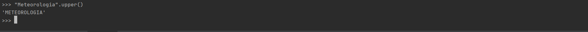

Python
=================================

### Instalando o Python no Windows

[https://www.python.org/downloads/](https://www.python.org/downloads/)

Ao executar o instalador, selecione a opção **Add Python to PATH**.

### Instalando o PyCharm no Windows

o PyCharm é uma IDE (*Integrated Development Environment* ou Ambiente de Desenvolvimento Integrado) que será utilizada para criar os programas em Python.

[https://www.jetbrains.com/pt-br/pycharm/download/#section=windows](https://www.jetbrains.com/pt-br/pycharm/download/#section=windows)

Basta clicar em **Baixar** na sessão **Community**.

Ao instalar o PyCharm, marque em **Create Associations** a opção `.py`.

### Definindo variáveis de ambiente no Windows

Vá para o seu usuário no Windows e digite na barra de endereço:

`C:\Users\jgmsa`

`jmsan` é o nome do meu usuário no Windows.

E digite: `AppData`

`C:\Users\jgmsa\AppData` 

Acesse o diretório:

`C:\Users\jgmsa\AppData\Local\Programs\Python\Python38-32\Scripts`

O `Python38-32 é a versão Python instalada no meu computador.

Apenas copie este caminho, pois ele será utilizado a seguir.

Vá para o painel de controle do Windows:

`Painel de Controle->Sistema e Segurança->Sistema->Configurações Avançadas do Sistema->Variáveis de Ambiente`

Há uma opção chamada `Variáveis do Sistema`, encontre a variável `Path`, clique em `Editar`, depois em `Novo` e cole a linha copiada acima.

Isso foi feito para adicionar os binários do Python a variável `Path`. 

Após fazer isso, clique em `OK` e depois clique em `Novo` para criar uma nova variável de ambiente e digite o nome abaixo:

Nome da variável `WORKON_HOME`
Valor da variável `%USERPROFILE%\Envs`

Basta clicar em `OK` e depois fechar tudo.

### Criando ambientes virtuais

Isto foi feito para criar ambientes virtuais no Python para deixar a instalação padrão do Python intocável, pois é uma prática muito boa em programação trabalhar com ambientais virtuais.

Em seguida, digite no seu terminal:

`pip --version`

Para saber se o pip está sendo reconhecido. Deve aparecer algo assim:

`pip 19.3.1 from /home/martins/.miniconda3/lib/python3.7/site-packages/pip (python 3.7)`

Depois digite os comandos no seu terminal do Windows:

`pip install virtualenv`
`pip install virtualenvwrapper-win`
`mkvirtualenv python`

O nome escolhido foi `python`, mas fica a sua escolha. Todo este processo foi feito para trabalhar com um ambiente virtual utilizando separado da instalação do Python que a forma correta de se trabalhar.

Note que o nome da sua linha de comando passa a se chamar `python` que foi o nome dado ao ambiente virtual.

Para remover um ambiente virtual, basta digitar:

`rmvirtualenv python`

Para sair de um ambiente virtual, basta digitar:

`deactivate`

Para entrar em um ambiente virtual, basta digitar:

`workon python`

A vantagem de fazer tudo isso, consiste em evitar conflitos nos programas Python utilizando versões diferentes, pois este procedimento mantém a mesma versão do Python mesmo que o seu sistema seja atualizado.

Feito todos os passos, agora começa a brincadeira com o PyCharm.

### Iniciando em Python - Um pouco sobre PEP (Python Enhancement Proposals)

Uma boa prática é ler sobre as PEP 8:

[https://www.python.org/dev/peps](https://www.python.org/dev/peps)

A PEP 8 (link abaixo) é um guia de estilo de codificação em Python, ou seja, como escrever um programa de forma adequada:

[https://www.python.org/dev/peps/pep-0008](https://www.python.org/dev/peps/pep-0008)

Exemplos de PEP 8:

- Utilize sempre 4 espaços para identação em vez de TAB. O TAB pode ter configurações diferentes em computadores distintos.
- Utilize sempre letras minúsculas separadas por `_` para funções ou variáveis.
- Utilize sempre duas linhas em branco para separar funções e definições de classe com duas linhas em branco.
- Métodos dentro de uma classe devem separados por uma única linha em branco.
- Imports devem ser feitos em linhas separadas.
  - `import sys`
  - `import os`
- Os imports são sempre declarados no topo do script.

### Iniciando em Python

Utilitários Python (`dir` e `help`) para auxiliar na programação.

`dir`: Apresenta todos os atributos/propriedades e funções/métodos disponíveis
para determinado tipo de dado ou variável.

dir(tipo de dado ou variável)

- Exemplo: Com o Python ativo, digitar no terminal o comando abaixo:

`>>> dir("Meteorologia")`


Ao digitar este comando serão mostradas todas as opções que podem ser utilizadas com o tipo `"Meteorologia"`.

Por exemplo, deseja-se saber o que um determinado comando faz, como no exemplo, para isso, utiliza-se o help.

`>>> "Meteorologia".upper`

`help`: Apresenta a documentação/como utilizar os atributos/propriedades e funções/métodos disponíveis para determinado tipo de dado ou variável.

`>>> help("Meteorologia".upper)`


Será mostrado o que o comando faz.

Ao digitar o comando abaixo:

`>>> "Meteorologia".upper()`



Toda a string foi convertida para o formato maiúsculo.

### Sobre variáveis em Python

Existem dois tipos:

- Váriáveis globais:
    - Variáveis globais são reconhecidas, ou seja, seu escopo compreende todo o programa.
    - Exemplo:
    ```python
    num = 2

    print(num)
    print(type(num))
    ````
- Variáveis locais:
    - Variáveis locais são reconhecidas apenas no bloco onde foram declaradas, ou seja, seu escopo está limitado ao bloco onde foi declarada.
    - Exemplo:
    ```python
    numero = 2

    if numero > 10:
        novo = numero + 10

    print(novo)
    ```
    - Será gerado erro porque a variável `novo` faz parte do contexto da estrutura condicional `if`.

- Para declarar variáveis em Python, utiliza-se:
    - `nome_da_variavel = valor_da_variavel`

O `Python` é uma liguagem de `tipagem dinâmica`. Isso siginifica que ao declarar uma variável, não há necessidade de informar o tipo da variável.

### Estrutura condicional

- Estrutura if:

```python
temperatura = 30

if temperatura < 40:
    print("Temperatura menor que 40 graus Celsius")
```

- Estrutura if-else:

```python
temperatura = 45

if temperatura < 40:
    print("Temperatura menor que 40 graus Celsius") # Sempre utilizar quatro espaços. Caso contrários será retornado erro.
else:
    print("Temperatura maior que 40 graus Celsius") # Sempre utilizar quatro espaços. Caso contrários será retornado erro.
```

- Estrutura if-elif-else:

```python
temperatura = 50

if temperatura < 30:
    print("Temperatura menor que 30 graus Celsius")
elif temperatura == 50:
    print("Temperatura igual a 50 graus Celsius")
else:
    print("Temperatura maior que 30 graus Celsius")
```

É possível utilizar vários `elif` que dependerá da condição.

### Estrutura lógica

- Estruturas lógicas: `and` (e), `or` (ou), `not` (não) e `is` (é).
- Operadores unários, isto é, dependem apenas de um valor:
    - `not`
- Operadores binários:
    - `and`, `or` e `is`
- Regras de funcionamento:
  - Para o `and`, ambos os valores devem ser `True`.
  - Para o `or`, um ou outro valor precisa ser `True`.
  - Para o `not`, o valor do booleano (`True` ou `False`) é invertido, ou seja, se for `True`, vira `False`, e vice-versa.
  - Para o `is`, o valor é comparado com outro valor.

- Exemplo de uso do `and`:

```python
umidade_relativa = 80
temperatura = 20

if umidade_relativa <= 30 and temperatura >= 40:
    print("Condição perigosa")
else:
    print("Condição favorável")
```

- Exemplo de uso do `or`:
```python
umidade_relativa = 80
temperatura = 45

if umidade_relativa <= 30 or temperatura >= 40:
    print("Condição perigosa")
else:
    print("Condição favorável")
```

- Exemplo de uso do `not`:
```python
umidade_relativa = 80

if not umidade_relativa <= 30:
    print("Umidade relativa alta")
else:
    print("Umidade relativa baixa")
```

- Exemplo de uso do `is`:
```python
umidade_relativa = 80

if (umidade_relativa <= 30) is False:
    print("Umidade relativa alta")
else:
    print("Umidade relativa baixa")
```

O trecho `(umidade_relativa <= 30)` é `False`, logo `False is False`? Verdade, por isso, `print("Umidade relativa alta")`

### Estrutura de repetição

#### Loop for

- Loop: É uma estrutura de repetição.
- Utilizamos loops para iterar sobre sequências ou sobre valores iteráveis.
- Loop `for` (para).
- `for`: É uma dessas estruturas.
- Exemplo1:
```python
nome = "Meteorologia"

for letra in nome:
    print(letra)
```

- Exemplo2:
```python
for numero in range(1, 10): # O último número é exclusivo.
    print(numero)
```

#### Loop while

- O bloco do `while` será repetido enquando a `expressão_booleana` for verdadeira. Expressão booleana é toda expressão onde o resultado é `True` (verdadeiro) ou `False` (falso).
- Em um loop while é importante que cuidemos do critério de parada para não causar um loop infinito.

```python
Exemplo1: Compara o valor 10 com o 5.

num = 10
print(num < 5) # False
```

```python
Exemplo2: Imprime os valores de 1 a 9, lembrando que o último valor é exclusivo.

numero = 1

while numero < 10:
    print(numero)
    numero = numero + 1
```

```python
Exemplo3: Enquanto o usuário não digitar sim, o loop será executado.

resposta = ''

while resposta != 'sim':
    resposta = input("Já acabou Jéssica?")
```

#### break

- Utilização do `break` para sair de loops de maneira projetada.
- Exemplo1:
```python
for numero in range(1, 11):
    if numero == 6:
        break
    else:
        print(numero)
print('Sai do loop') # print está fora do bloco for.
```

- Exemplo2:
```python
while True:
    comando = input("Digite 'sair' para sair")
    if comando == 'sair':
        break
```

### Coleções em Python

#### Listas

Listas em Python funcionam como vetores/matrizes (arrays) em outras linguagens, com a diferença de serem dinâmico e também de poder colocar qualquer tipo de dado.

Em Python:
- As listas em Python são representadas por `[]`.
- **Dinâmico**: Não possui tamanho fixo, ou seja, pode-se criar a lista e adicionar elementos a ela;
- **Qualquer tipo de dado**: Não possuem tipo de dado fixo, ou seja, pode-se colocar qualquer tipo de dado.
- **Listas são mutaveis:** elas podem mudar constantemente

Exemplos de listas:

```python
lista1 = [1, 99, 4, 27, 15] # Lista de inteiros.
lista2 = ['M', 'e', 't', 'e', 'o', 'r', 'o', 'l', 'o', 'g', 'i', 'a'] # Lista de strings.
lista3 = [] # Lista vazia.
lista4 = list(range(11)) # Cria uma lista com 10 elementos (0 a 10) do tipo inteiro.
lista5 = list('Meteorologia') # Lista de strings.
```
Aplicações utilizando lista:

- Localizar um número dentro da lista:

```python
Podemos facilmente checar se determinado valor estã contido na lista
lista = list(range(11))
num = 7

if num in lista:
    print(f'Encontrei o numero {num}')
else:
    print(f'Nao encontrei o numero {num}')
```

- Ordenar uma lista:

```python
lista = [1, 99, 4, 27, 15]
lista.sort() # Ordena primeiro.
print(lista)
```

- Contar o número de ocorrências de um valor em uma lista: 

```python
lista = [1, 99, 4, 27, 15]
print(lista.count(1)) # 2 ocorrências para o valor 1.
```

```python
lista = [1, 99, 4, 1, 15]
print(lista.count(1)) # 2 ocorrências para o valor 1.
```

- Adicionar elementos em listas
  - Para adicionar valores em listas, utilizamos a função `append`.

```python
lista = [1, 99, 4, 27, 15]
print(lista)
lista.append(42)
print(lista)
```

- Com append, somente é possível adicionar 1 elemento por vez;

```python
lista = [1, 99, 4, 27, 15]
print(lista)
lista.append([8, 3, 11]) # Coloca a lista dentro de uma lista.
print(lista)
```

- Para verificar se uma lista está dentro de uma lista:

```python
lista = [1, 99, 4, 27, 15, [2, 7, 8]]
if [2, 7, 8] in lista:
    print("Encontrei a lista")
else:
    print("Não encontrei a lista")
```

- Adicionar elementos em uma lista utilizando o `extent`:
  - O valor inserido ficará sempre no fim da lista. 

```python
lista = [1, 99, 4, 27, 15]
lista.extend([123, 44, 67])
print(lista)
```
- Inserir elementos em uma lista informando a posição com o uso do `insert`:
  - Pode-se inserir um novo elemento na lista informando a posição do índice.
  - Insere na posição 2 o valor -999.
  - Isso não substitui o valor inicial. O mesmo será deslocado para a direita da lista.
  - É possível misturar diferentes tipos, isto é, números e strings, por exemplo.

```python
lista = [1, 99, 4, 27, 15] # Índice 0 1 2 3 4
lista.insert(2, -999) # No índice 2, insere o valor -999.
print(lista)
```

```python
lista = [1, 99, 4, 27, 15] # Índice 0 1 2 3 4
lista.insert(3, 'Temperatura') # No índice 3, insere o valor 'Temperatura'.
print(lista)
```

- Juntar duas listas utilizando o `extend`:

```python
lista1 = [1, 99, 4, 27, 15]
lista2 = [2, 6, 7]
lista1.extend(lista2)
print(lista1)
```

- Inverter os valores de uma lista utilizando o `reverse`:
- Forma 1:

```python
lista = [1, 99, 4, 27, 15]
lista.reverse()
print(lista)
```
- Forma 2:
```python
lista = [1, 99, 4, 27, 15]
print(lista[::-1])
```

- Copiar uma lista utilizando o `copy`:

```python
lista = [1, 99, 4, 27, 15]
lista1 = lista.copy()
print(lista1)
```

- Contar o número de elementos de uma lista utilizando o `len`:

```python
lista = [1, 99, 4, 27, 15]
print(len(lista))
```

- Remover e retornar o último elemento de uma lista com a função `pop`:

```python
lista = [1, 99, 4, 27, 15]
print(lista)
lista.pop()
print(lista)
```

- Remover o elemento da lista pelo seu índice:
  - **Observação1**: Os elementos a direita deste índice serão deslocados para esquerda.
  - **Observação2**: Se não houver elemento no índice informado será retornado o erro `IndexError`.

```python
lista = [1, 99, 4, 27, 15] # Índice 0 1 2 3 4
print(lista)
lista.pop(2) # Remove o valor 4 da lista que encontra-se no índice 2.
print(lista)
```

- Remover (limpar) todos os elementos de uma lista utilizando o `clear`:

```python
lista = [1, 99, 4, 27, 15]
print(lista)
lista.clear()
print(lista)
```

- Repetir elementos em uma lista:

```python
lista = [1, 2, 3]
print(lista)
lista = lista * 3 # Repete a lista 3 vezes.
print(lista)
```

- Converter uma string para uma lista utilizando o `split`:
  - **Observação**: Por padrão, o `split` separa os elementos da lista pelo espaço entre elas.

```python
nome = 'Egua moleque'
print(nome)
nome = nome.split()
print(nome) # ['Egua', 'moleque']
```

Outro exemplo utilizando um separador, neste caso, a `,`:

```python
nome = 'Egua, moleque'
print(nome)
nome = nome.split(',') # O separador entre as palavras é a vírgula.
print(nome) # ['Egua', 'moleque']
```

- A partir da lista `nome`, coloca espaço entre cada elemento dela e depois tranforma em uma string utilizando o `join`:

```python
nome = ['Egua', 'moleque']
nome = ' '.join(nome)
print(nome) # Egua, moleque
```

- Adiciona `$` entre cada elemento da lista e tranforma em uma string:

```python
nome = ['Egua', 'moleque']
nome = '$'.join(nome) # Separa os elementos da lista por $.
print(nome) # Egua$moleque
```

- Pode-se colocar qualquer tipo de dado em uma lista, inclusive misturando estes dados:

```python
lista = [1, 2.34, True, 'Tempo', 'd', [1, 2, 3], 4534567]
print(lista)
print(type(lista))
```

- Iterando sobre lista:
- Utilizando o `for`.

```python
# Exemplo: Imprimindo os valores de uma lista.
lista = [1, 2, 3, 4]
for elemento in lista:
    print(elemento)
```

```python
# Exemplo2: Somando elementos de uma lista.
lista = [1, 2, 3, 4]
soma = 0

for elemento in lista:
    print(elemento)
    soma = soma + elemento
print(soma) # 10
```

```python
# Exemplo3: Somando strings.
lista = ['e', 'g', 'u', 'a']
soma = ''
for elemento in lista:
    print(elemento)
    soma = soma + elemento
print(soma)
```

- Utilizando o `while`.

```python
carrinho = []  # Lista vazia que receberá os valores.
produto = ''  # Uma variável do tipo string para armazenar os produtos.

while produto != 'sair':
    print("Adicione um produto na lista ou digite 'sair' para sair: ")
    produto = input()
    if produto != 'sair':
        carrinho.append(produto)

for produto in carrinho:
    print(produto)
```

- Acessar os valores de uma lista de forma indexada:

```python
#           0         1         2        3
cores = ['verde', 'amarelo', 'azul', 'branco']

print(cores[0])   # verde
print(cores[1])   # amarelo
print(cores[2])   # azul
print(cores[3])   # branco
```

- Fazer acesso aos elementos de uma lista de forma indexada inversa:

```python
print(cores[-1])   # branco
print(cores[-2])   # azul
print(cores[-3])   # amarelo
print(cores[-4])   # verde
print(cores[-5])   # IndexError: List index out of range
```

- Gerar índice em um `for` com o `enumerate`:
  - O `enumerate` gera pares chave/valor. Coloca chave no índice e o valor na variavel cor.
 - O resultado do `enumerate` será `[(0, 'verde'), (1, 'amarelo'), (2, 'azul'), (3, 'branco')]`.

```python
# Exemplo de uso.
cores = ['verde', 'amarelo', 'azul', 'branco']

for indice, cor in enumerate(cores):
    print(indice, cor)
```

- Listar aceitam valores repetidos:
  - Algumas coleções não aceitam repetição.

```python
lista = []  # Cria uma lista vazia.
lista.append(42)
lista.append(42)
lista.append(33)
lista.append(33)
lista.append(42)

print(lista)
```

- Encontrar o índice de um elemento na lista utilizando o `ìndex`:

```python
# Caso o valor não esteja na lista será retornado erro (ValueError).
lista = [5, 6, 7, 8, 10]
print(lista.index(6)) # Em qual índice está o valor 6? 1
```

- Retornar o índice do primeiro elemento encontrado:
```python
#  O valor 5 tem duas repetições.
numeros = [5, 6, 7, 5, 8]
print(numeros.index(5)) # 0
```

- Fazer busca dentro de um range, ou seja, qual índice começar a busca:

```python
#          0  1  2  3  4  5
numeros = [5, 6, 7, 5, 8, 9]
print(numeros.index(5, 1))  # Busca o valor 5 na lista a partir do índice 1. Resultado: 3.
print(numeros.index(5, 2))  # Busca o valor 5 na lista a partir do índice 2. Resultado: 3.
print(numeros.index(5, 3))  # Busca o valor 5 na lista a partir do índice 3. Resultado: 3.
print(numeros.index(5, 4))  # Busca o valor 5 na lista a partir do índice 4. Gera erro porque não está na lista => ValueError: 5 is not in list

```

- Pode-se fazer busca dentro de um range (início/fim):

```python
#          0  1  2  3  4  5  6
numeros = [5, 6, 7, 5, 8, 9, 10]
print(numeros.index(8, 3, 6)) # Busca o indice do valor 8 entre os indices 3 e 6. Resultado: 4.
```

- Algumas operações matemáticas:
```python
# Soma*, valor máximo*, valor mínimo*, tamanho
# *Somente se os valores forem inteiros ou reais

lista = [1, 2, 3, 4, 5, 6]

print(sum(lista))
print(max(lista))
print(min(lista))
print(len(lista))  # Qualquer tipo de dado
```

- Transformar lista em tupla:

```python
lista = [1, 2, 3, 4, 5, 6]
print(lista)
print(type(lista))

# Os parênteses caracterizam a tupla.
tupla = tuple(lista)
print(tupla)
print(type(tupla))
```

- Copiando uma lista para outra (Shallow copy e Deep Copy)

   - Forma 1: Deep Copy

```python
lista = [1, 2, 3]
print(lista)  # [1, 2, 3]

nova = lista.copy() # Criando uma nova lista.
print(nova)  # [1, 2, 3]

nova.append(4) # Adiciona o valor 4 a lista nova.

print(lista)  # [1, 2, 3]
print(nova)  # [1, 2, 3, 4]
```
- Ao utilizar `lista.copy()` copia-se os dados da lista para uma nova lista, mas elas ficaram totalmente independentes, ou seja, modificando uma lista, não afeta a outra. Isso em Python é chamado de `Deep Copy` (cópia profunda).

- Forma 2: Shallow Copy

```python
lista = [1, 2, 3]
print(lista)  # [1, 2, 3]

nova = lista  # Cópia de lista para nova.
print(nova)  # [1, 2, 3]

nova.append(4)

print(lista)  # [1, 2, 3, 4]
print(nova)  # [1, 2, 3, 4]
```
- Ao utilizar a cópia via atribuição, copia-se os dados da lista para a nova a lista, mas após realizar a modificação em uma das listas, essa modificação se reflete em ambas as listas. Isso em Python é chamado de `Shallow Copy`.

#### Tuplas

- Tuplas são bastante parecidas com listas.
- Utiliza-se tuplas sempre que não há necessidade de modificar os dados contidos em uma coleção.
- Qual a razão de utilizar tuplas?
  - Tuplas são mais rápidas do que listas.
  - Tuplas deixam o seu código mais seguro, isso porque trabalhar com elementos imutáveis deixa o seu cõdigo mais seguro.
- Existem basicamente duas diferenças básicas:
  - As tuplas são representadas por parênteses ().
  - `As tuplas são imutáveis`. Isso significa que ao se criar uma tupla ela não muda. Toda operação em uma tupla gera uma nova tupla.
  - A indexação em tuplas é a mesma feita em listas.
- Exemplos de tuplas:

```python
tupla1 = (1, 2, 3)
print(type(tupla1))

# É o mesmo que:
tupla1 = 1, 2, 3
```

**Observação**: Tuplas com 1 elemento

```python
tupla1 = (4)  # Isso não é uma tupla.
print(tupla1)
print(type(tupla1))

tupla2 = (4,)  # Isso é uma tupla
print(tupla2)
print(type(tupla2))

tupla3 = 4,  # Isso é uma tupla
print(tupla3)
print(type(tupla3))
```

**Conclusão**: Conclui-se que  tuplas são definidas pela vírgula e não pelo uso do parênteses.

- Podemos gerar uma tupla dinamicamente com `range(início,fim,passo)`:

```python
tupla = tuple(range(4))
print(tupla)  # (0, 1, 2, 3)
print(type(tupla))
```

- Desempacotamento de tupla:

```python
# Gera erro (ValueError) se colocar um número diferente de elementos para desempacotar.
tupla = ('Meteorologia', 'Previsão de tempo')
curso, funcao = tupla
print(curso)
print(funcao)
```

```python
# Concatenação (juntar) de tuplas
tupla1 = (1, 2, 3)
print(tupla1)  # (1, 2, 3)

tupla2 = (4, 5, 6)
print(tupla2)  # (4, 5, 6)

print(tupla1 + tupla2)  # Tuplas são imutáveis.

print(tupla1)
print(tupla2)

tupla3 = tupla1 + tupla2  # Pode-se criar uma nova tupla.

print(tupla3)  # (1, 2, 3, 4, 5, 6)
print(tupla2)
print(tupla1)

# Tuplas são imutáveis, mas pode-se sobrescrever seus valores.
tupla1 = tupla1 + tupla2  # (1, 2, 3, 4, 5, 6)
print(tupla1)
```

- Verificar se determinado elementos estã contido na tupla:
```python 
tupla = (1, 2, 3)
print(3 in tupla)  # True
```

- Iterando sobre uma tupla:

```python
tupla = (1, 2, 3)

for n in tupla:
    print(n)

# Obtendo o índice e valor da tupla.

for indice, valor in enumerate(tupla):
    print(indice, valor)
```

- Contando elementos dentro de uma tupla:
```python
tupla = ('a', 'b', 'c', 'd', 'e', 'a', 'b')
print(tupla.count('a'))  # 2
```

- Converte string para tupla:
```python
curso = tuple('Meteorologia')
print(curso)  # ('M', 'e', 't', 'e', 'o', 'r', 'o', 'l', 'o', 'g', 'i', 'a')
```

### Dicionários

- Em algumas linguagens de progrmação, os dicionários Python são conhecidos por mapas.
- Dicionários são coleções do tipo chave/valor.
- Dicionários são representados por `chaves {}`.
- Sobre dicionários:
    - Chaves e valor são separados por `'chave:valor'`;
    - Tanto chave quanto valor podem ser de qualquer tipo de dado;
    - Pode-se misturar tipos de dados.

- Exemplos:
```python
# Exemplo:
variaveis = {'Temp': '30', 'UR': '80', 'Prec': '10'}
print(variaveis)
print(type(variaveis))  # <class 'dict'>

```

- Acessando as informações utilizando a chave:

```python
# Exemplo: Acessando as informações utilizando a chave.
# Forma 1:
variaveis = {'Temp': '30', 'UR': '80', 'Prec': '10'}
print(variaveis)
print(variaveis['Temp'])
print(variaveis['VV'])  # KeyError: 'VV'

# Acesso via get:
# Forma 2: Acessando via get (Forma Remocomendada).
# Caso o get não encontre o objeto com a chave informada será retornado o valor None e será gerado erro KeyError.
print(variaveis.get('UR'))
print(variaveis.get('VV'))  # None
```

- Pode-se definir um valor padrão para o caso de não encontrar o objeto com a chave informada:

```python
# Exemplo: Pode-se definir um valor padrão para o caso de não encontrar o objeto com a chave informada.
variaveis = {'Temp': '30', 'UR': '80', 'Prec': '10'}
nome = variaveis.get('VV', 'Não encontrado')  # Procurar pelo 'Prec', e caso não ache, retorna 'Não encontrado'
print(f'Valor da variável {nome}')
```

- Pode-se utilizar qualquer tipo de dado (int, float, boolean), inclusive lista, tupla, dicionário com chaves de dicionários.

- Tuplas são bastante interessante de serem utilizadas como chave de dicionários, pois as mesmas são imutáveis.
```python
localidades = {
    (35.6895, 39.6917): 'Escritorio em Tókio',
    (40.7128, 74.0060): 'Escritorio em Nova York',
    (37.7749, 122.4195): 'Escritorio em São Paulo',
}

print(localidades)
print(type(localidades))
```

- Adicionar elementos em um dicionário:

```python
# Exemplo: Adicionar elementos em um dicionário.
receita = {'jan': 100, 'fev': 120, 'mar': 300}
print(receita)
print(type(receita))

# Forma 1: Forma mais comum
receita['abr'] = 350
print(receita)

# Forma 2:
novo_dado = {'maio': 500}
receita.update(novo_dado)
print(receita)
```
- Atualizando dados em um dicionário:

```python
# Atualizando dados em um dicionário
# Forma 1:
receita = {'jan': 100, 'fev': 120, 'mar': 300}
receita['maio'] = 550
print(receita)

# Forma 2
receita.update({'maio': 600})
print(receita)
```

- **Conclusão1:** A forma de adicionar novos elementos ou atualizar dados em um dicionário é a mesma.
- **Conclusão2:** Em dicionário não pode ter chaves repetidas.
- Remover dados de um dicionário:

```python
# Exemplo: Remover dados de um dicionário.
receita = {'jan': 100, 'fev': 120, 'mar': 300}
print(receita)

# Forma 1: Forma mais comum.
ret = receita.pop('mar')
print(ret)
print(receita)
```
- **Observação 1:** É preciso informar sempre a chave, e caso não se encontre o elemento, um KeyError é informado.
- **Observação 2:** Ao remover um objeto, o valor desse objeto é sempre retornado.
- **Observação 3:** O valor removido é retornado.

```python
# Forma 2:
del receita['fev']
print(receita)
del receita['fev']  # Erro => KeyError: 'fev' porque não existe mais na chave
print(receita)
```
- Neste caso o valor removido não é retornado.
- Imagine que você tem comércio eletrônico, onde temos um carrinho de compra onde adicionamos produtos.
- Copiando um dicionário para outro:

```python
# Exemplo: Copiando um dicionário para outro.
# Forma 1: Deep Copy.
d = dict(a=1, b=2, c=3)  # Não usual
novo = d.copy()
print(novo)

novo['d'] = 4
print(d)
print(novo)

# Forma 2 - Shallow Copy
d = dict(a=1, b=2, c=3)  # Não usual
novo = d
print(novo)
novo['d'] = 4
print(d)
print(novo)
```
### Tipo None

- O tipo de dado `None` em Python representa o tipo sem tipo, ou poderia ser conhecido também como tipo vazio, porém falar  que é um tipo sem tipo é mais apropriado.
- O tipo `None` é sempre especificado com a primeira letra maiúscula.
- Quando utilizar `None`?
  - Utiliza-se `None` quando deseja-se criar uma variável e inicializá-la com um tipo sem tipo, antes de receber um valor final.
- O tipo `None` em Python é sempre considerado `False`.

```python
# Exemplo:
numeros = None

print(numeros)
print(type(numeros))

numeros = (1.44, 1.34, 5.67)
print(numeros)
print(type(numeros))
```