Instalação do Windows Subsystem for Linux (WSL) no Windows
=================================

Para quem não sabe, existe a possibilidade de executar o Linux dentro do Windows. Isso é feito a partir do WSL. Por padrão, a instalação já conta com a versão 2.

Para verificar as diferenças entre o WSL 1 e o 2, basta acessar o link abaixo:

[https://learn.microsoft.com/pt-br/windows/wsl/compare-versions](https://learn.microsoft.com/pt-br/windows/wsl/compare-versions)

Desta forma, é possível executar qualquer programa como se o usuário estivesse utilizando o Linux.

Após a instalação do WSL é possível fazer a transferência de arquivos por meio do Windows Explorer.

Eu adoro as funcionalidades que o WSL fornece porque não há mais necessidade de particionar o disco do computador e muito menos reiniciar para trocar de sistema operacional.

## Links de apoio

Os links abaixo foram utilizados para realizar a instalação.

* Instalar o Linux no Windows com o WSL: 
  * [https://learn.microsoft.com/pt-br/windows/wsl/install](https://learn.microsoft.com/pt-br/windows/wsl/install)
* Perguntas frequentes sobre o Subsistema Windows para Linux (WSL): 
  * [https://learn.microsoft.com/pt-br/windows/wsl/faq](https://learn.microsoft.com/pt-br/windows/wsl/faq)
* Comandos básicos para o WSL: 
  * [https://learn.microsoft.com/pt-br/windows/wsl/basic-commands#install](https://learn.microsoft.com/pt-br/windows/wsl/basic-commands#install)

## Download do pacote de atualização do kernel do Linux

Baixar o pacote de atualização do kernel do Linux a partir do link abaixo.

[https://learn.microsoft.com/pt-br/windows/wsl/install-manual#step-4---download-the-linux-kernel-update-package](https://learn.microsoft.com/pt-br/windows/wsl/install-manual#step-4---download-the-linux-kernel-update-package)

Clicar em:

[Pacote de atualização do kernel do Linux do WSL2 para computadores x64](https://wslstorestorage.blob.core.windows.net/wslblob/wsl_update_x64.msi)

Sera feito o download do arquivo abaixo no diretório Download do Windows. Posteriormente, basta executar para realizar a  instalação.

```wsl_update_x64.msi```

**Importante**: Abra o ```Windows PowerShell``` como *administrador* para executar os comandos abaixo.

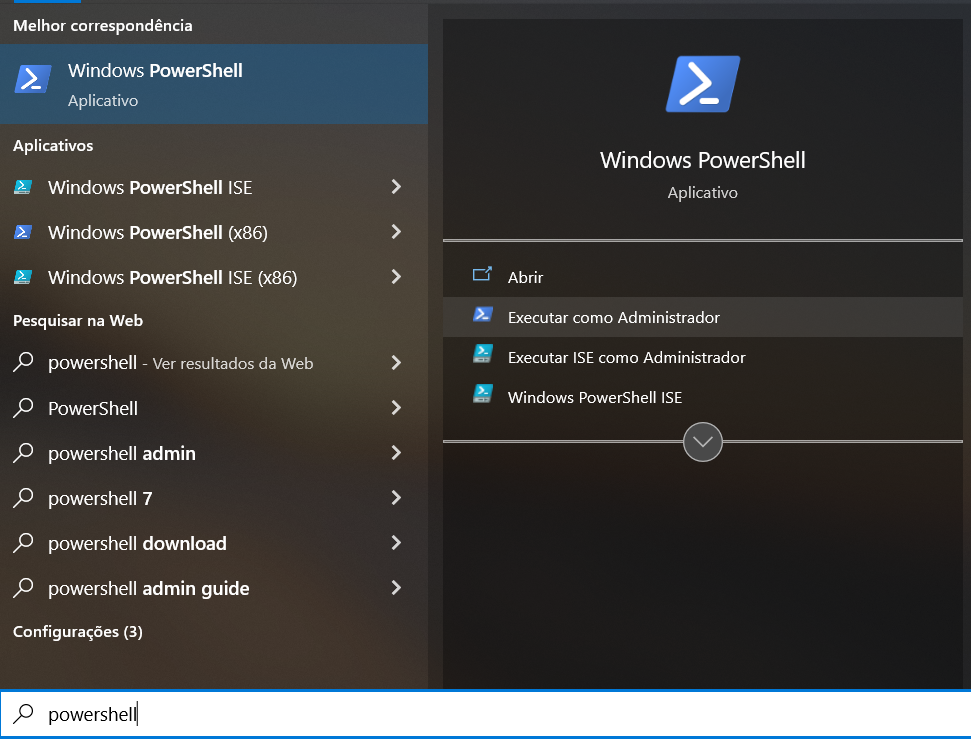

## Atualizar o WSL

```wsl --update```

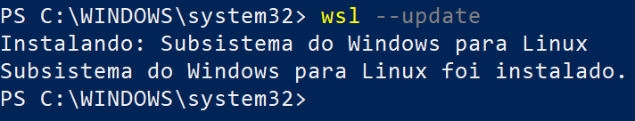

## Verificar a versão do WSL

```wsl --version```

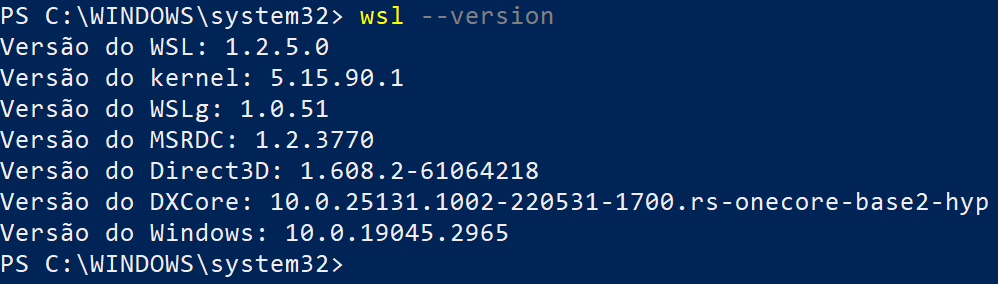

## Listar as distribuições Linux instaladas

Inicialmente, não será mostrado nada porque não tem nenhum distribuição instalada.

```wsl --list --verbose```

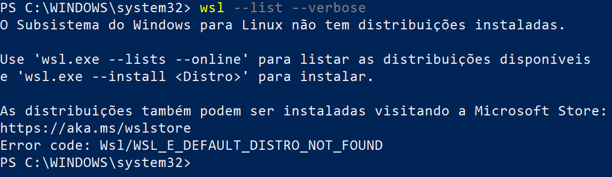

## Listar as distribuições disponíveis para instalação

Nesta parte do tutorial, o usuário irá escolher qual versão do Linux será instalada.

```wsl --list --online```

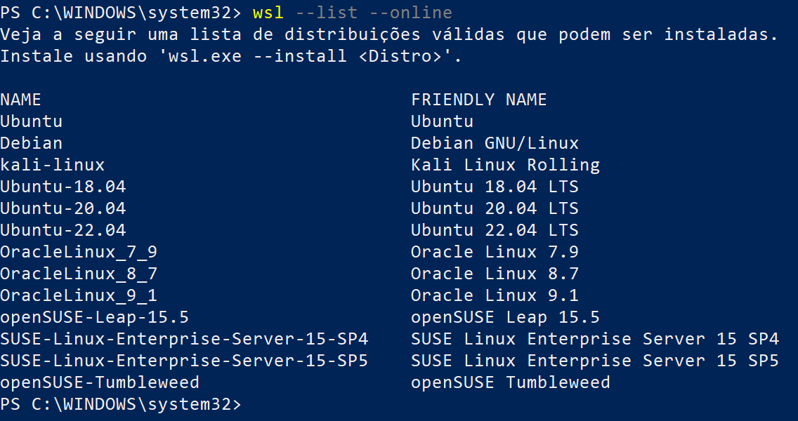

Após digitar o comando acima, serão mostradas duas colunas: ```1) NAME``` e ```2) FRIENDLY NAME```. Utilize a coluna ```NAME``` para escolher a distribuição de interesse.

## Instalar uma distribuição Linux

**Importante1**: Neste tutorial será instalado o ```Ubuntu-22.04```. A versão a ser instalada ficará a critério de cada um.

```wsl --install <Distribuicao_Linux>```

**Exemplo**: Instalar o ```Ubuntu-22.04```. O nome desta distribuição é resultado do comando: ```wsl --list --online```

```wsl --install Ubuntu-22.04```

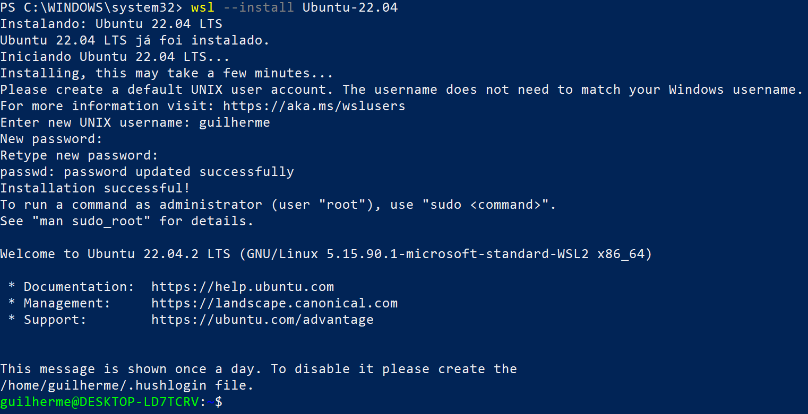

Será necessário criar um ```usuário``` e ```senha``` para logar no Linux. Esta etapa será solicitada durante a instalação. Neste exemplo, foi criado o usuário ```guilherme```.

**Importante2**: O ```usuário``` e a ```senha``` não são as mesmas utilizadas no Windows, pode ser um nome de usuário/senha qualquer. Ficará a seu critério escolher o nome e a senha.

**Importante3**: Note que após a instalação, aparece no fim do processo uma linha verde (```guilherme@DESKTOP-LD7TCRV```), esta linha indica que o Linux já foi instalado.

Após todos esses passos, o seu Linux já estará funcionando normalmente no seu computador.

**Importante4**: Sugiro atualizar o seu Linux com o comando abaixo.

```sudo apt-get update```

Será solicitada a senha do usuário que foi criado.

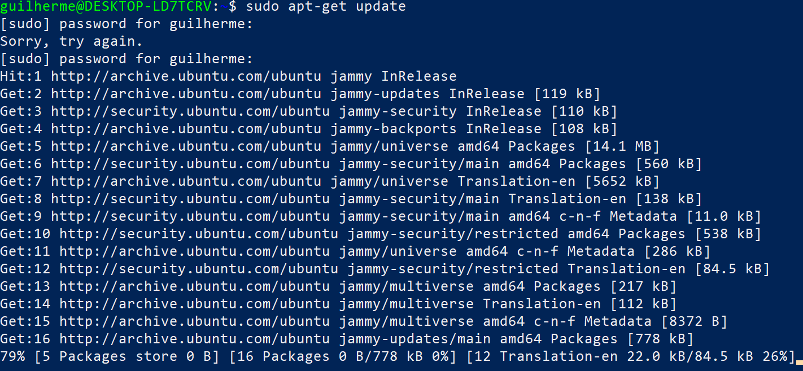

E em seguida:

```sudo apt-get upgrade```

Eu sugiro instalar o ```xeyes``` para saber se o ambiente gráfico foi instalado corretamente porque a WSL 2 já vem com este suporte. Basta digitar o comando abaixo.

```sudo apt install x11-apps```

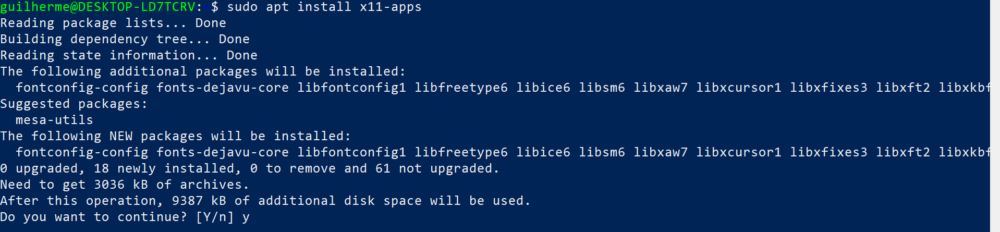

E depois, digitar no terminal do Linux:

```xeyes```

Se aparecer uma janela com dois olhos, tudo está funcionando perfeitamente. Pode fechar esta janela e ser feliz com o seu Linux.

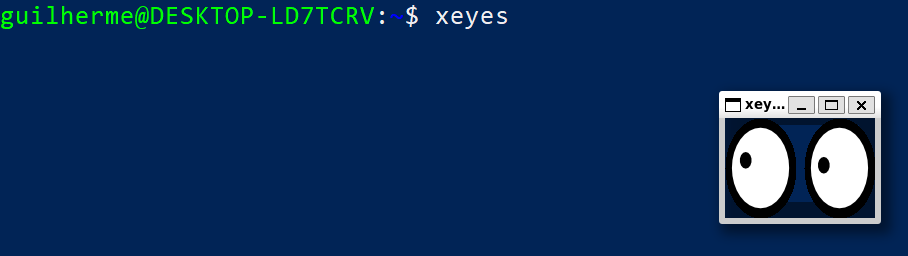

**Importante5**: Ao clicar no menu iniciar do Windows terá um ícone chamado ```Ubuntu-22.04.2 LTS```. Utilize este ícone para abrir o terminal do Linux. Ao abrir esse ícone, note que o Linux já abre com o nome do usuário que foi criado. Neste caso, usuário ```guilherme```.

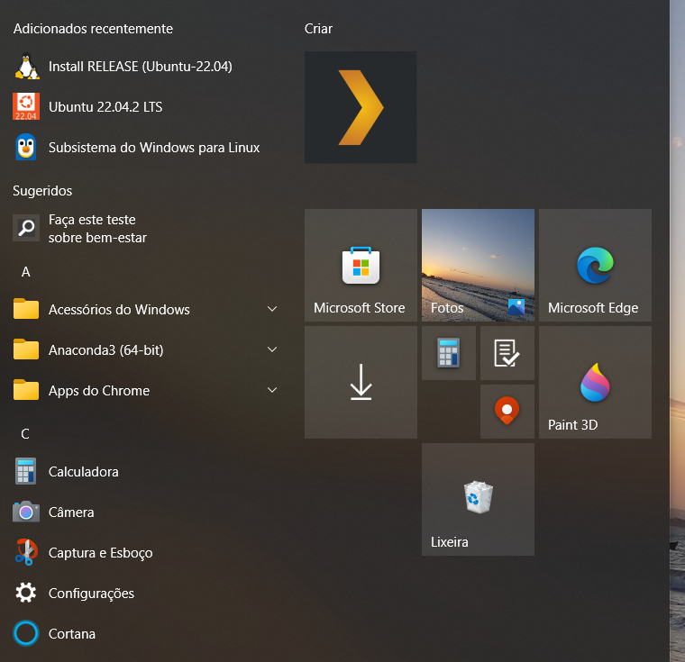

## Listar distribuições instaladas

Neste caso, foi instalada apenas a distribuição Ubuntu-22.04. Nota-se a versão do WSL, isto é, a versão 2.

```wsl --list --verbose```

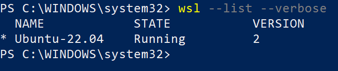

## Desinstalar uma distribuição

**Importante**: O comando abaixo apaga tudo da distribuição. Por isso, use com cuidado e antes faça backup.

Caso seja necessário desinstalar uma distribuição, inicialmente listam-se as possíveis distribuções instaladas com o comando abaixo.

```wsl --list --verbose```

Posteriormente, basta escolher qual distribuição deseja-se remover.

```wsl --unregister <Distribuicao_Linux>```

Onde: ```<Distribuicao_Linux>``` é a distribuição a ser desinstalada.

**Exemplo**: Remover a distribuição ```Ubuntu-22.04```.

```wsl --unregister Ubuntu-22.04```