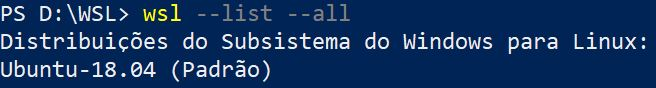
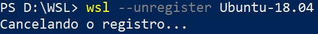
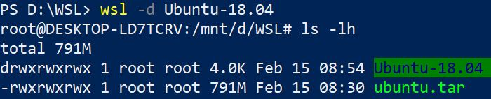

Mover a instalação do Windows Subsystem for Linux (WSL) para outro disco
=================================

Recentemente passei por um problema. O notebook que trabalho tem dois discos, um (`C:`) de 128Gb SSD, e outro (`D:`) de 1Tb. Toda a instalação é feita no "`C:`". E como é de se esperar, o disco "`C:`" encheu, e com isso, os problemas começaram a surgir, principalmente com a instalação do WSL onde executo o Linux e os demais programas que utilizo para trabalhar.

Após muita pesquisa no Google, achei o link abaixo que foi muito útil:

[https://marquesfernandes.com/tecnologia/como-mover-instalar-o-wsl-2-do-disco-c-para-outro-disco](https://marquesfernandes.com/tecnologia/como-mover-instalar-o-wsl-2-do-disco-c-para-outro-disco)

Fiz um pequeno resumo do link acima e espero que sirva para resolver o problema de outros usuários.

Basta seguir os passos abaixo:

Com o `PowerShell` do Windows vá para o disco que você deseja utilizando o comando abaixo. No meu caso, o disco "`D:`".

`cd D:\`

Será necessário criar um diretório (`WSL`), para isso, utilize o comando abaixo:

`mkdir WSL`

Entre no diretório `WSL` que foi criado.

`cd WSL`

O próximo passo será saber o nome da distribuição Linux instalada. Basta digitar o comando abaixo no PowerShell:

`wsl --list --all`

Será mostrada a figura a seguir. A informação que nos interessa é `Ubuntu-18.04`. Guarde essa informação.

A seguir, digite:

`wsl --export Ubuntu-18.04 ubuntu.tar`

Será criado o arquivo `ubuntu.tar` dentro do diretório `WSL`.

Lembrando que `Ubuntu-18.04` é o nome da distribuição obtida com o comando acima.

Digite o comando abaixo:

`wsl --unregister Ubuntu-18.04`

Será mostrada a seguinte imagem:

Crie o diretório `Ubuntu-18.04` dentro do diretório `WSL` com o comando:

`mkdir Ubuntu-18.04`

E digite o comando abaixo:

`wsl --import Ubuntu-18.04 Ubuntu-18.04 ubuntu.tar`

Feito todos esses passos, vamos testar se o WSL foi movido do disco "`C:`" para o disco "`D:`" corretamente.

`wsl -d Ubuntu-18.04`

Não aparecerá nenhuma mensagem, mas note a imagem abaixo. Antes estava `PS D:\WSL>` e houve a mudança para o ambiente Linux por meio do nome `root@DESKTOP-LD7TCRV:/mnt/d/WSL# ls -lh`.

O passo final é criar um usuário para não ter que ficar utilizando a conta de superusuário root.

`sudo useradd -m usuario`

Eu vou criar com o nome de `guilherme`.

`sudo useradd -m -s bash guilherme`

Crie uma senha para o usuário criado (`guilherme`):

`sudo passwd guilherme`

Adicionar o usuário ao grupo `sudo`.

`sudo usermod -a -G sudo guilherme`

Aproveite a sua distribuição e não tenha mais dor de cabeça com problema de espaço em disco.